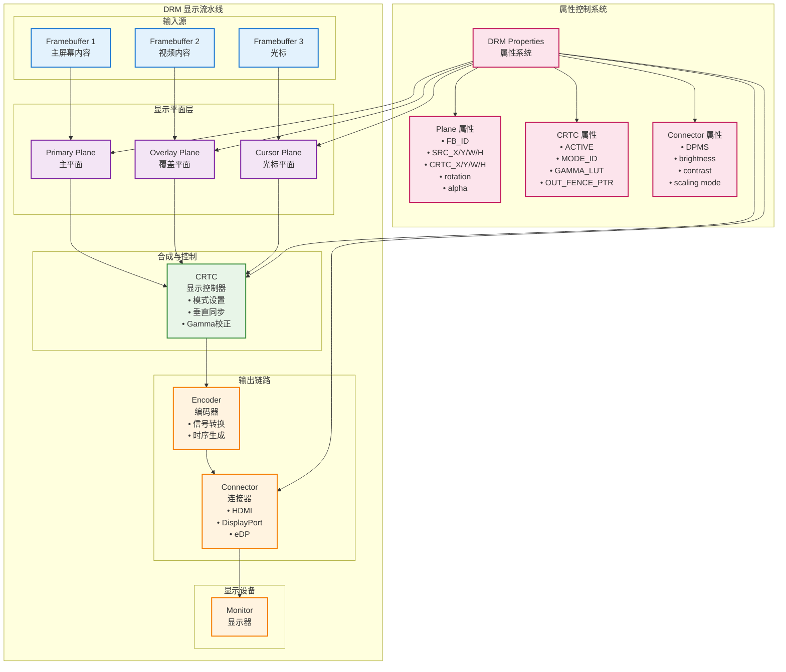
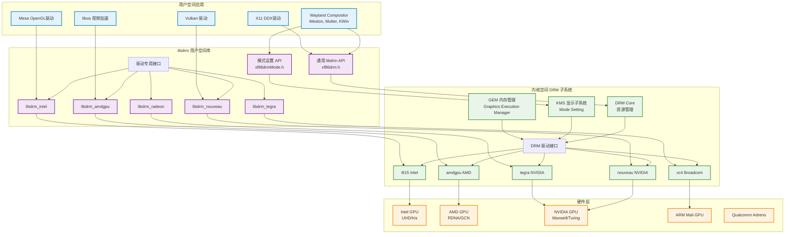
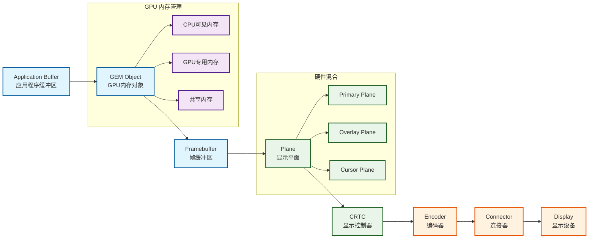
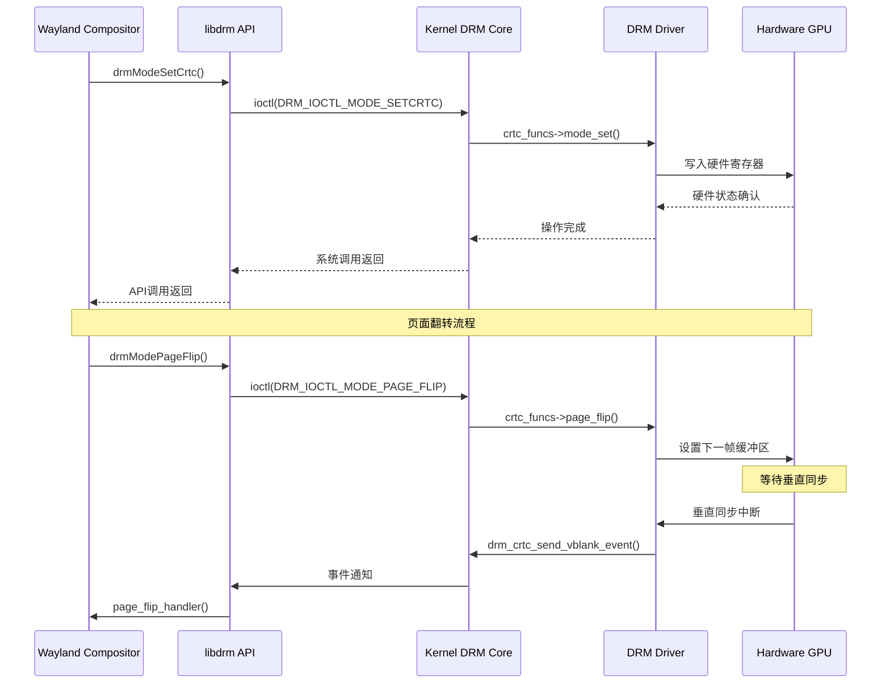
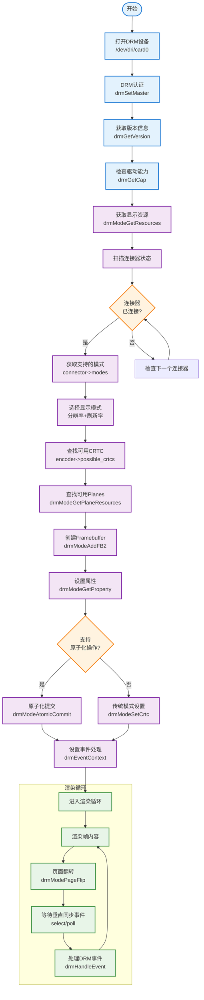
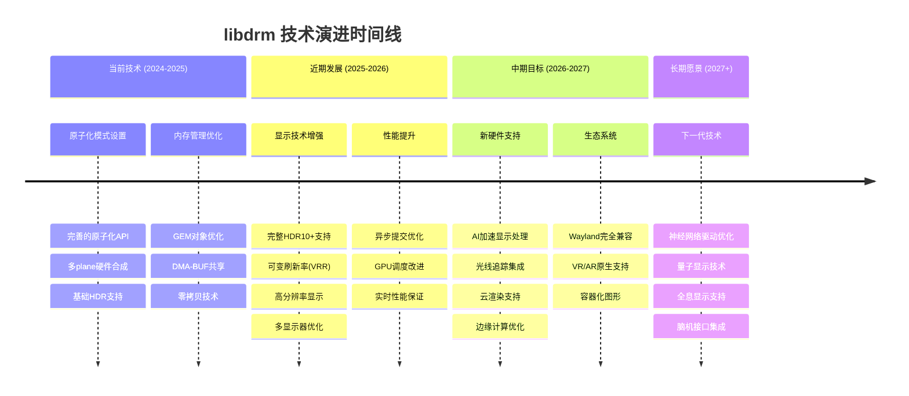
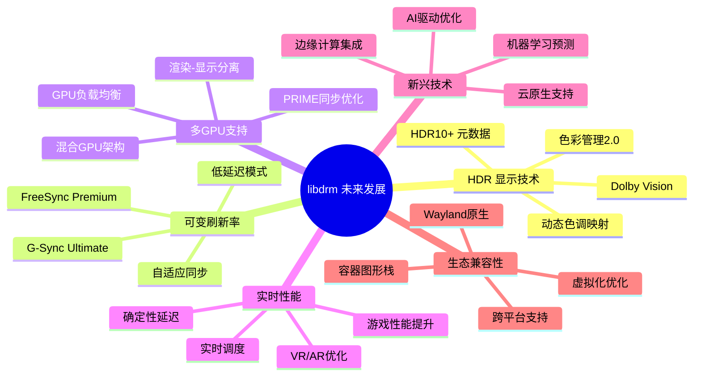

# libdrm 技术文档 - Wayland合成器开发指南

## 概述

libdrm（Direct Rendering Manager library）是Linux图形栈中的核心用户空间库，为GPU驱动和用户空间应用程序提供了直接访问图形硬件的接口。对于Wayland合成器开发人员而言，libdrm是实现高性能硬件加速渲染和显示控制的关键组件。

### 什么是DRM？

DRM（Direct Rendering Manager）是Linux内核的图形子系统，负责管理GPU资源、内存分配和显示输出。libdrm作为用户空间库，封装了与内核DRM子系统交互的复杂性，为应用程序提供了简洁的API。

## 核心组件详解

### DRM 显示流水线架构



### 1. drm_plane（显示平面）

`drm_plane` 是DRM显示流水线中的基本渲染单元，代表硬件中的一个显示层或平面。

#### 技术特性
- **硬件加速合成**：支持硬件层级的图像合成，减少CPU负载
- **多层支持**：现代GPU通常支持多个硬件平面（Primary、Overlay、Cursor）
- **格式支持**：支持多种像素格式（ARGB8888、NV12、YUV420等）
- **变换操作**：支持旋转、缩放、裁剪等硬件变换

#### Plane类型
```c
enum drm_plane_type {
    DRM_PLANE_TYPE_OVERLAY = 0,    // 覆盖层，用于视频、UI元素
    DRM_PLANE_TYPE_PRIMARY = 1,    // 主平面，通常用于桌面背景
    DRM_PLANE_TYPE_CURSOR = 2,     // 光标层，专用于鼠标光标
};
```

#### 在Wayland合成器中的应用
```c
// 查询可用的planes
drmModePlaneResPtr planes = drmModeGetPlaneResources(fd);
for (uint32_t i = 0; i < planes->count_planes; i++) {
    drmModePlanePtr plane = drmModeGetPlane(fd, planes->planes[i]);
    // 检查plane类型和支持的格式
    if (plane->possible_crtcs & (1 << crtc_index)) {
        // 此plane可用于指定的CRTC
    }
}

// 设置plane属性
drmModeSetPlane(fd, plane_id, crtc_id, fb_id, 0,
                crtc_x, crtc_y, crtc_w, crtc_h,
                src_x, src_y, src_w, src_h);
```

### 2. drm_crtc（显示控制器）

`drm_crtc`（Cathode Ray Tube Controller）是显示流水线的核心控制单元，负责从framebuffer读取数据并输出到显示设备。

#### 核心功能
- **模式设置**：配置分辨率、刷新率、色彩空间
- **垂直同步**：控制画面更新时机，防止撕裂
- **Gamma校正**：硬件级色彩校正
- **多显示器支持**：每个CRTC可驱动一个显示输出

#### 关键属性
```c
typedef struct _drmModeCrtc {
    uint32_t crtc_id;
    uint32_t buffer_id;          // 当前显示的framebuffer
    uint32_t x, y;               // 扫描起始位置
    uint32_t width, height;      // 显示分辨率
    int mode_valid;
    drmModeModeInfo mode;        // 显示模式信息
    int gamma_size;              // Gamma表大小
} drmModeCrtc, *drmModeCrtcPtr;
```

#### Wayland合成器中的CRTC管理
```c
// 获取CRTC信息
drmModeCrtcPtr crtc = drmModeGetCrtc(fd, crtc_id);

// 设置显示模式
drmModeSetCrtc(fd, crtc_id, fb_id, 0, 0,
               &connector_id, 1, &mode);

// 页面翻转（用于垂直同步）
drmModePageFlip(fd, crtc_id, fb_id,
                DRM_MODE_PAGE_FLIP_EVENT, user_data);
```

### 3. drm_connector（显示连接器）

`drm_connector` 代表物理显示接口，如HDMI、DisplayPort、eDP等。

#### 连接器状态
```c
enum drm_connector_status {
    DRM_MODE_CONNECTED = 1,      // 显示器已连接
    DRM_MODE_DISCONNECTED = 2,   // 显示器未连接
    DRM_MODE_UNKNOWNCONNECTION = 3 // 连接状态未知
};
```

#### 连接器类型
- **DRM_MODE_CONNECTOR_HDMIA/B**：HDMI接口
- **DRM_MODE_CONNECTOR_DisplayPort**：DisplayPort接口
- **DRM_MODE_CONNECTOR_eDP**：嵌入式DisplayPort
- **DRM_MODE_CONNECTOR_LVDS**：LVDS接口
- **DRM_MODE_CONNECTOR_VGA**：传统VGA接口

#### 热插拔检测
```c
// 监听连接器状态变化
drmModeConnectorPtr connector = drmModeGetConnector(fd, connector_id);
if (connector->connection == DRM_MODE_CONNECTED) {
    // 显示器已连接，获取支持的模式
    for (int i = 0; i < connector->count_modes; i++) {
        drmModeModeInfo *mode = &connector->modes[i];
        printf("Mode: %dx%d@%dHz\n", 
               mode->hdisplay, mode->vdisplay, mode->vrefresh);
    }
}
```

### 4. drm_property（属性系统）

DRM属性系统提供了运行时配置显示硬件的机制，支持动态调整各种显示参数。

#### 属性类型
```c
enum drm_mode_property_type {
    DRM_MODE_PROP_RANGE = 1,      // 数值范围
    DRM_MODE_PROP_ENUM = 2,       // 枚举值
    DRM_MODE_PROP_BLOB = 4,       // 二进制数据
    DRM_MODE_PROP_BITMASK = 8,    // 位掩码
    DRM_MODE_PROP_OBJECT = 16,    // 对象引用
    DRM_MODE_PROP_SIGNED_RANGE = 32, // 有符号范围
};
```

#### 常用属性
- **CRTC属性**：
  - `ACTIVE`：CRTC激活状态
  - `MODE_ID`：显示模式配置
  - `OUT_FENCE_PTR`：输出同步栅栏

- **Plane属性**：
  - `FB_ID`：关联的framebuffer
  - `SRC_X/Y/W/H`：源矩形区域
  - `CRTC_X/Y/W/H`：目标显示区域
  - `rotation`：旋转角度
  - `alpha`：透明度

- **Connector属性**：
  - `DPMS`：电源管理状态

#### 原子化属性更新
```c
// 创建属性更新请求
drmModeAtomicReqPtr req = drmModeAtomicAlloc();

// 添加属性更新
drmModeAtomicAddProperty(req, plane_id, fb_id_prop, new_fb_id);
drmModeAtomicAddProperty(req, plane_id, crtc_x_prop, new_x);
drmModeAtomicAddProperty(req, plane_id, crtc_y_prop, new_y);

// 原子化提交
uint32_t flags = DRM_MODE_ATOMIC_NONBLOCK | DRM_MODE_PAGE_FLIP_EVENT;
int ret = drmModeAtomicCommit(fd, req, flags, user_data);

drmModeAtomicFree(req);
```

## 项目结构

### 目录结构
```
libdrm/
├── include/drm/          # 公共头文件
│   ├── drm.h            # 核心DRM定义
│   ├── drm_mode.h       # 模式设置API
│   └── drm_fourcc.h     # 像素格式定义
├── libdrm/              # 核心库实现
│   ├── xf86drm.c        # 主要API实现
│   ├── xf86drmMode.c    # 模式设置API
│   └── xf86drmHash.c    # 哈希表实现
├── amdgpu/              # AMD GPU驱动接口
├── intel/               # Intel GPU驱动接口
├── nouveau/             # NVIDIA开源驱动接口
├── radeon/              # AMD Radeon驱动接口
└── tests/               # 测试程序
    ├── modetest/        # 模式测试工具
    └── proptest/        # 属性测试工具
```

### 核心模块

#### 1. 通用DRM接口（libdrm）
- **设备管理**：打开/关闭DRM设备
- **内存管理**：GEM缓冲区分配和映射
- **认证系统**：DRM魔数认证
- **事件处理**：垂直同步和热插拔事件

#### 2. 模式设置接口（libdrm_mode）
- **资源枚举**：CRTC、连接器、编码器查询
- **模式配置**：分辨率和刷新率设置
- **原子化更新**：多属性同步更新
- **页面翻转**：双缓冲和垂直同步

#### 3. 驱动专用接口
- **Intel**：i915驱动专用功能
- **AMD**：AMDGPU和Radeon驱动
- **NVIDIA**：Nouveau开源驱动
- **ARM**：Mali GPU支持

## 技术架构

### 层次结构



### 数据流

#### 1. 显示数据流


#### 2. 控制流


### 内存管理架构

#### GEM（Graphics Execution Manager）
- **对象导向**：每个缓冲区都是一个GEM对象
- **引用计数**：自动内存生命周期管理
- **mmap支持**：用户空间直接访问GPU内存
- **同步机制**：栅栏（fence）和信号量

```c
// GEM缓冲区创建
struct drm_mode_create_dumb create_req = {
    .width = width,
    .height = height,
    .bpp = 32,
};
drmIoctl(fd, DRM_IOCTL_MODE_CREATE_DUMB, &create_req);

// 内存映射
struct drm_mode_map_dumb map_req = {
    .handle = create_req.handle,
};
drmIoctl(fd, DRM_IOCTL_MODE_MAP_DUMB, &map_req);
void *data = mmap(0, create_req.size, PROT_READ | PROT_WRITE, 
                  MAP_SHARED, fd, map_req.offset);
```

## 使用流程

### DRM 初始化和配置流程图



### 1. 初始化流程

```c
// 1. 打开DRM设备
int fd = open("/dev/dri/card0", O_RDWR | O_CLOEXEC);

// 2. 获取DRM版本信息
drmVersionPtr version = drmGetVersion(fd);
printf("Driver: %s\n", version->name);

// 3. 设置为主设备
drmSetMaster(fd);

// 4. 获取显示资源
drmModeResPtr resources = drmModeGetResources(fd);
```

### 2. 显示配置流程

```c
// 1. 枚举连接器，找到已连接的显示器
for (int i = 0; i < resources->count_connectors; i++) {
    drmModeConnectorPtr connector = 
        drmModeGetConnector(fd, resources->connectors[i]);
    
    if (connector->connection == DRM_MODE_CONNECTED) {
        // 2. 选择显示模式
        drmModeModeInfoPtr mode = &connector->modes[0];
        
        // 3. 找到合适的编码器和CRTC
        drmModeEncoderPtr encoder = 
            drmModeGetEncoder(fd, connector->encoder_id);
        uint32_t crtc_id = encoder->crtc_id;
        
        // 4. 创建framebuffer
        uint32_t fb_id = create_framebuffer(fd, mode->hdisplay, mode->vdisplay);
        
        // 5. 设置CRTC
        drmModeSetCrtc(fd, crtc_id, fb_id, 0, 0,
                       &connector->connector_id, 1, mode);
    }
}
```

### 3. 渲染循环

```c
while (running) {
    // 1. 渲染到后缓冲区
    render_frame(back_buffer);
    
    // 2. 页面翻转
    drmModePageFlip(fd, crtc_id, back_fb_id,
                    DRM_MODE_PAGE_FLIP_EVENT, &flip_data);
    
    // 3. 等待垂直同步事件
    fd_set fds;
    FD_ZERO(&fds);
    FD_SET(fd, &fds);
    select(fd + 1, &fds, NULL, NULL, NULL);
    
    // 4. 处理DRM事件
    drmEventContext ctx = {
        .version = DRM_EVENT_CONTEXT_VERSION,
        .page_flip_handler = page_flip_handler,
    };
    drmHandleEvent(fd, &ctx);
    
    // 5. 交换前后缓冲区
    swap_buffers();
}
```

### 4. 多显示器支持

```c
typedef struct {
    uint32_t crtc_id;
    uint32_t connector_id;
    drmModeModeInfo mode;
    uint32_t fb_id;
} output_config_t;

// 配置多个输出
output_config_t outputs[MAX_OUTPUTS];
int output_count = 0;

// 为每个连接的显示器配置独立的CRTC
for (int i = 0; i < resources->count_connectors; i++) {
    drmModeConnectorPtr connector = 
        drmModeGetConnector(fd, resources->connectors[i]);
    
    if (connector->connection == DRM_MODE_CONNECTED) {
        outputs[output_count].connector_id = connector->connector_id;
        outputs[output_count].mode = connector->modes[0];
        // 分配CRTC和创建framebuffer
        setup_output(&outputs[output_count]);
        output_count++;
    }
}
```

### 5. 硬件加速合成

```c
// 使用多个planes进行硬件合成
typedef struct {
    uint32_t plane_id;
    uint32_t fb_id;
    uint32_t crtc_x, crtc_y, crtc_w, crtc_h;
    uint32_t src_x, src_y, src_w, src_h;
} layer_t;

void composite_layers(layer_t *layers, int count) {
    drmModeAtomicReqPtr req = drmModeAtomicAlloc();
    
    for (int i = 0; i < count; i++) {
        // 为每个layer设置plane属性
        drmModeAtomicAddProperty(req, layers[i].plane_id, 
                                fb_id_prop, layers[i].fb_id);
        drmModeAtomicAddProperty(req, layers[i].plane_id,
                                crtc_x_prop, layers[i].crtc_x);
        drmModeAtomicAddProperty(req, layers[i].plane_id,
                                crtc_y_prop, layers[i].crtc_y);
        // ... 其他属性
    }
    
    // 原子化提交所有更改
    drmModeAtomicCommit(fd, req, DRM_MODE_ATOMIC_NONBLOCK, NULL);
    drmModeAtomicFree(req);
}
```

## Wayland合成器集成指南

### Wayland 合成器 DRM 后端架构

```mermaid
graph TB
    subgraph "Wayland 协议层"
        WC[Wayland Compositor Core]
        WS[Wayland Surfaces]
        WO[Wayland Outputs]
        WI[Wayland Input]
    end
    
    subgraph "DRM 后端"
        subgraph "后端管理"
            DRM_BE[DRM Backend]
            DRM_BE --> OUT_MGR[Output Manager]
            DRM_BE --> INPUT_MGR[Input Manager]
            DRM_BE --> REND_MGR[Renderer Manager]
        end
        
        subgraph "输出管理"
            OUT_MGR --> OUT1[Output 1<br/>主显示器]
            OUT_MGR --> OUT2[Output 2<br/>扩展显示器]
            OUT_MGR --> HOTPLUG[热插拔处理<br/>udev监控]
        end
        
        subgraph "渲染管理"
            REND_MGR --> EGL_CTX[EGL Context]
            REND_MGR --> GBM_DEV[GBM Device]
            REND_MGR --> GL_REND[OpenGL Renderer]
        end
        
        subgraph "事件处理"
            EVT_LOOP[Event Loop<br/>wl_event_loop]
            EVT_LOOP --> DRM_EVT[DRM Events<br/>页面翻转/VBlank]
            EVT_LOOP --> UDEV_EVT[udev Events<br/>热插拔检测]
            EVT_LOOP --> INPUT_EVT[Input Events<br/>键盘/鼠标]
        end
    end
    
    subgraph "libdrm 接口层"
        LIBDRM[libdrm Core API]
        LIBDRM --> KMS[KMS Mode Setting]
        LIBDRM --> GEM[GEM Memory Mgmt]
        LIBDRM --> PLANE[Plane Control]
        LIBDRM --> PROP[Property System]
    end
    
    subgraph "渲染流水线"
        subgraph "表面合成"
            SURF_COMP[Surface Compositor]
            SURF_COMP --> DAMAGE[Damage Tracking]
            SURF_COMP --> TRANSFORM[变换处理]
            SURF_COMP --> BLEND[混合模式]
        end
        
        subgraph "硬件加速"
            HW_COMP[Hardware Compositor]
            HW_COMP --> PLANE_ASSIGN[Plane分配策略]
            HW_COMP --> FB_CACHE[Framebuffer缓存]
            HW_COMP --> ATOMIC_UPD[原子化更新]
        end
        
        subgraph "回退渲染"
            SW_COMP[Software Compositor]
            SW_COMP --> CPU_BLEND[CPU混合]
            SW_COMP --> PRIMARY_ONLY[仅使用Primary Plane]
        end
    end
    
    subgraph "缓冲区管理"
        BUF_MGR[Buffer Manager]
        BUF_MGR --> DMABUF[DMA-BUF共享]
        BUF_MGR --> WL_DRM[wl_drm协议]
        BUF_MGR --> LINUX_DMABUF[linux-dmabuf协议]
    end
    
    WC --> DRM_BE
    WS --> SURF_COMP
    WO --> OUT_MGR
    
    DRM_BE --> LIBDRM
    OUT1 --> KMS
    OUT2 --> KMS
    
    GL_REND --> GBM_DEV
    EGL_CTX --> GBM_DEV
    GBM_DEV --> GEM
    
    SURF_COMP --> HW_COMP
    HW_COMP --> SW_COMP
    PLANE_ASSIGN --> PLANE
    ATOMIC_UPD --> PROP
    
    BUF_MGR --> DMABUF
    DMABUF --> GEM
    
    DRM_EVT --> EVT_LOOP
    HOTPLUG --> UDEV_EVT
    
    classDef waylandLayer fill:#e3f2fd,stroke:#1976d2,stroke-width:2px
    classDef backendLayer fill:#f3e5f5,stroke:#7b1fa2,stroke-width:2px
    classDef libdrmLayer fill:#e8f5e8,stroke:#388e3c,stroke-width:2px
    classDef renderPipe fill:#fff3e0,stroke:#f57c00,stroke-width:2px
    classDef bufferMgmt fill:#fce4ec,stroke:#c2185b,stroke-width:2px
    
    class WC,WS,WO,WI waylandLayer
    class DRM_BE,OUT_MGR,INPUT_MGR,REND_MGR,OUT1,OUT2,HOTPLUG,EGL_CTX,GBM_DEV,GL_REND,EVT_LOOP,DRM_EVT,UDEV_EVT,INPUT_EVT backendLayer
    class LIBDRM,KMS,GEM,PLANE,PROP libdrmLayer
    class SURF_COMP,DAMAGE,TRANSFORM,BLEND,HW_COMP,PLANE_ASSIGN,FB_CACHE,ATOMIC_UPD,SW_COMP,CPU_BLEND,PRIMARY_ONLY renderPipe
    class BUF_MGR,DMABUF,WL_DRM,LINUX_DMABUF bufferMgmt
```



### 1. 后端架构设计

```c
typedef struct {
    int drm_fd;
    drmModeResPtr resources;
    
    // 输出管理
    struct wl_list outputs;     // 显示器列表
    
    // 渲染资源
    struct gbm_device *gbm;     // GBM设备
    EGLDisplay egl_display;     // EGL显示
    
    // 事件处理
    struct wl_event_source *drm_source;
    
    // 页面翻转状态
    bool pending_pageflip;
} drm_backend_t;
```

### 2. 输出管理

```c
typedef struct {
    struct wl_list link;
    
    uint32_t connector_id;
    uint32_t crtc_id;
    drmModeModeInfo current_mode;
    
    // 双缓冲
    struct gbm_surface *gbm_surface;
    struct gbm_bo *front_bo;
    struct gbm_bo *back_bo;
    
    // EGL渲染上下文
    EGLSurface egl_surface;
    
    bool pending_flip;
} drm_output_t;
```

### 3. 渲染流程集成

```c
// Wayland合成器的渲染函数
void compositor_render_output(drm_output_t *output) {
    // 1. 激活EGL上下文
    eglMakeCurrent(egl_display, output->egl_surface, 
                   output->egl_surface, egl_context);
    
    // 2. 渲染Wayland surfaces
    wl_list_for_each(surface, &compositor->surface_list, link) {
        if (surface_visible_on_output(surface, output)) {
            render_surface(surface);
        }
    }
    
    // 3. 提交渲染结果
    eglSwapBuffers(egl_display, output->egl_surface);
    
    // 4. 获取渲染后的buffer object
    struct gbm_bo *bo = gbm_surface_lock_front_buffer(output->gbm_surface);
    
    // 5. 创建DRM framebuffer
    uint32_t fb_id = get_fb_for_bo(bo);
    
    // 6. 页面翻转
    int ret = drmModePageFlip(drm_fd, output->crtc_id, fb_id,
                              DRM_MODE_PAGE_FLIP_EVENT, output);
    
    if (ret == 0) {
        output->pending_flip = true;
        output->back_bo = output->front_bo;
        output->front_bo = bo;
    }
}
```

### 4. 事件处理集成

```c
// DRM事件处理
static void drm_event_handler(int fd, uint32_t mask, void *data) {
    drmEventContext ctx = {
        .version = DRM_EVENT_CONTEXT_VERSION,
        .page_flip_handler = page_flip_handler,
        .vblank_handler = vblank_handler,
    };
    
    drmHandleEvent(fd, &ctx);
}

static void page_flip_handler(int fd, unsigned int sequence,
                              unsigned int tv_sec, unsigned int tv_usec,
                              void *user_data) {
    drm_output_t *output = user_data;
    
    // 页面翻转完成
    output->pending_flip = false;
    
    // 释放旧的buffer
    if (output->back_bo) {
        gbm_surface_release_buffer(output->gbm_surface, output->back_bo);
        output->back_bo = NULL;
    }
    
    // 通知Wayland compositor刷新完成
    wl_output_send_frame(&output->wl_output, get_timestamp());
}

// 在主事件循环中注册DRM事件源
drm_source = wl_event_loop_add_fd(compositor->event_loop, drm_fd,
                                  WL_EVENT_READABLE, drm_event_handler, NULL);
```

### 5. 热插拔处理

```c
// udev监控显示器热插拔
static void handle_udev_event(int fd, uint32_t mask, void *data) {
    struct udev_device *device = udev_monitor_receive_device(udev_monitor);
    
    if (device) {
        const char *action = udev_device_get_action(device);
        const char *devnode = udev_device_get_devnode(device);
        
        if (strcmp(action, "change") == 0 && 
            strstr(devnode, "/dev/dri/card")) {
            
            // 重新扫描连接器状态
            rescan_connectors();
            
            // 创建或销毁输出
            update_outputs();
        }
        
        udev_device_unref(device);
    }
}

void rescan_connectors(void) {
    drmModeResPtr resources = drmModeGetResources(drm_fd);
    
    for (int i = 0; i < resources->count_connectors; i++) {
        drmModeConnectorPtr connector = 
            drmModeGetConnector(drm_fd, resources->connectors[i]);
        
        drm_output_t *output = find_output_by_connector(connector->connector_id);
        
        if (connector->connection == DRM_MODE_CONNECTED && !output) {
            // 新显示器连接，创建输出
            create_output(connector);
        } else if (connector->connection == DRM_MODE_DISCONNECTED && output) {
            // 显示器断开，销毁输出
            destroy_output(output);
        }
        
        drmModeFreeConnector(connector);
    }
    
    drmModeFreeResources(resources);
}
```

## 性能优化

### DRM 性能优化策略图

```mermaid
graph TB
    subgraph "性能优化层次"
        subgraph "应用层优化"
            APP_OPT[应用层优化]
            APP_OPT --> DAMAGE_TRACK[损伤追踪<br/>只更新变化区域]
            APP_OPT --> SURFACE_CACHE[表面缓存<br/>避免重复渲染]
            APP_OPT --> VSYNC_TIMING[垂直同步对齐<br/>减少输入延迟]
        end
        
        subgraph "合成器优化"
            COMP_OPT[合成器优化]
            COMP_OPT --> PLANE_ASSIGN[智能Plane分配]
            COMP_OPT --> ATOMIC_BATCH[原子化批处理]
            COMP_OPT --> ZERO_COPY[零拷贝缓冲区]
            COMP_OPT --> ASYNC_RENDER[异步渲染流水线]
        end
        
        subgraph "驱动层优化"
            DRV_OPT[驱动层优化]
            DRV_OPT --> CMD_SUBMIT[命令提交优化]
            DRV_OPT --> MEM_POOL[内存池管理]
            DRV_OPT --> GPU_SCHED[GPU调度优化]
        end
        
        subgraph "硬件层优化"
            HW_OPT[硬件层优化]
            HW_OPT --> PLANE_COMP[硬件平面合成]
            HW_OPT --> COLOR_CONVERT[硬件色彩转换]
            HW_OPT --> SCALING[硬件缩放]
        end
    end
    
    subgraph "优化技术实现"
        subgraph "原子化更新优化"
            ATOMIC_FLOW[原子化更新流程]
            ATOMIC_FLOW --> STATE_COLLECT[收集状态变化]
            STATE_COLLECT --> STATE_VALIDATE[状态验证<br/>TEST_ONLY]
            STATE_VALIDATE --> BATCH_COMMIT[批量提交<br/>NONBLOCK]
        end
        
        subgraph "零拷贝实现"
            ZEROCOPY_FLOW[零拷贝流程]
            ZEROCOPY_FLOW --> DMABUF_CREATE[创建DMA-BUF]
            DMABUF_CREATE --> DMABUF_SHARE[跨进程共享]
            DMABUF_SHARE --> DIRECT_SCAN[直接扫描输出]
        end
        
        subgraph "异步渲染"
            ASYNC_FLOW[异步渲染流程]
            ASYNC_FLOW --> RENDER_THREAD[渲染线程]
            RENDER_THREAD --> PRESENT_THREAD[呈现线程]
            PRESENT_THREAD --> SYNC_POINT[同步点管理]
        end
    end
    
    subgraph "性能监控"
        PERF_MON[性能监控系统]
        PERF_MON --> FPS_TRACK[帧率追踪]
        PERF_MON --> LATENCY_MEASURE[延迟测量]
        PERF_MON --> GPU_UTIL[GPU利用率]
        PERF_MON --> MEM_USAGE[内存使用情况]
        
        FPS_TRACK --> FRAME_TIME[帧时间分析]
        LATENCY_MEASURE --> INPUT_LAG[输入延迟]
        GPU_UTIL --> BOTTLENECK[瓶颈识别]
        MEM_USAGE --> LEAK_DETECT[内存泄漏检测]
    end
    
    PLANE_ASSIGN --> ATOMIC_FLOW
    ATOMIC_BATCH --> ATOMIC_FLOW
    ZERO_COPY --> ZEROCOPY_FLOW
    ASYNC_RENDER --> ASYNC_FLOW
    
    DAMAGE_TRACK --> PERF_MON
    PLANE_COMP --> PERF_MON
    CMD_SUBMIT --> PERF_MON
    
    classDef appLayer fill:#e3f2fd,stroke:#1976d2,stroke-width:2px
    classDef compLayer fill:#f3e5f5,stroke:#7b1fa2,stroke-width:2px
    classDef driverLayer fill:#e8f5e8,stroke:#388e3c,stroke-width:2px
    classDef hwLayer fill:#fff3e0,stroke:#f57c00,stroke-width:2px
    classDef techImpl fill:#fce4ec,stroke:#c2185b,stroke-width:2px
    classDef perfMon fill:#f1f8e9,stroke:#33691e,stroke-width:2px
    
    class APP_OPT,DAMAGE_TRACK,SURFACE_CACHE,VSYNC_TIMING appLayer
    class COMP_OPT,PLANE_ASSIGN,ATOMIC_BATCH,ZERO_COPY,ASYNC_RENDER compLayer
    class DRV_OPT,CMD_SUBMIT,MEM_POOL,GPU_SCHED driverLayer
    class HW_OPT,PLANE_COMP,COLOR_CONVERT,SCALING hwLayer
    class ATOMIC_FLOW,STATE_COLLECT,STATE_VALIDATE,BATCH_COMMIT,ZEROCOPY_FLOW,DMABUF_CREATE,DMABUF_SHARE,DIRECT_SCAN,ASYNC_FLOW,RENDER_THREAD,PRESENT_THREAD,SYNC_POINT techImpl
    class PERF_MON,FPS_TRACK,LATENCY_MEASURE,GPU_UTIL,MEM_USAGE,FRAME_TIME,INPUT_LAG,BOTTLENECK,LEAK_DETECT perfMon
```



### 1. 原子化更新优化

```c
// 批量属性更新，减少系统调用
void atomic_update_planes(drm_output_t *output, plane_state_t *states, int count) {
    drmModeAtomicReqPtr req = drmModeAtomicAlloc();
    
    for (int i = 0; i < count; i++) {
        plane_state_t *state = &states[i];
        
        if (state->fb_id != state->old_fb_id) {
            drmModeAtomicAddProperty(req, state->plane_id, 
                                    fb_id_prop, state->fb_id);
        }
        
        if (state->src_changed) {
            drmModeAtomicAddProperty(req, state->plane_id,
                                    src_x_prop, state->src_x);
            drmModeAtomicAddProperty(req, state->plane_id,
                                    src_y_prop, state->src_y);
            // ... 其他源属性
        }
        
        if (state->dst_changed) {
            drmModeAtomicAddProperty(req, state->plane_id,
                                    crtc_x_prop, state->crtc_x);
            drmModeAtomicAddProperty(req, state->plane_id,
                                    crtc_y_prop, state->crtc_y);
            // ... 其他目标属性
        }
    }
    
    uint32_t flags = DRM_MODE_ATOMIC_NONBLOCK | DRM_MODE_PAGE_FLIP_EVENT;
    int ret = drmModeAtomicCommit(drm_fd, req, flags, output);
    
    drmModeAtomicFree(req);
}
```

### 2. 零拷贝缓冲区共享

```c
// 使用dmabuf实现零拷贝
typedef struct {
    int dmabuf_fd;
    uint32_t fb_id;
    struct gbm_bo *bo;
} shared_buffer_t;

shared_buffer_t *create_shared_buffer(int width, int height, uint32_t format) {
    shared_buffer_t *buffer = calloc(1, sizeof(*buffer));
    
    // 创建GBM buffer object
    buffer->bo = gbm_bo_create(gbm_device, width, height, format,
                               GBM_BO_USE_SCANOUT | GBM_BO_USE_RENDERING);
    
    // 导出为dmabuf
    buffer->dmabuf_fd = gbm_bo_get_fd(buffer->bo);
    
    // 创建DRM framebuffer
    uint32_t handles[4] = {gbm_bo_get_handle(buffer->bo).u32};
    uint32_t strides[4] = {gbm_bo_get_stride(buffer->bo)};
    uint32_t offsets[4] = {0};
    
    drmModeAddFB2(drm_fd, width, height, format,
                  handles, strides, offsets, &buffer->fb_id, 0);
    
    return buffer;
}

// 在客户端之间共享缓冲区
void share_buffer_with_client(struct wl_client *client, shared_buffer_t *buffer) {
    struct wl_resource *buffer_resource = 
        wl_resource_create(client, &wl_buffer_interface, 1, 0);
    
    // 发送dmabuf给客户端
    zwp_linux_dmabuf_v1_send_buffer(buffer_resource, buffer->dmabuf_fd,
                                     width, height, format, 0);
}
```

### 3. 异步渲染流水线

```c
// 多线程渲染流水线
typedef struct {
    pthread_t render_thread;
    pthread_mutex_t queue_mutex;
    pthread_cond_t queue_cond;
    
    struct wl_list render_queue;    // 待渲染队列
    struct wl_list ready_queue;     // 渲染完成队列
    
    bool running;
} render_pipeline_t;

void *render_thread_func(void *data) {
    render_pipeline_t *pipeline = data;
    
    while (pipeline->running) {
        pthread_mutex_lock(&pipeline->queue_mutex);
        
        while (wl_list_empty(&pipeline->render_queue) && pipeline->running) {
            pthread_cond_wait(&pipeline->queue_cond, &pipeline->queue_mutex);
        }
        
        if (!pipeline->running) {
            pthread_mutex_unlock(&pipeline->queue_mutex);
            break;
        }
        
        // 取出渲染任务
        render_task_t *task = wl_container_of(pipeline->render_queue.next,
                                              task, link);
        wl_list_remove(&task->link);
        pthread_mutex_unlock(&pipeline->queue_mutex);
        
        // 执行渲染
        execute_render_task(task);
        
        // 将结果放入完成队列
        pthread_mutex_lock(&pipeline->queue_mutex);
        wl_list_insert(&pipeline->ready_queue, &task->link);
        pthread_mutex_unlock(&pipeline->queue_mutex);
        
        // 通知主线程
        wl_event_source_timer_update(pipeline->completion_timer, 0);
    }
    
    return NULL;
}
```

## 错误处理和调试

### DRM 错误处理和调试流程

```mermaid
flowchart TD
    START([检测到错误]) --> ERR_TYPE{错误类型分析}
    
    ERR_TYPE -->|设备错误| DEV_ERR[设备相关错误]
    ERR_TYPE -->|权限错误| PERM_ERR[权限/认证错误]
    ERR_TYPE -->|资源错误| RES_ERR[资源不足错误]
    ERR_TYPE -->|配置错误| CONF_ERR[配置/模式错误]
    
    DEV_ERR --> DEV_CHECK{设备状态检查}
    DEV_CHECK -->|设备丢失| DEV_REINIT[重新初始化设备]
    DEV_CHECK -->|设备忙| DEV_RETRY[延迟重试]
    DEV_CHECK -->|驱动问题| DEV_FALLBACK[回退到软件渲染]
    
    PERM_ERR --> PERM_CHECK{权限检查}
    PERM_CHECK -->|需要root| PERM_ELEVATE[提升权限]
    PERM_CHECK -->|DRM Master被占用| PERM_WAIT[等待释放或抢占]
    PERM_CHECK -->|SELinux/AppArmor| PERM_POLICY[检查安全策略]
    
    RES_ERR --> RES_CHECK{资源类型}
    RES_CHECK -->|内存不足| RES_MEM[释放缓存/GC]
    RES_CHECK -->|CRTC不足| RES_CRTC[重新分配显示器]
    RES_CHECK -->|Plane不足| RES_PLANE[回退合成模式]
    
    CONF_ERR --> CONF_CHECK{配置验证}
    CONF_CHECK -->|模式不支持| CONF_MODE[选择兼容模式]
    CONF_CHECK -->|属性无效| CONF_PROP[重置为默认值]
    CONF_CHECK -->|连接器问题| CONF_CONN[重新检测连接]
    
    subgraph "调试工具链"
        DEBUG[调试工具]
        DEBUG --> DUMP_STATE[状态转储<br/>dump_drm_state()]
        DEBUG --> TRACE_EVENTS[事件追踪<br/>ftrace/perf]
        DEBUG --> LOG_ANALYSIS[日志分析<br/>dmesg/journalctl]
        DEBUG --> PERF_PROFILE[性能分析<br/>frame timing]
        
        DUMP_STATE --> STATE_INFO[• CRTC状态<br/>• Connector状态<br/>• Plane配置<br/>• Property值]
        TRACE_EVENTS --> EVENT_INFO[• DRM事件时序<br/>• 系统调用追踪<br/>• 中断处理<br/>• 调度延迟]
        LOG_ANALYSIS --> LOG_INFO[• 内核DRM日志<br/>• 驱动错误信息<br/>• 用户空间日志<br/>• 系统事件]
        PERF_PROFILE --> PERF_INFO[• 帧率统计<br/>• 渲染时间<br/>• VBlank延迟<br/>• GPU利用率]
    end
    
    subgraph "恢复策略"
        RECOVERY[恢复机制]
        RECOVERY --> GRACEFUL[优雅降级]
        RECOVERY --> FALLBACK[功能回退]
        RECOVERY --> RESTART[服务重启]
        RECOVERY --> NOTIFICATION[用户通知]
        
        GRACEFUL --> REDUCE_QUALITY[降低渲染质量]
        GRACEFUL --> DISABLE_EFFECTS[禁用特效]
        FALLBACK --> SOFTWARE_RENDER[软件渲染]
        FALLBACK --> BASIC_MODE[基础显示模式]
        RESTART --> CLEAN_RESTART[清理重启]
        RESTART --> SAFE_MODE[安全模式启动]
    end
    
    DEV_REINIT --> RECOVERY
    DEV_FALLBACK --> RECOVERY
    RES_MEM --> RECOVERY
    CONF_MODE --> RECOVERY
    
    classDef errorType fill:#ffebee,stroke:#c62828,stroke-width:2px
    classDef deviceErr fill:#e8f5e8,stroke:#2e7d32,stroke-width:2px
    classDef permErr fill:#fff3e0,stroke:#ef6c00,stroke-width:2px
    classDef resErr fill:#e3f2fd,stroke:#1565c0,stroke-width:2px
    classDef confErr fill:#f3e5f5,stroke:#6a1b9a,stroke-width:2px
    classDef debugTool fill:#fce4ec,stroke:#ad1457,stroke-width:2px
    classDef recovery fill:#f1f8e9,stroke:#33691e,stroke-width:2px
    
    class ERR_TYPE errorType
    class DEV_ERR,DEV_CHECK,DEV_REINIT,DEV_RETRY,DEV_FALLBACK deviceErr
    class PERM_ERR,PERM_CHECK,PERM_ELEVATE,PERM_WAIT,PERM_POLICY permErr
    class RES_ERR,RES_CHECK,RES_MEM,RES_CRTC,RES_PLANE resErr
    class CONF_ERR,CONF_CHECK,CONF_MODE,CONF_PROP,CONF_CONN confErr
    class DEBUG,DUMP_STATE,TRACE_EVENTS,LOG_ANALYSIS,PERF_PROFILE,STATE_INFO,EVENT_INFO,LOG_INFO,PERF_INFO debugTool
    class RECOVERY,GRACEFUL,FALLBACK,RESTART,NOTIFICATION,REDUCE_QUALITY,DISABLE_EFFECTS,SOFTWARE_RENDER,BASIC_MODE,CLEAN_RESTART,SAFE_MODE recovery
```

### 1. 常见错误处理

```c
// DRM设备打开失败处理
int open_drm_device(void) {
    int fd = -1;
    
    // 尝试渲染节点
    for (int i = 128; i < 192; i++) {
        char path[32];
        snprintf(path, sizeof(path), "/dev/dri/renderD%d", i);
        
        fd = open(path, O_RDWR | O_CLOEXEC);
        if (fd >= 0) {
            drmVersionPtr version = drmGetVersion(fd);
            if (version && is_supported_driver(version->name)) {
                drmFreeVersion(version);
                return fd;
            }
            drmFreeVersion(version);
            close(fd);
        }
    }
    
    // 回退到主节点
    for (int i = 0; i < 64; i++) {
        char path[32];
        snprintf(path, sizeof(path), "/dev/dri/card%d", i);
        
        fd = open(path, O_RDWR | O_CLOEXEC);
        if (fd >= 0) {
            if (drmSetMaster(fd) == 0) {
                return fd;
            }
            close(fd);
        }
    }
    
    return -1;
}

// 属性设置错误处理
int set_plane_property_safe(uint32_t plane_id, uint32_t prop_id, uint64_t value) {
    drmModeAtomicReqPtr req = drmModeAtomicAlloc();
    if (!req) {
        return -ENOMEM;
    }
    
    int ret = drmModeAtomicAddProperty(req, plane_id, prop_id, value);
    if (ret < 0) {
        drmModeAtomicFree(req);
        return ret;
    }
    
    ret = drmModeAtomicCommit(drm_fd, req, DRM_MODE_ATOMIC_TEST_ONLY, NULL);
    if (ret != 0) {
        fprintf(stderr, "Property test failed: %s\n", strerror(-ret));
        drmModeAtomicFree(req);
        return ret;
    }
    
    ret = drmModeAtomicCommit(drm_fd, req, 0, NULL);
    drmModeAtomicFree(req);
    
    return ret;
}
```

### 2. 调试工具和技巧

```c
// DRM状态转储
void dump_drm_state(void) {
    drmModeResPtr resources = drmModeGetResources(drm_fd);
    
    printf("=== DRM Resources ===\n");
    printf("CRTCs: %d\n", resources->count_crtcs);
    printf("Connectors: %d\n", resources->count_connectors);
    printf("Encoders: %d\n", resources->count_encoders);
    
    // 转储CRTC状态
    for (int i = 0; i < resources->count_crtcs; i++) {
        drmModeCrtcPtr crtc = drmModeGetCrtc(drm_fd, resources->crtcs[i]);
        printf("CRTC %d: %dx%d@%d+%d, buffer=%d\n",
               crtc->crtc_id, crtc->width, crtc->height,
               crtc->x, crtc->y, crtc->buffer_id);
        drmModeFreeCrtc(crtc);
    }
    
    // 转储连接器状态
    for (int i = 0; i < resources->count_connectors; i++) {
        drmModeConnectorPtr conn = 
            drmModeGetConnector(drm_fd, resources->connectors[i]);
        
        printf("Connector %d: %s, %s\n",
               conn->connector_id,
               connector_type_name(conn->connector_type),
               connection_status_name(conn->connection));
        
        if (conn->connection == DRM_MODE_CONNECTED) {
            printf("  Modes: %d\n", conn->count_modes);
            for (int j = 0; j < conn->count_modes; j++) {
                drmModeModeInfo *mode = &conn->modes[j];
                printf("    %dx%d@%d\n", 
                       mode->hdisplay, mode->vdisplay, mode->vrefresh);
            }
        }
        
        drmModeFreeConnector(conn);
    }
    
    drmModeFreeResources(resources);
}

// 性能监控
typedef struct {
    uint64_t frame_count;
    uint64_t flip_count;
    uint64_t last_vblank_time;
    double avg_frame_time;
} perf_stats_t;

void update_perf_stats(perf_stats_t *stats, uint64_t vblank_time) {
    stats->frame_count++;
    
    if (stats->last_vblank_time > 0) {
        double frame_time = (vblank_time - stats->last_vblank_time) / 1000000.0;
        stats->avg_frame_time = (stats->avg_frame_time * 0.9) + (frame_time * 0.1);
    }
    
    stats->last_vblank_time = vblank_time;
    
    if (stats->frame_count % 60 == 0) {
        printf("FPS: %.1f, Avg frame time: %.2fms\n",
               1000.0 / stats->avg_frame_time, stats->avg_frame_time);
    }
}
```

## 未来发展趋势

### libdrm 技术发展路线图



### 技术发展重点领域



### 1. HDR支持

随着HDR显示技术的普及，libdrm正在扩展对高动态范围内容的支持：

```c
// HDR元数据属性
typedef struct {
    uint16_t display_primaries_x[3];  // 显示原色坐标
    uint16_t display_primaries_y[3];
    uint16_t white_point_x;           // 白点坐标
    uint16_t white_point_y;
    uint16_t max_display_mastering_luminance;  // 最大亮度
    uint16_t min_display_mastering_luminance;  // 最小亮度
    uint16_t max_cll;                 // 最大内容亮度
    uint16_t max_fall;                // 最大帧平均亮度
} hdr_metadata_t;

// 设置HDR模式
void enable_hdr_output(drm_output_t *output, hdr_metadata_t *metadata) {
    uint32_t blob_id;
    drmModeCreatePropertyBlob(drm_fd, metadata, sizeof(*metadata), &blob_id);
    
    drmModeAtomicReqPtr req = drmModeAtomicAlloc();
    drmModeAtomicAddProperty(req, output->connector_id, 
                            hdr_output_metadata_prop, blob_id);
    drmModeAtomicCommit(drm_fd, req, 0, NULL);
    drmModeAtomicFree(req);
}
```

### 2. 可变刷新率（VRR）

支持FreeSync/G-Sync等可变刷新率技术：

```c
// VRR属性控制
typedef struct {
    bool vrr_enabled;
    uint32_t min_vrefresh;
    uint32_t max_vrefresh;
} vrr_config_t;

void configure_vrr(drm_output_t *output, vrr_config_t *config) {
    drmModeAtomicReqPtr req = drmModeAtomicAlloc();
    
    drmModeAtomicAddProperty(req, output->connector_id,
                            vrr_enabled_prop, config->vrr_enabled);
    
    if (config->vrr_enabled) {
        drmModeAtomicAddProperty(req, output->crtc_id,
                                vrr_enabled_prop, 1);
    }
    
    drmModeAtomicCommit(drm_fd, req, 0, NULL);
    drmModeAtomicFree(req);
}
```

### 3. 多GPU支持

改进的多GPU渲染和显示分离：

```c
// 多GPU配置
typedef struct {
    int render_fd;    // 渲染GPU
    int display_fd;   // 显示GPU
    bool prime_sync;  // PRIME同步支持
} multi_gpu_config_t;

// 跨GPU缓冲区共享
int share_buffer_across_gpus(multi_gpu_config_t *config, 
                             struct gbm_bo *render_bo) {
    // 导出render GPU的buffer
    int dmabuf_fd = gbm_bo_get_fd(render_bo);
    
    // 在display GPU上导入buffer
    struct gbm_import_fd_data import_data = {
        .fd = dmabuf_fd,
        .width = gbm_bo_get_width(render_bo),
        .height = gbm_bo_get_height(render_bo),
        .stride = gbm_bo_get_stride(render_bo),
        .format = gbm_bo_get_format(render_bo),
    };
    
    struct gbm_bo *display_bo = 
        gbm_bo_import(config->display_gbm, GBM_BO_IMPORT_FD, 
                      &import_data, GBM_BO_USE_SCANOUT);
    
    close(dmabuf_fd);
    return display_bo ? 0 : -1;
}
```

### 4. 色彩管理

扩展的色彩空间和校准支持：

```c
// 色彩空间枚举
enum drm_color_encoding {
    DRM_COLOR_YCBCR_BT601,
    DRM_COLOR_YCBCR_BT709,
    DRM_COLOR_YCBCR_BT2020,
};

enum drm_color_range {
    DRM_COLOR_RANGE_LIMITED,
    DRM_COLOR_RANGE_FULL,
};

// 设置色彩属性
void setup_color_management(uint32_t plane_id) {
    drmModeAtomicReqPtr req = drmModeAtomicAlloc();
    
    drmModeAtomicAddProperty(req, plane_id, 
                            color_encoding_prop, DRM_COLOR_YCBCR_BT2020);
    drmModeAtomicAddProperty(req, plane_id,
                            color_range_prop, DRM_COLOR_RANGE_FULL);
    
    drmModeAtomicCommit(drm_fd, req, 0, NULL);
    drmModeAtomicFree(req);
}
```

### 5. 实时性能优化

针对VR/AR应用的低延迟优化：

```c
// 低延迟渲染模式
typedef struct {
    bool low_latency_mode;
    uint32_t target_vblank;
    uint64_t deadline_ns;
} realtime_config_t;

void setup_realtime_rendering(realtime_config_t *config) {
    // 设置实时调度优先级
    struct sched_param param = {.sched_priority = 50};
    sched_setscheduler(0, SCHED_FIFO, &param);
    
    // 配置低延迟DRM模式
    if (config->low_latency_mode) {
        drmModeAtomicReqPtr req = drmModeAtomicAlloc();
        drmModeAtomicAddProperty(req, crtc_id,
                                low_latency_prop, 1);
        drmModeAtomicCommit(drm_fd, req, 0, NULL);
        drmModeAtomicFree(req);
    }
}
```

## 最佳实践建议

### 1. 错误恢复策略

```c
// 健壮的错误恢复
typedef enum {
    RECOVERY_NONE,
    RECOVERY_MODESET,
    RECOVERY_REINIT,
    RECOVERY_FALLBACK,
} recovery_strategy_t;

recovery_strategy_t handle_drm_error(int error_code) {
    switch (error_code) {
    case -ENOENT:
    case -ENODEV:
        // 设备丢失，需要重新初始化
        return RECOVERY_REINIT;
        
    case -EINVAL:
        // 模式设置错误，尝试重新设置
        return RECOVERY_MODESET;
        
    case -EBUSY:
        // 资源忙，稍后重试
        return RECOVERY_NONE;
        
    default:
        // 未知错误，使用软件渲染作为后备
        return RECOVERY_FALLBACK;
    }
}
```

### 2. 资源生命周期管理

```c
// RAII风格的资源管理
typedef struct {
    uint32_t fb_id;
    struct gbm_bo *bo;
    bool is_valid;
} managed_framebuffer_t;

managed_framebuffer_t *create_managed_fb(int width, int height, uint32_t format) {
    managed_framebuffer_t *fb = calloc(1, sizeof(*fb));
    
    fb->bo = gbm_bo_create(gbm_device, width, height, format,
                           GBM_BO_USE_SCANOUT | GBM_BO_USE_RENDERING);
    if (!fb->bo) {
        goto error;
    }
    
    uint32_t handle = gbm_bo_get_handle(fb->bo).u32;
    uint32_t stride = gbm_bo_get_stride(fb->bo);
    
    int ret = drmModeAddFB(drm_fd, width, height, 24, 32,
                           stride, handle, &fb->fb_id);
    if (ret) {
        goto error;
    }
    
    fb->is_valid = true;
    return fb;
    
error:
    destroy_managed_fb(fb);
    return NULL;
}

void destroy_managed_fb(managed_framebuffer_t *fb) {
    if (!fb) return;
    
    if (fb->is_valid && fb->fb_id) {
        drmModeRmFB(drm_fd, fb->fb_id);
    }
    
    if (fb->bo) {
        gbm_bo_destroy(fb->bo);
    }
    
    free(fb);
}
```

### 3. 性能监控和调优

```c
// 性能监控框架
typedef struct {
    uint64_t render_time_ns;
    uint64_t commit_time_ns;
    uint64_t vblank_time_ns;
    uint32_t missed_vblanks;
} frame_timing_t;

void profile_frame_timing(frame_timing_t *timing) {
    static uint64_t last_vblank = 0;
    
    // 计算帧时间
    if (last_vblank > 0) {
        uint64_t frame_time = timing->vblank_time_ns - last_vblank;
        uint64_t expected_time = 16666667; // 60 FPS
        
        if (frame_time > expected_time * 1.5) {
            timing->missed_vblanks++;
            printf("Warning: Missed vblank, frame time: %lums\n",
                   frame_time / 1000000);
        }
    }
    
    last_vblank = timing->vblank_time_ns;
    
    // 输出性能统计
    printf("Render: %lums, Commit: %lums, Total: %lums\n",
           timing->render_time_ns / 1000000,
           timing->commit_time_ns / 1000000,
           (timing->render_time_ns + timing->commit_time_ns) / 1000000);
}
```

## 结论

libdrm作为Linux图形栈的基础设施，为Wayland合成器提供了强大而灵活的硬件抽象层。通过深入理解DRM的核心概念（plane、CRTC、connector、property）和合理运用libdrm API，开发者可以构建高性能、稳定的合成器。

随着GPU硬件的持续发展和新显示技术的出现，libdrm也在不断演进，支持HDR、VRR、多GPU等先进特性。掌握libdrm的使用对于现代Wayland合成器开发是至关重要的。

在实际开发中，建议采用渐进式的方法：从基本的模式设置开始，逐步添加硬件加速合成、多显示器支持和高级特性。同时要重视错误处理、性能优化和兼容性测试，确保合成器在各种硬件平台上都能稳定运行。