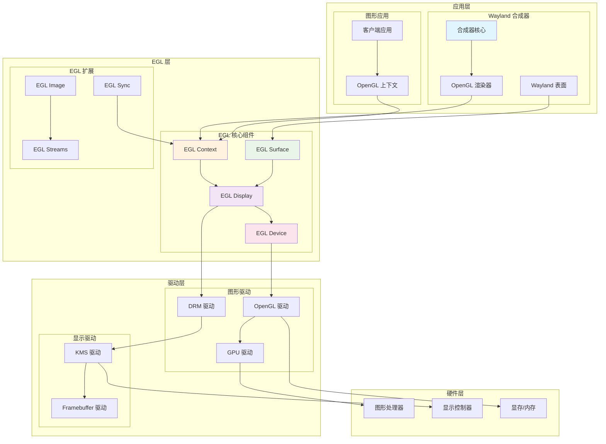
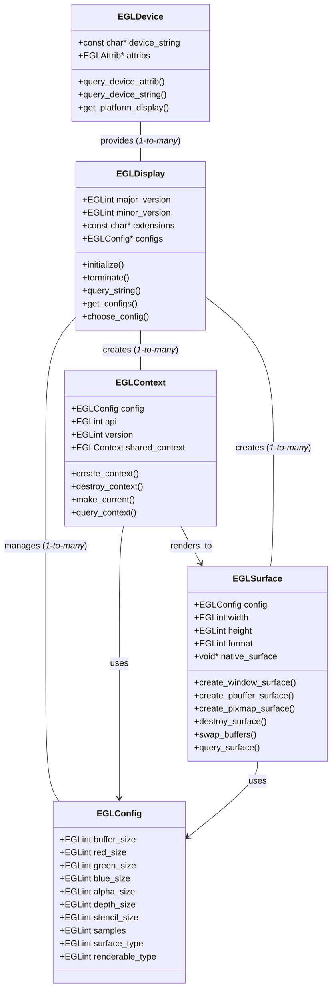
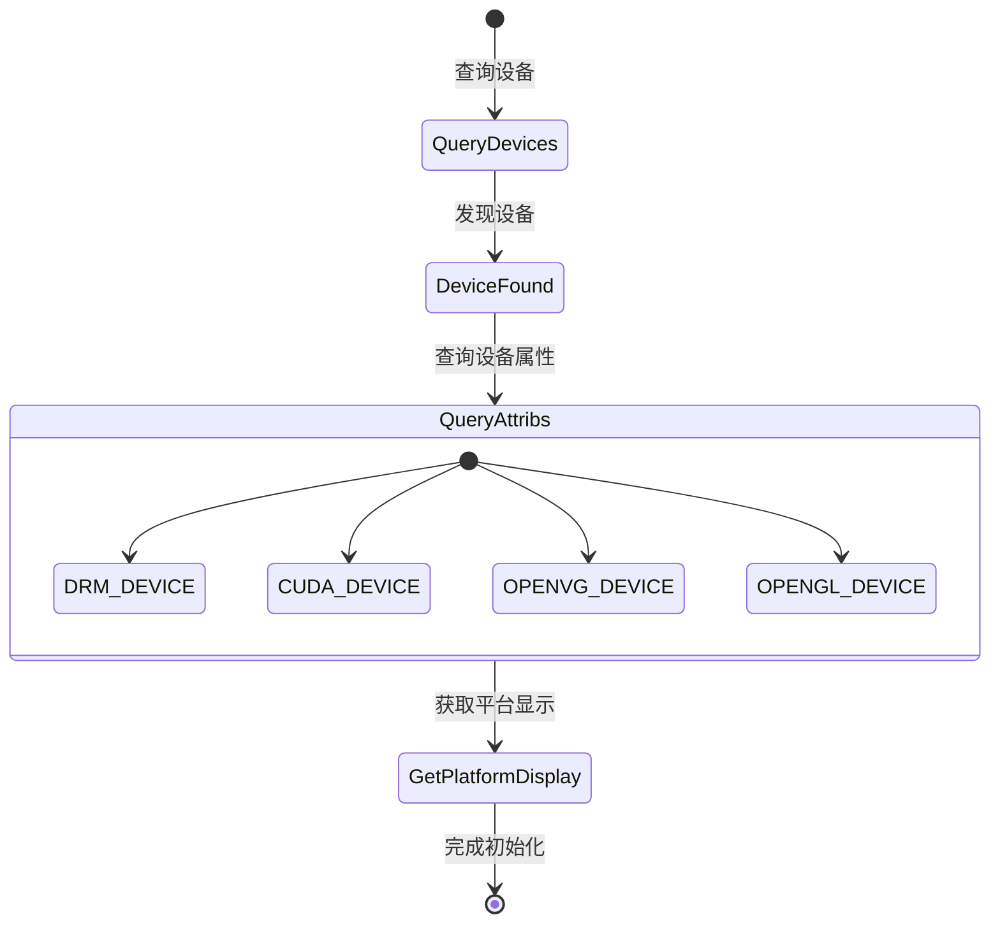
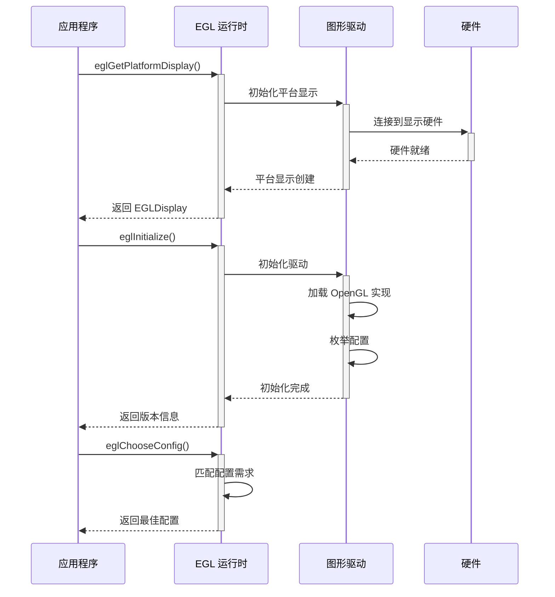
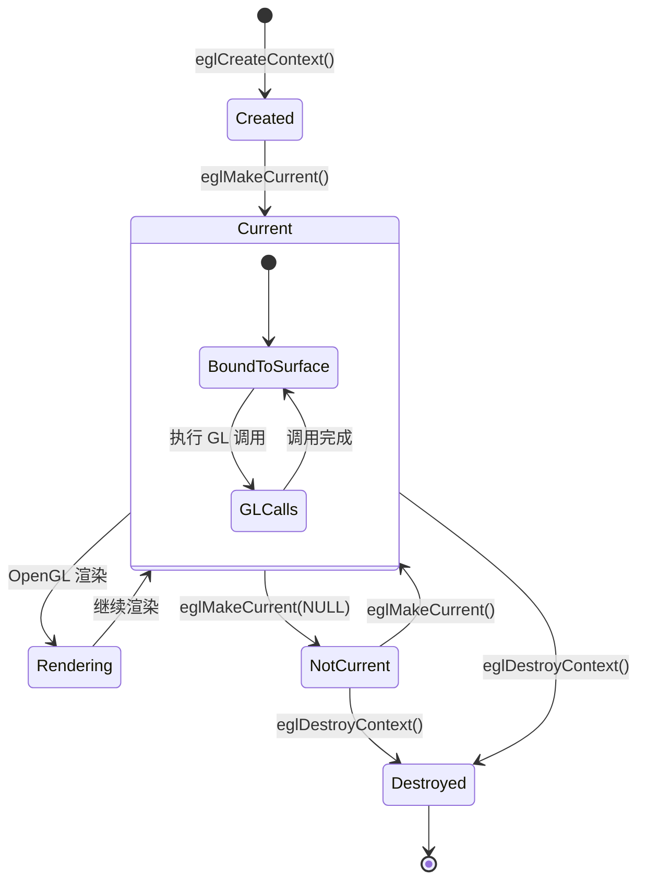
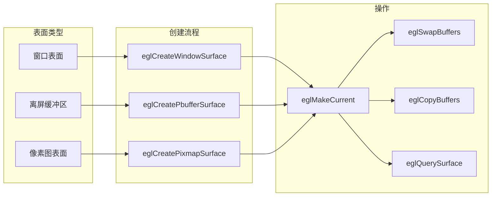
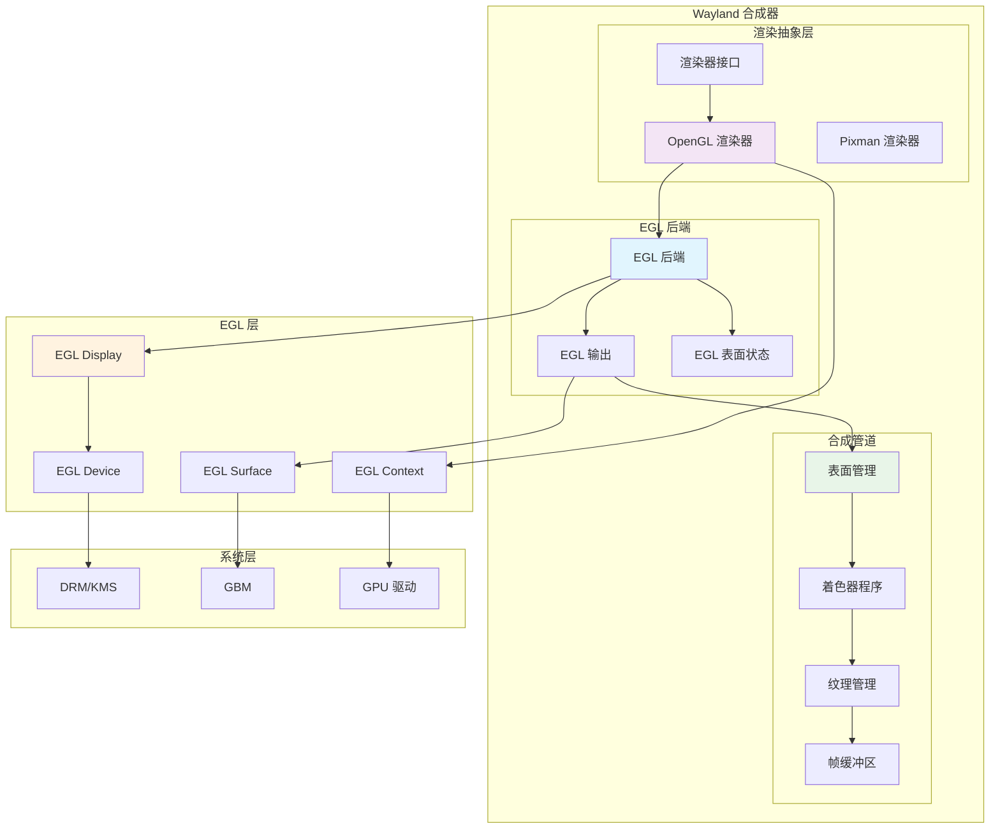

# EGL 图形接口与 Wayland 合成器开发指南

## 概述

EGL (Embedded-System Graphics Library) 是一个用于管理图形上下文、表面和渲染的跨平台 API。它作为 OpenGL ES、OpenVG 和其他图形 API 与底层原生平台窗口系统之间的接口层。对于 Wayland 合成器开发者来说，EGL 是实现硬件加速渲染的核心组件，提供了高效的 GPU 渲染能力和与显示系统的集成。

EGL 的主要优势包括：跨平台兼容性、硬件加速支持、多种渲染 API 集成、灵活的表面管理以及高效的资源共享机制。

## 技术架构

### 整体架构图



### EGL 核心组件关系



## 核心组件详解

### EGLDevice - 设备抽象



#### EGLDevice 实现

```c
#include <EGL/egl.h>
#include <EGL/eglext.h>
#include <stdio.h>
#include <stdlib.h>

// EGL 设备管理结构
struct egl_device_manager {
    EGLDeviceEXT *devices;
    EGLint device_count;
    EGLDeviceEXT selected_device;
    
    // 函数指针
    PFNEGLQUERYDEVICESEXTPROC eglQueryDevicesEXT;
    PFNEGLQUERYDEVICEATTRIBEXTPROC eglQueryDeviceAttribEXT;
    PFNEGLQUERYDEVICESTRINGEXTPROC eglQueryDeviceStringEXT;
    PFNEGLGETPLATFORMDISPLAYEXTPROC eglGetPlatformDisplayEXT;
};

// 初始化 EGL 设备管理器
struct egl_device_manager *egl_device_manager_create() {
    struct egl_device_manager *manager;
    
    manager = calloc(1, sizeof(*manager));
    if (!manager)
        return NULL;
    
    // 获取扩展函数指针
    manager->eglQueryDevicesEXT = 
        (PFNEGLQUERYDEVICESEXTPROC)eglGetProcAddress("eglQueryDevicesEXT");
    manager->eglQueryDeviceAttribEXT = 
        (PFNEGLQUERYDEVICEATTRIBEXTPROC)eglGetProcAddress("eglQueryDeviceAttribEXT");
    manager->eglQueryDeviceStringEXT = 
        (PFNEGLQUERYDEVICESTRINGEXTPROC)eglGetProcAddress("eglQueryDeviceStringEXT");
    manager->eglGetPlatformDisplayEXT = 
        (PFNEGLGETPLATFORMDISPLAYEXTPROC)eglGetProcAddress("eglGetPlatformDisplayEXT");
    
    if (!manager->eglQueryDevicesEXT || !manager->eglQueryDeviceAttribEXT) {
        printf("EGL_EXT_device_enumeration not supported\n");
        free(manager);
        return NULL;
    }
    
    return manager;
}

// 枚举 EGL 设备
EGLBoolean egl_enumerate_devices(struct egl_device_manager *manager) {
    // 首先获取设备数量
    if (!manager->eglQueryDevicesEXT(0, NULL, &manager->device_count)) {
        printf("Failed to query device count\n");
        return EGL_FALSE;
    }
    
    if (manager->device_count == 0) {
        printf("No EGL devices found\n");
        return EGL_FALSE;
    }
    
    // 分配设备数组
    manager->devices = malloc(manager->device_count * sizeof(EGLDeviceEXT));
    if (!manager->devices)
        return EGL_FALSE;
    
    // 获取设备列表
    if (!manager->eglQueryDevicesEXT(manager->device_count, manager->devices, 
                                   &manager->device_count)) {
        printf("Failed to enumerate devices\n");
        free(manager->devices);
        return EGL_FALSE;
    }
    
    return EGL_TRUE;
}

// 查询设备信息
void egl_query_device_info(struct egl_device_manager *manager, EGLDeviceEXT device) {
    const char *device_string;
    EGLAttrib drm_fd;
    
    // 查询设备字符串
    device_string = manager->eglQueryDeviceStringEXT(device, EGL_DRM_DEVICE_FILE_EXT);
    if (device_string) {
        printf("DRM device: %s\n", device_string);
    }
    
    device_string = manager->eglQueryDeviceStringEXT(device, EGL_EXTENSIONS);
    if (device_string) {
        printf("Device extensions: %s\n", device_string);
    }
    
    // 查询 DRM 文件描述符
    if (manager->eglQueryDeviceAttribEXT(device, EGL_DRM_MASTER_FD_EXT, &drm_fd)) {
        printf("DRM master FD: %ld\n", drm_fd);
    }
}

// 选择最佳设备
EGLDeviceEXT egl_select_best_device(struct egl_device_manager *manager) {
    for (EGLint i = 0; i < manager->device_count; i++) {
        EGLDeviceEXT device = manager->devices[i];
        const char *extensions;
        
        extensions = manager->eglQueryDeviceStringEXT(device, EGL_EXTENSIONS);
        
        // 优先选择支持 DRM 的设备
        if (extensions && strstr(extensions, "EGL_EXT_device_drm")) {
            const char *drm_device = manager->eglQueryDeviceStringEXT(device, 
                                                                     EGL_DRM_DEVICE_FILE_EXT);
            if (drm_device) {
                printf("Selected DRM device: %s\n", drm_device);
                manager->selected_device = device;
                return device;
            }
        }
    }
    
    // 如果没有找到 DRM 设备，使用第一个设备
    if (manager->device_count > 0) {
        manager->selected_device = manager->devices[0];
        return manager->devices[0];
    }
    
    return EGL_NO_DEVICE_EXT;
}
```

### EGLDisplay - 显示管理



#### EGLDisplay 实现

```c
// EGL 显示管理结构
struct egl_display_manager {
    EGLDisplay display;
    EGLint major, minor;
    const char *extensions;
    const char *vendor;
    const char *version;
    
    EGLConfig *configs;
    EGLint config_count;
    EGLConfig selected_config;
    
    // 平台特定信息
    int drm_fd;
    struct gbm_device *gbm_device;
    
    // 扩展函数
    PFNEGLCREATEPLATFORMWINDOWSURFACEEXTPROC eglCreatePlatformWindowSurfaceEXT;
    PFNEGLCREATEPLATFORMPIXMAPSURFACEEXTPROC eglCreatePlatformPixmapSurfaceEXT;
};

// 创建平台显示
struct egl_display_manager *egl_display_create(EGLDeviceEXT device, int drm_fd) {
    struct egl_display_manager *display_mgr;
    EGLAttrib display_attribs[] = {
        EGL_DRM_MASTER_FD_EXT, drm_fd,
        EGL_NONE
    };
    
    display_mgr = calloc(1, sizeof(*display_mgr));
    if (!display_mgr)
        return NULL;
    
    display_mgr->drm_fd = drm_fd;
    
    // 获取平台显示
    PFNEGLGETPLATFORMDISPLAYEXTPROC eglGetPlatformDisplayEXT = 
        (PFNEGLGETPLATFORMDISPLAYEXTPROC)eglGetProcAddress("eglGetPlatformDisplayEXT");
    
    if (device != EGL_NO_DEVICE_EXT) {
        display_mgr->display = eglGetPlatformDisplayEXT(EGL_PLATFORM_DEVICE_EXT,
                                                       device, display_attribs);
    } else {
        display_mgr->display = eglGetPlatformDisplayEXT(EGL_PLATFORM_GBM_KHR,
                                                       display_mgr->gbm_device, NULL);
    }
    
    if (display_mgr->display == EGL_NO_DISPLAY) {
        printf("Failed to get platform display\n");
        free(display_mgr);
        return NULL;
    }
    
    return display_mgr;
}

// 初始化 EGL 显示
EGLBoolean egl_display_initialize(struct egl_display_manager *display_mgr) {
    // 初始化 EGL
    if (!eglInitialize(display_mgr->display, &display_mgr->major, &display_mgr->minor)) {
        printf("Failed to initialize EGL: %s\n", egl_error_string(eglGetError()));
        return EGL_FALSE;
    }
    
    printf("EGL version: %d.%d\n", display_mgr->major, display_mgr->minor);
    
    // 获取显示信息
    display_mgr->vendor = eglQueryString(display_mgr->display, EGL_VENDOR);
    display_mgr->version = eglQueryString(display_mgr->display, EGL_VERSION);
    display_mgr->extensions = eglQueryString(display_mgr->display, EGL_EXTENSIONS);
    
    printf("EGL vendor: %s\n", display_mgr->vendor);
    printf("EGL version: %s\n", display_mgr->version);
    printf("EGL extensions: %s\n", display_mgr->extensions);
    
    // 获取扩展函数
    display_mgr->eglCreatePlatformWindowSurfaceEXT = 
        (PFNEGLCREATEPLATFORMWINDOWSURFACEEXTPROC)
        eglGetProcAddress("eglCreatePlatformWindowSurfaceEXT");
    
    return EGL_TRUE;
}

// 枚举配置
EGLBoolean egl_display_enumerate_configs(struct egl_display_manager *display_mgr) {
    // 获取配置数量
    if (!eglGetConfigs(display_mgr->display, NULL, 0, &display_mgr->config_count)) {
        printf("Failed to get config count\n");
        return EGL_FALSE;
    }
    
    // 分配配置数组
    display_mgr->configs = malloc(display_mgr->config_count * sizeof(EGLConfig));
    if (!display_mgr->configs)
        return EGL_FALSE;
    
    // 获取所有配置
    if (!eglGetConfigs(display_mgr->display, display_mgr->configs,
                      display_mgr->config_count, &display_mgr->config_count)) {
        printf("Failed to get configs\n");
        free(display_mgr->configs);
        return EGL_FALSE;
    }
    
    printf("Found %d EGL configs\n", display_mgr->config_count);
    return EGL_TRUE;
}

// 选择最佳配置
EGLConfig egl_display_choose_config(struct egl_display_manager *display_mgr,
                                   const EGLint *desired_attribs) {
    EGLConfig configs[64];
    EGLint config_count;
    
    // 使用 eglChooseConfig 查找匹配的配置
    if (!eglChooseConfig(display_mgr->display, desired_attribs,
                        configs, 64, &config_count)) {
        printf("eglChooseConfig failed\n");
        return NULL;
    }
    
    if (config_count == 0) {
        printf("No matching EGL config found\n");
        return NULL;
    }
    
    // 选择第一个匹配的配置
    display_mgr->selected_config = configs[0];
    
    // 打印配置信息
    egl_print_config_info(display_mgr->display, configs[0]);
    
    return configs[0];
}

// 打印配置信息
void egl_print_config_info(EGLDisplay display, EGLConfig config) {
    EGLint value;
    
    printf("EGL Config info:\n");
    
    eglGetConfigAttrib(display, config, EGL_BUFFER_SIZE, &value);
    printf("  Buffer size: %d\n", value);
    
    eglGetConfigAttrib(display, config, EGL_RED_SIZE, &value);
    printf("  Red size: %d\n", value);
    
    eglGetConfigAttrib(display, config, EGL_GREEN_SIZE, &value);
    printf("  Green size: %d\n", value);
    
    eglGetConfigAttrib(display, config, EGL_BLUE_SIZE, &value);
    printf("  Blue size: %d\n", value);
    
    eglGetConfigAttrib(display, config, EGL_ALPHA_SIZE, &value);
    printf("  Alpha size: %d\n", value);
    
    eglGetConfigAttrib(display, config, EGL_DEPTH_SIZE, &value);
    printf("  Depth size: %d\n", value);
    
    eglGetConfigAttrib(display, config, EGL_STENCIL_SIZE, &value);
    printf("  Stencil size: %d\n", value);
    
    eglGetConfigAttrib(display, config, EGL_SAMPLES, &value);
    printf("  Samples: %d\n", value);
    
    eglGetConfigAttrib(display, config, EGL_SURFACE_TYPE, &value);
    printf("  Surface type: 0x%x\n", value);
    
    eglGetConfigAttrib(display, config, EGL_RENDERABLE_TYPE, &value);
    printf("  Renderable type: 0x%x\n", value);
}
```

### EGLContext - 渲染上下文



#### EGLContext 实现

```c
// EGL 上下文管理结构
struct egl_context_manager {
    EGLDisplay display;
    EGLConfig config;
    EGLContext context;
    EGLContext shared_context;
    
    // 上下文属性
    EGLint api;
    EGLint major_version;
    EGLint minor_version;
    EGLint profile_mask;
    EGLint context_flags;
    
    // 当前绑定的表面
    EGLSurface current_draw_surface;
    EGLSurface current_read_surface;
    
    // OpenGL 信息
    const char *gl_vendor;
    const char *gl_renderer;
    const char *gl_version;
    const char *gl_extensions;
};

// 创建 EGL 上下文
struct egl_context_manager *egl_context_create(EGLDisplay display, EGLConfig config,
                                              EGLContext shared_context,
                                              EGLint api, EGLint major, EGLint minor) {
    struct egl_context_manager *ctx_mgr;
    EGLint context_attribs[] = {
        EGL_CONTEXT_MAJOR_VERSION, major,
        EGL_CONTEXT_MINOR_VERSION, minor,
        EGL_CONTEXT_OPENGL_PROFILE_MASK, EGL_CONTEXT_OPENGL_CORE_PROFILE_BIT,
        EGL_CONTEXT_FLAGS_KHR, EGL_CONTEXT_OPENGL_DEBUG_BIT_KHR,
        EGL_NONE
    };
    
    ctx_mgr = calloc(1, sizeof(*ctx_mgr));
    if (!ctx_mgr)
        return NULL;
    
    ctx_mgr->display = display;
    ctx_mgr->config = config;
    ctx_mgr->shared_context = shared_context;
    ctx_mgr->api = api;
    ctx_mgr->major_version = major;
    ctx_mgr->minor_version = minor;
    
    // 绑定 OpenGL API
    if (!eglBindAPI(api)) {
        printf("Failed to bind API: %s\n", egl_error_string(eglGetError()));
        free(ctx_mgr);
        return NULL;
    }
    
    // 创建上下文
    ctx_mgr->context = eglCreateContext(display, config, shared_context, context_attribs);
    if (ctx_mgr->context == EGL_NO_CONTEXT) {
        printf("Failed to create EGL context: %s\n", egl_error_string(eglGetError()));
        free(ctx_mgr);
        return NULL;
    }
    
    printf("Created EGL context for OpenGL %d.%d\n", major, minor);
    return ctx_mgr;
}

// 激活上下文
EGLBoolean egl_context_make_current(struct egl_context_manager *ctx_mgr,
                                   EGLSurface draw_surface, EGLSurface read_surface) {
    if (!eglMakeCurrent(ctx_mgr->display, draw_surface, read_surface, ctx_mgr->context)) {
        printf("Failed to make context current: %s\n", egl_error_string(eglGetError()));
        return EGL_FALSE;
    }
    
    ctx_mgr->current_draw_surface = draw_surface;
    ctx_mgr->current_read_surface = read_surface;
    
    // 第一次激活时获取 OpenGL 信息
    if (!ctx_mgr->gl_vendor) {
        ctx_mgr->gl_vendor = (const char*)glGetString(GL_VENDOR);
        ctx_mgr->gl_renderer = (const char*)glGetString(GL_RENDERER);
        ctx_mgr->gl_version = (const char*)glGetString(GL_VERSION);
        ctx_mgr->gl_extensions = (const char*)glGetString(GL_EXTENSIONS);
        
        printf("OpenGL vendor: %s\n", ctx_mgr->gl_vendor);
        printf("OpenGL renderer: %s\n", ctx_mgr->gl_renderer);
        printf("OpenGL version: %s\n", ctx_mgr->gl_version);
    }
    
    return EGL_TRUE;
}

// 查询上下文属性
EGLint egl_context_query_attrib(struct egl_context_manager *ctx_mgr, EGLint attribute) {
    EGLint value;
    
    if (!eglQueryContext(ctx_mgr->display, ctx_mgr->context, attribute, &value)) {
        printf("Failed to query context attribute: %s\n", egl_error_string(eglGetError()));
        return -1;
    }
    
    return value;
}

// 上下文共享示例
struct egl_context_manager *egl_context_create_shared(struct egl_context_manager *main_ctx,
                                                     EGLConfig config) {
    return egl_context_create(main_ctx->display, config, main_ctx->context,
                             main_ctx->api, main_ctx->major_version, main_ctx->minor_version);
}

// 销毁上下文
void egl_context_destroy(struct egl_context_manager *ctx_mgr) {
    if (ctx_mgr->context != EGL_NO_CONTEXT) {
        // 取消当前绑定
        eglMakeCurrent(ctx_mgr->display, EGL_NO_SURFACE, EGL_NO_SURFACE, EGL_NO_CONTEXT);
        
        // 销毁上下文
        eglDestroyContext(ctx_mgr->display, ctx_mgr->context);
    }
    
    free(ctx_mgr);
}
```

### EGLSurface - 渲染表面



#### EGLSurface 实现

```c
// EGL 表面管理结构
struct egl_surface_manager {
    EGLDisplay display;
    EGLConfig config;
    EGLSurface surface;
    
    // 表面类型和属性
    EGLint surface_type;
    EGLint width, height;
    EGLint format;
    EGLint swap_behavior;
    EGLint multisample_resolve;
    
    // 原生表面
    void *native_surface;
    
    // Wayland 特定
    struct wl_surface *wl_surface;
    struct wl_egl_window *egl_window;
    
    // GBM 特定
    struct gbm_surface *gbm_surface;
    struct gbm_bo *current_bo;
    struct gbm_bo *previous_bo;
};

// 创建窗口表面 (Wayland)
struct egl_surface_manager *egl_surface_create_window_wayland(EGLDisplay display,
                                                             EGLConfig config,
                                                             struct wl_surface *wl_surface,
                                                             int width, int height) {
    struct egl_surface_manager *surf_mgr;
    EGLint surface_attribs[] = {
        EGL_RENDER_BUFFER, EGL_BACK_BUFFER,
        EGL_NONE
    };
    
    surf_mgr = calloc(1, sizeof(*surf_mgr));
    if (!surf_mgr)
        return NULL;
    
    surf_mgr->display = display;
    surf_mgr->config = config;
    surf_mgr->wl_surface = wl_surface;
    surf_mgr->width = width;
    surf_mgr->height = height;
    
    // 创建 Wayland EGL 窗口
    surf_mgr->egl_window = wl_egl_window_create(wl_surface, width, height);
    if (!surf_mgr->egl_window) {
        printf("Failed to create Wayland EGL window\n");
        free(surf_mgr);
        return NULL;
    }
    
    // 创建 EGL 表面
    surf_mgr->surface = eglCreateWindowSurface(display, config,
                                              (EGLNativeWindowType)surf_mgr->egl_window,
                                              surface_attribs);
    if (surf_mgr->surface == EGL_NO_SURFACE) {
        printf("Failed to create EGL window surface: %s\n", egl_error_string(eglGetError()));
        wl_egl_window_destroy(surf_mgr->egl_window);
        free(surf_mgr);
        return NULL;
    }
    
    surf_mgr->surface_type = EGL_WINDOW_BIT;
    return surf_mgr;
}

// 创建 GBM 表面
struct egl_surface_manager *egl_surface_create_gbm(EGLDisplay display, EGLConfig config,
                                                   struct gbm_device *gbm_device,
                                                   int width, int height, uint32_t format) {
    struct egl_surface_manager *surf_mgr;
    
    surf_mgr = calloc(1, sizeof(*surf_mgr));
    if (!surf_mgr)
        return NULL;
    
    surf_mgr->display = display;
    surf_mgr->config = config;
    surf_mgr->width = width;
    surf_mgr->height = height;
    
    // 创建 GBM 表面
    surf_mgr->gbm_surface = gbm_surface_create(gbm_device, width, height,
                                              format, GBM_BO_USE_RENDERING | GBM_BO_USE_SCANOUT);
    if (!surf_mgr->gbm_surface) {
        printf("Failed to create GBM surface\n");
        free(surf_mgr);
        return NULL;
    }
    
    // 创建 EGL 表面
    surf_mgr->surface = eglCreateWindowSurface(display, config,
                                              (EGLNativeWindowType)surf_mgr->gbm_surface, NULL);
    if (surf_mgr->surface == EGL_NO_SURFACE) {
        printf("Failed to create EGL GBM surface: %s\n", egl_error_string(eglGetError()));
        gbm_surface_destroy(surf_mgr->gbm_surface);
        free(surf_mgr);
        return NULL;
    }
    
    surf_mgr->surface_type = EGL_WINDOW_BIT;
    return surf_mgr;
}

// 创建离屏缓冲区表面
struct egl_surface_manager *egl_surface_create_pbuffer(EGLDisplay display, EGLConfig config,
                                                       int width, int height) {
    struct egl_surface_manager *surf_mgr;
    EGLint pbuffer_attribs[] = {
        EGL_WIDTH, width,
        EGL_HEIGHT, height,
        EGL_LARGEST_PBUFFER, EGL_FALSE,
        EGL_TEXTURE_FORMAT, EGL_NO_TEXTURE,
        EGL_TEXTURE_TARGET, EGL_NO_TEXTURE,
        EGL_MIPMAP_TEXTURE, EGL_FALSE,
        EGL_NONE
    };
    
    surf_mgr = calloc(1, sizeof(*surf_mgr));
    if (!surf_mgr)
        return NULL;
    
    surf_mgr->display = display;
    surf_mgr->config = config;
    surf_mgr->width = width;
    surf_mgr->height = height;
    
    // 创建 PBuffer 表面
    surf_mgr->surface = eglCreatePbufferSurface(display, config, pbuffer_attribs);
    if (surf_mgr->surface == EGL_NO_SURFACE) {
        printf("Failed to create EGL pbuffer surface: %s\n", egl_error_string(eglGetError()));
        free(surf_mgr);
        return NULL;
    }
    
    surf_mgr->surface_type = EGL_PBUFFER_BIT;
    
    // 查询实际大小
    eglQuerySurface(display, surf_mgr->surface, EGL_WIDTH, &surf_mgr->width);
    eglQuerySurface(display, surf_mgr->surface, EGL_HEIGHT, &surf_mgr->height);
    
    printf("Created pbuffer surface: %dx%d\n", surf_mgr->width, surf_mgr->height);
    
    return surf_mgr;
}

// 调整表面大小
EGLBoolean egl_surface_resize(struct egl_surface_manager *surf_mgr, int width, int height) {
    if (surf_mgr->surface_type == EGL_WINDOW_BIT && surf_mgr->egl_window) {
        // Wayland EGL 窗口调整大小
        wl_egl_window_resize(surf_mgr->egl_window, width, height, 0, 0);
        surf_mgr->width = width;
        surf_mgr->height = height;
        return EGL_TRUE;
    }
    
    return EGL_FALSE;
}

// 交换缓冲区
EGLBoolean egl_surface_swap_buffers(struct egl_surface_manager *surf_mgr) {
    if (surf_mgr->surface_type != EGL_WINDOW_BIT) {
        printf("Cannot swap buffers on non-window surface\n");
        return EGL_FALSE;
    }
    
    if (!eglSwapBuffers(surf_mgr->display, surf_mgr->surface)) {
        printf("Failed to swap buffers: %s\n", egl_error_string(eglGetError()));
        return EGL_FALSE;
    }
    
    // GBM 表面处理
    if (surf_mgr->gbm_surface) {
        surf_mgr->previous_bo = surf_mgr->current_bo;
        surf_mgr->current_bo = gbm_surface_lock_front_buffer(surf_mgr->gbm_surface);
        
        if (!surf_mgr->current_bo) {
            printf("Failed to lock front buffer\n");
            return EGL_FALSE;
        }
    }
    
    return EGL_TRUE;
}

// 查询表面属性
EGLint egl_surface_query_attrib(struct egl_surface_manager *surf_mgr, EGLint attribute) {
    EGLint value;
    
    if (!eglQuerySurface(surf_mgr->display, surf_mgr->surface, attribute, &value)) {
        printf("Failed to query surface attribute: %s\n", egl_error_string(eglGetError()));
        return -1;
    }
    
    return value;
}

// 销毁表面
void egl_surface_destroy(struct egl_surface_manager *surf_mgr) {
    if (surf_mgr->surface != EGL_NO_SURFACE) {
        eglDestroySurface(surf_mgr->display, surf_mgr->surface);
    }
    
    if (surf_mgr->egl_window) {
        wl_egl_window_destroy(surf_mgr->egl_window);
    }
    
    if (surf_mgr->gbm_surface) {
        if (surf_mgr->current_bo) {
            gbm_surface_release_buffer(surf_mgr->gbm_surface, surf_mgr->current_bo);
        }
        if (surf_mgr->previous_bo) {
            gbm_surface_release_buffer(surf_mgr->gbm_surface, surf_mgr->previous_bo);
        }
        gbm_surface_destroy(surf_mgr->gbm_surface);
    }
    
    free(surf_mgr);
}
```

## Wayland 合成器 EGL 集成

### EGL 渲染后端架构



### 完整的 Wayland 合成器 EGL 实现

```c
// Wayland 合成器 EGL 后端
struct compositor_egl_backend {
    struct compositor *compositor;
    
    // EGL 组件
    struct egl_device_manager *device_mgr;
    struct egl_display_manager *display_mgr;
    struct egl_context_manager *context_mgr;
    
    // DRM/GBM
    int drm_fd;
    struct gbm_device *gbm_device;
    
    // 输出列表
    struct wl_list output_list;
    
    // 共享资源
    GLuint vertex_shader;
    GLuint fragment_shader;
    GLuint program;
    
    // 纹理缓存
    struct wl_list texture_cache;
};

// EGL 输出
struct compositor_egl_output {
    struct compositor_output base;
    struct compositor_egl_backend *backend;
    struct wl_list link;
    
    // EGL 表面
    struct egl_surface_manager *surface_mgr;
    
    // DRM 相关
    uint32_t crtc_id;
    uint32_t connector_id;
    drmModeModeInfo mode;
    
    // 渲染状态
    GLuint framebuffer;
    GLuint color_texture;
    GLuint depth_texture;
    
    // 页面翻转
    bool page_flip_pending;
    struct gbm_bo *next_bo;
};

// 初始化 EGL 后端
struct compositor_egl_backend *compositor_egl_backend_create(struct compositor *comp,
                                                           const char *drm_device) {
    struct compositor_egl_backend *backend;
    EGLDeviceEXT device;
    
    backend = calloc(1, sizeof(*backend));
    if (!backend)
        return NULL;
    
    backend->compositor = comp;
    wl_list_init(&backend->output_list);
    wl_list_init(&backend->texture_cache);
    
    // 打开 DRM 设备
    backend->drm_fd = open(drm_device, O_RDWR | O_CLOEXEC);
    if (backend->drm_fd < 0) {
        printf("Failed to open DRM device: %s\n", drm_device);
        goto error;
    }
    
    // 创建 GBM 设备
    backend->gbm_device = gbm_create_device(backend->drm_fd);
    if (!backend->gbm_device) {
        printf("Failed to create GBM device\n");
        goto error;
    }
    
    // 初始化 EGL 设备
    backend->device_mgr = egl_device_manager_create();
    if (!backend->device_mgr) {
        printf("Failed to create EGL device manager\n");
        goto error;
    }
    
    if (!egl_enumerate_devices(backend->device_mgr)) {
        printf("Failed to enumerate EGL devices\n");
        goto error;
    }
    
    device = egl_select_best_device(backend->device_mgr);
    if (device == EGL_NO_DEVICE_EXT) {
        printf("No suitable EGL device found\n");
        goto error;
    }
    
    // 创建 EGL 显示
    backend->display_mgr = egl_display_create(device, backend->drm_fd);
    if (!backend->display_mgr) {
        printf("Failed to create EGL display\n");
        goto error;
    }
    
    if (!egl_display_initialize(backend->display_mgr)) {
        printf("Failed to initialize EGL display\n");
        goto error;
    }
    
    // 选择 EGL 配置
    EGLint config_attribs[] = {
        EGL_SURFACE_TYPE, EGL_WINDOW_BIT,
        EGL_RENDERABLE_TYPE, EGL_OPENGL_ES2_BIT,
        EGL_RED_SIZE, 8,
        EGL_GREEN_SIZE, 8,
        EGL_BLUE_SIZE, 8,
        EGL_ALPHA_SIZE, 8,
        EGL_DEPTH_SIZE, 24,
        EGL_STENCIL_SIZE, 8,
        EGL_NONE
    };
    
    EGLConfig config = egl_display_choose_config(backend->display_mgr, config_attribs);
    if (!config) {
        printf("Failed to choose EGL config\n");
        goto error;
    }
    
    // 创建 EGL 上下文
    backend->context_mgr = egl_context_create(backend->display_mgr->display, config,
                                            EGL_NO_CONTEXT, EGL_OPENGL_ES_API, 2, 0);
    if (!backend->context_mgr) {
        printf("Failed to create EGL context\n");
        goto error;
    }
    
    // 初始化 OpenGL 资源
    if (!compositor_egl_init_gl_resources(backend)) {
        printf("Failed to initialize OpenGL resources\n");
        goto error;
    }
    
    return backend;

error:
    compositor_egl_backend_destroy(backend);
    return NULL;
}

// 初始化 OpenGL 资源
EGLBoolean compositor_egl_init_gl_resources(struct compositor_egl_backend *backend) {
    // 激活上下文
    if (!egl_context_make_current(backend->context_mgr, EGL_NO_SURFACE, EGL_NO_SURFACE)) {
        return EGL_FALSE;
    }
    
    // 创建着色器程序
    const char *vertex_shader_source = 
        "#version 100\n"
        "attribute vec2 position;\n"
        "attribute vec2 texcoord;\n"
        "varying vec2 v_texcoord;\n"
        "uniform mat4 projection;\n"
        "void main() {\n"
        "    gl_Position = projection * vec4(position, 0.0, 1.0);\n"
        "    v_texcoord = texcoord;\n"
        "}\n";
    
    const char *fragment_shader_source = 
        "#version 100\n"
        "precision mediump float;\n"
        "varying vec2 v_texcoord;\n"
        "uniform sampler2D texture;\n"
        "uniform float alpha;\n"
        "void main() {\n"
        "    gl_FragColor = texture2D(texture, v_texcoord) * alpha;\n"
        "}\n";
    
    backend->vertex_shader = compile_shader(GL_VERTEX_SHADER, vertex_shader_source);
    backend->fragment_shader = compile_shader(GL_FRAGMENT_SHADER, fragment_shader_source);
    
    if (!backend->vertex_shader || !backend->fragment_shader) {
        return EGL_FALSE;
    }
    
    backend->program = link_program(backend->vertex_shader, backend->fragment_shader);
    if (!backend->program) {
        return EGL_FALSE;
    }
    
    return EGL_TRUE;
}

// 创建输出
struct compositor_egl_output *compositor_egl_output_create(struct compositor_egl_backend *backend,
                                                          uint32_t crtc_id, uint32_t connector_id,
                                                          drmModeModeInfo *mode) {
    struct compositor_egl_output *output;
    
    output = calloc(1, sizeof(*output));
    if (!output)
        return NULL;
    
    output->backend = backend;
    output->crtc_id = crtc_id;
    output->connector_id = connector_id;
    output->mode = *mode;
    
    // 创建 GBM 表面
    output->surface_mgr = egl_surface_create_gbm(backend->display_mgr->display,
                                               backend->display_mgr->selected_config,
                                               backend->gbm_device,
                                               mode->hdisplay, mode->vdisplay,
                                               GBM_FORMAT_XRGB8888);
    if (!output->surface_mgr) {
        printf("Failed to create GBM surface for output\n");
        free(output);
        return NULL;
    }
    
    // 初始化渲染资源
    if (!compositor_egl_output_init_render_resources(output)) {
        printf("Failed to initialize output render resources\n");
        egl_surface_destroy(output->surface_mgr);
        free(output);
        return NULL;
    }
    
    wl_list_insert(&backend->output_list, &output->link);
    
    return output;
}

// 渲染帧
void compositor_egl_output_render_frame(struct compositor_egl_output *output) {
    struct compositor_egl_backend *backend = output->backend;
    struct surface *surface;
    
    // 激活上下文和表面
    if (!egl_context_make_current(backend->context_mgr, output->surface_mgr->surface,
                                 output->surface_mgr->surface)) {
        printf("Failed to make context current\n");
        return;
    }
    
    // 设置视口
    glViewport(0, 0, output->surface_mgr->width, output->surface_mgr->height);
    
    // 清空帧缓冲区
    glClear(GL_COLOR_BUFFER_BIT | GL_DEPTH_BUFFER_BIT);
    
    // 设置投影矩阵
    float projection[16];
    matrix_orthographic(projection, 0, output->surface_mgr->width,
                       output->surface_mgr->height, 0, -1, 1);
    
    glUseProgram(backend->program);
    glUniformMatrix4fv(glGetUniformLocation(backend->program, "projection"),
                      1, GL_FALSE, projection);
    
    // 渲染所有表面
    wl_list_for_each_reverse(surface, &backend->compositor->surface_list, link) {
        if (surface_is_visible(surface, &output->base)) {
            compositor_egl_render_surface(backend, surface);
        }
    }
    
    // 交换缓冲区
    if (!egl_surface_swap_buffers(output->surface_mgr)) {
        printf("Failed to swap buffers\n");
        return;
    }
    
    // 提交到显示
    compositor_egl_output_page_flip(output);
}

// 页面翻转
void compositor_egl_output_page_flip(struct compositor_egl_output *output) {
    struct gbm_bo *bo = output->surface_mgr->current_bo;
    uint32_t fb_id;
    
    if (!bo) {
        printf("No buffer available for page flip\n");
        return;
    }
    
    // 获取帧缓冲 ID
    fb_id = gbm_bo_get_user_data(bo);
    if (!fb_id) {
        // 创建新的帧缓冲
        uint32_t handle = gbm_bo_get_handle(bo).u32;
        uint32_t width = gbm_bo_get_width(bo);
        uint32_t height = gbm_bo_get_height(bo);
        uint32_t stride = gbm_bo_get_stride(bo);
        
        drmModeAddFB(output->backend->drm_fd, width, height, 24, 32,
                    stride, handle, &fb_id);
        gbm_bo_set_user_data(bo, (void*)(uintptr_t)fb_id, drm_fb_destroy_callback);
    }
    
    // 执行页面翻转
    if (drmModePageFlip(output->backend->drm_fd, output->crtc_id, fb_id,
                       DRM_MODE_PAGE_FLIP_EVENT, output) == 0) {
        output->page_flip_pending = true;
        output->next_bo = bo;
    }
}

// 错误处理函数
const char *egl_error_string(EGLenum error) {
    switch (error) {
    case EGL_SUCCESS: return "EGL_SUCCESS";
    case EGL_NOT_INITIALIZED: return "EGL_NOT_INITIALIZED";
    case EGL_BAD_ACCESS: return "EGL_BAD_ACCESS";
    case EGL_BAD_ALLOC: return "EGL_BAD_ALLOC";
    case EGL_BAD_ATTRIBUTE: return "EGL_BAD_ATTRIBUTE";
    case EGL_BAD_CONFIG: return "EGL_BAD_CONFIG";
    case EGL_BAD_CONTEXT: return "EGL_BAD_CONTEXT";
    case EGL_BAD_CURRENT_SURFACE: return "EGL_BAD_CURRENT_SURFACE";
    case EGL_BAD_DISPLAY: return "EGL_BAD_DISPLAY";
    case EGL_BAD_MATCH: return "EGL_BAD_MATCH";
    case EGL_BAD_NATIVE_PIXMAP: return "EGL_BAD_NATIVE_PIXMAP";
    case EGL_BAD_NATIVE_WINDOW: return "EGL_BAD_NATIVE_WINDOW";
    case EGL_BAD_PARAMETER: return "EGL_BAD_PARAMETER";
    case EGL_BAD_SURFACE: return "EGL_BAD_SURFACE";
    case EGL_CONTEXT_LOST: return "EGL_CONTEXT_LOST";
    default: return "Unknown EGL error";
    }
}
```

## 性能优化和最佳实践

### 1. 上下文管理
- 避免频繁的上下文切换
- 使用共享上下文进行资源共享
- 合理使用多线程渲染

### 2. 表面优化
- 选择合适的表面类型
- 避免不必要的缓冲区交换
- 使用多重缓冲提高性能

### 3. 资源管理
- 及时释放 EGL 资源
- 使用对象池减少分配开销
- 监控显存使用情况

### 4. 调试技巧

```bash
# 设置环境变量进行调试
export EGL_LOG_LEVEL=debug
export MESA_DEBUG=1
export LIBGL_DEBUG=verbose

# 使用 EGL 调试扩展
export EGL_PLATFORM=drm
export EGL_DEVICE=/dev/dri/card0
```

## 总结

EGL 作为图形渲染的核心接口，为 Wayland 合成器提供了强大的硬件加速能力。通过深入理解 EGLDevice、EGLDisplay、EGLContext 和 EGLSurface 这四个核心组件，开发者可以构建高效的图形渲染系统。

关键要点：
1. **设备抽象**: EGLDevice 提供了统一的硬件访问接口
2. **显示管理**: EGLDisplay 负责驱动初始化和配置管理
3. **上下文隔离**: EGLContext 确保渲染状态的正确管理
4. **表面灵活性**: EGLSurface 支持多种渲染目标

通过合理使用这些组件和遵循最佳实践，Wayland 合成器开发者可以实现高性能、稳定的硬件加速渲染系统。