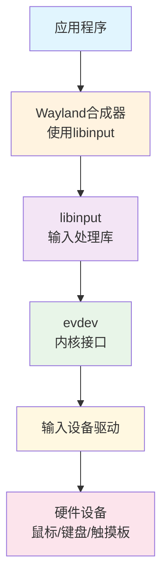
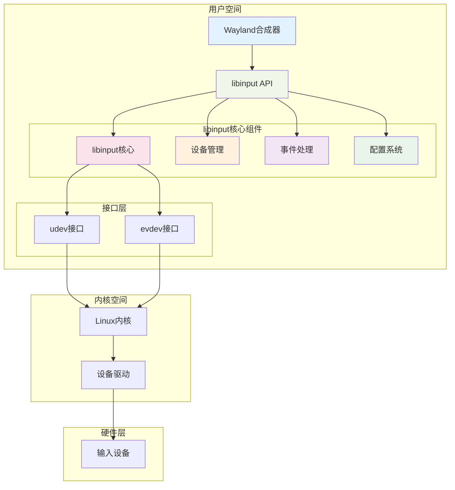

# libinput 技术指南 - Wayland合成器开发者手册

## 目录
- [概述](#概述)
- [libinput 简介](#libinput-简介)
- [核心架构](#核心架构)
- [项目结构](#项目结构)
- [技术架构详解](#技术架构详解)
- [Wayland合成器集成](#wayland合成器集成)
- [使用流程](#使用流程)
- [设备管理](#设备管理)
- [事件处理](#事件处理)
- [配置与定制](#配置与定制)
- [性能优化](#性能优化)
- [调试与故障排除](#调试与故障排除)
- [未来发展](#未来发展)
- [最佳实践](#最佳实践)

## 概述

libinput是Linux系统中的现代输入设备处理库，专为Wayland显示服务器协议设计。它提供了统一的输入设备抽象层，处理鼠标、键盘、触摸板、触摸屏等各种输入设备的事件。对于Wayland合成器开发者来说，libinput是实现用户交互的核心组件。

## libinput 简介

### 什么是libinput

libinput是一个处理输入设备的库，它：
- 提供了统一的输入设备API
- 处理复杂的设备特性（如多点触控、手势识别）
- 实现设备配置和校准
- 管理设备的热插拔
- 提供高级输入处理功能

### 核心特性

- **设备抽象**: 为不同类型的输入设备提供统一接口
- **事件处理**: 处理原始输入事件并转换为高级事件
- **手势识别**: 支持多点触控手势
- **设备配置**: 提供设备特定的配置选项
- **热插拔支持**: 动态检测和管理设备连接/断开
- **加速度处理**: 智能指针加速和滚动处理

### 在Linux输入栈中的位置



## 核心架构

### 系统架构图



### 主要组件

1. **libinput Context**: 库的主要入口点
2. **Device Management**: 设备发现和管理
3. **Event Processing**: 事件生成和分发
4. **Configuration System**: 设备配置管理
5. **Gesture Recognition**: 手势识别引擎

## 项目结构

基于libinput项目的典型结构：

```mermaid
graph TD
    A[libinput/] --> B[src/ - 核心源代码]
    A --> C[include/ - 公共头文件]
    A --> D[tools/ - 工具程序]
    A --> E[test/ - 测试套件]
    A --> F[quirks/ - 设备特殊配置]
    A --> G[udev/ - udev规则]
    A --> H[doc/ - 文档]
    
    B --> B1[libinput.c - 主API实现]
    B --> B2[libinput-private.h - 内部头文件]
    B --> B3[evdev.c - evdev设备处理]
    B --> B4[evdev-*.c - 各种evdev处理器]
    B --> B5[path.c - 路径后端]
    B --> B6[udev.c - udev后端]
    B --> B7[filter/ - 输入过滤器]
    
    B7 --> B71[pointer-acceleration.c]
    B7 --> B72[touchpad-*.c]
    
    C --> C1[libinput.h - 主API头文件]
    
    D --> D1[libinput-tool.c - 命令行工具]
    D --> D2[event-debug.c - 事件调试器]
    D --> D3[device-quirks.c - 设备特殊处理]
    
    E --> E1[litest/ - 测试框架]
    E --> E2[*.c - 各种测试]
    
    F --> F1[*.quirks - 设备配置文件]
    
    G --> G1[*.rules - udev规则文件]
    
    H --> H1[user/ - 用户文档]
    H --> H2[developer/ - 开发者文档]
    
    style A fill:#e1f5fe
    style B fill:#fff3e0
    style C fill:#f3e5f5
    style D fill:#e8f5e8
    style E fill:#fff8e1
    style F fill:#fce4ec
    style G fill:#e0f2f1
    style H fill:#f9fbe7
```



### 关键文件说明

- **libinput.h**: 主要的公共API定义
- **libinput.c**: 核心API实现
- **evdev.c**: evdev设备处理的核心逻辑
- **path.c/udev.c**: 两种设备发现后端
- **filter/**: 各种输入过滤和处理算法

## 技术架构详解

### 1. 设备后端系统

libinput支持两种设备发现机制：

#### Path后端
```c
// 直接指定设备路径
struct libinput *li = libinput_path_create_context(&interface, userdata);
libinput_path_add_device(li, "/dev/input/event0");
```

#### udev后端
```c
// 使用udev自动发现设备
struct libinput *li = libinput_udev_create_context(&interface, userdata, udev);
libinput_udev_assign_seat(li, "seat0");
```

### 2. 事件系统

libinput使用事件驱动模型：

```c
// 事件类型
enum libinput_event_type {
    LIBINPUT_EVENT_DEVICE_ADDED,
    LIBINPUT_EVENT_DEVICE_REMOVED,
    LIBINPUT_EVENT_KEYBOARD_KEY,
    LIBINPUT_EVENT_POINTER_MOTION,
    LIBINPUT_EVENT_POINTER_BUTTON,
    LIBINPUT_EVENT_TOUCH_DOWN,
    LIBINPUT_EVENT_GESTURE_SWIPE_BEGIN,
    // ...
};
```

### 3. 设备能力系统

每个设备都有特定的能力集：

```c
enum libinput_device_capability {
    LIBINPUT_DEVICE_CAP_KEYBOARD = 1,
    LIBINPUT_DEVICE_CAP_POINTER = 2,
    LIBINPUT_DEVICE_CAP_TOUCH = 3,
    LIBINPUT_DEVICE_CAP_TABLET_TOOL = 4,
    LIBINPUT_DEVICE_CAP_TABLET_PAD = 5,
    LIBINPUT_DEVICE_CAP_GESTURE = 6,
    LIBINPUT_DEVICE_CAP_SWITCH = 7,
};
```

### 4. 过滤器系统

libinput包含多种输入过滤器：

- **指针加速**: 智能鼠标加速算法
- **触摸板处理**: 多点触控、手掌检测、边缘滚动
- **手势识别**: 滑动、捏合、旋转手势
- **按钮去抖**: 物理按钮去抖动处理

## Wayland合成器集成

### 基本集成步骤

#### 1. 初始化libinput

```c
#include <libinput.h>

static int open_restricted(const char *path, int flags, void *user_data) {
    int fd = open(path, flags);
    return fd < 0 ? -errno : fd;
}

static void close_restricted(int fd, void *user_data) {
    close(fd);
}

static const struct libinput_interface interface = {
    .open_restricted = open_restricted,
    .close_restricted = close_restricted,
};

// 创建libinput上下文
struct libinput *li = libinput_udev_create_context(&interface, NULL, udev);
libinput_udev_assign_seat(li, "seat0");
```

#### 2. 设置事件循环

```c
// 获取libinput文件描述符
int fd = libinput_get_fd(li);

// 在主事件循环中监听
struct pollfd fds[1];
fds[0].fd = fd;
fds[0].events = POLLIN;

while (running) {
    poll(fds, 1, -1);
    if (fds[0].revents & POLLIN) {
        libinput_dispatch(li);
        process_libinput_events(li);
    }
}
```

#### 3. 处理输入事件

```c
void process_libinput_events(struct libinput *li) {
    struct libinput_event *event;
    
    while ((event = libinput_get_event(li)) != NULL) {
        enum libinput_event_type type = libinput_event_get_type(event);
        
        switch (type) {
        case LIBINPUT_EVENT_DEVICE_ADDED:
            handle_device_added(event);
            break;
        case LIBINPUT_EVENT_POINTER_MOTION:
            handle_pointer_motion(event);
            break;
        case LIBINPUT_EVENT_KEYBOARD_KEY:
            handle_keyboard_key(event);
            break;
        case LIBINPUT_EVENT_TOUCH_DOWN:
            handle_touch_down(event);
            break;
        // ... 处理其他事件类型
        }
        
        libinput_event_destroy(event);
    }
}
```

### 具体事件处理示例

#### 指针事件处理

```c
void handle_pointer_motion(struct libinput_event *event) {
    struct libinput_event_pointer *pointer_event;
    pointer_event = libinput_event_get_pointer_event(event);
    
    double dx = libinput_event_pointer_get_dx(pointer_event);
    double dy = libinput_event_pointer_get_dy(pointer_event);
    
    // 更新合成器中的指针位置
    compositor_move_pointer(dx, dy);
}

void handle_pointer_button(struct libinput_event *event) {
    struct libinput_event_pointer *pointer_event;
    pointer_event = libinput_event_get_pointer_event(event);
    
    uint32_t button = libinput_event_pointer_get_button(pointer_event);
    enum libinput_button_state state = libinput_event_pointer_get_button_state(pointer_event);
    
    // 发送按钮事件到Wayland客户端
    compositor_send_button(button, state);
}
```

#### 键盘事件处理

```c
void handle_keyboard_key(struct libinput_event *event) {
    struct libinput_event_keyboard *keyboard_event;
    keyboard_event = libinput_event_get_keyboard_event(event);
    
    uint32_t key = libinput_event_keyboard_get_key(keyboard_event);
    enum libinput_key_state state = libinput_event_keyboard_get_key_state(keyboard_event);
    
    // 处理按键事件
    compositor_handle_key(key, state);
}
```

#### 触摸事件处理

```c
void handle_touch_down(struct libinput_event *event) {
    struct libinput_event_touch *touch_event;
    touch_event = libinput_event_get_touch_event(event);
    
    int32_t slot = libinput_event_touch_get_slot(touch_event);
    double x = libinput_event_touch_get_x_transformed(touch_event, width);
    double y = libinput_event_touch_get_y_transformed(touch_event, height);
    
    // 处理触摸点
    compositor_touch_down(slot, x, y);
}
```

## 使用流程

### 完整的使用流程

```c
#include <libinput.h>
#include <libudev.h>
#include <poll.h>

int main() {
    // 1. 初始化udev
    struct udev *udev = udev_new();
    
    // 2. 创建libinput上下文
    struct libinput *li = libinput_udev_create_context(&interface, NULL, udev);
    
    // 3. 分配座位
    libinput_udev_assign_seat(li, "seat0");
    
    // 4. 获取文件描述符
    int fd = libinput_get_fd(li);
    
    // 5. 事件循环
    struct pollfd fds[1];
    fds[0].fd = fd;
    fds[0].events = POLLIN;
    
    while (1) {
        poll(fds, 1, -1);
        
        if (fds[0].revents & POLLIN) {
            // 6. 分发事件
            libinput_dispatch(li);
            
            // 7. 处理事件
            struct libinput_event *event;
            while ((event = libinput_get_event(li))) {
                process_event(event);
                libinput_event_destroy(event);
            }
        }
    }
    
    // 8. 清理
    libinput_unref(li);
    udev_unref(udev);
    
    return 0;
}
```

## 设备管理

### 设备生命周期

1. **设备检测**: udev发现新设备
2. **设备添加**: libinput接收设备添加事件
3. **能力检测**: 确定设备支持的功能
4. **配置应用**: 应用设备特定配置
5. **事件处理**: 处理来自设备的输入事件
6. **设备移除**: 处理设备断开连接

### 设备配置

```c
// 获取设备信息
const char *name = libinput_device_get_name(device);
unsigned int vendor = libinput_device_get_id_vendor(device);
unsigned int product = libinput_device_get_id_product(device);

// 检查设备能力
if (libinput_device_has_capability(device, LIBINPUT_DEVICE_CAP_POINTER)) {
    // 配置指针设备
    configure_pointer_device(device);
}

if (libinput_device_has_capability(device, LIBINPUT_DEVICE_CAP_KEYBOARD)) {
    // 配置键盘设备
    configure_keyboard_device(device);
}
```

### 设备配置选项

libinput提供了丰富的设备配置选项：

```c
// 触摸板配置
libinput_device_config_tap_set_enabled(device, LIBINPUT_CONFIG_TAP_ENABLED);
libinput_device_config_scroll_set_method(device, LIBINPUT_CONFIG_SCROLL_2FG);
libinput_device_config_accel_set_speed(device, 0.5);

// 鼠标配置
libinput_device_config_accel_set_profile(device, LIBINPUT_CONFIG_ACCEL_PROFILE_ADAPTIVE);
```

## 事件处理

### 事件类型详解

#### 1. 设备事件
- `LIBINPUT_EVENT_DEVICE_ADDED`: 设备添加
- `LIBINPUT_EVENT_DEVICE_REMOVED`: 设备移除

#### 2. 键盘事件
- `LIBINPUT_EVENT_KEYBOARD_KEY`: 按键事件

#### 3. 指针事件
- `LIBINPUT_EVENT_POINTER_MOTION`: 指针移动
- `LIBINPUT_EVENT_POINTER_MOTION_ABSOLUTE`: 绝对坐标移动
- `LIBINPUT_EVENT_POINTER_BUTTON`: 按钮事件
- `LIBINPUT_EVENT_POINTER_AXIS`: 滚轮/滚动事件

#### 4. 触摸事件
- `LIBINPUT_EVENT_TOUCH_DOWN`: 触摸开始
- `LIBINPUT_EVENT_TOUCH_UP`: 触摸结束
- `LIBINPUT_EVENT_TOUCH_MOTION`: 触摸移动
- `LIBINPUT_EVENT_TOUCH_CANCEL`: 触摸取消
- `LIBINPUT_EVENT_TOUCH_FRAME`: 触摸帧

#### 5. 手势事件
- `LIBINPUT_EVENT_GESTURE_SWIPE_*`: 滑动手势
- `LIBINPUT_EVENT_GESTURE_PINCH_*`: 捏合手势

### 坐标转换

```c
// 触摸事件坐标转换
double x = libinput_event_touch_get_x_transformed(touch_event, screen_width);
double y = libinput_event_touch_get_y_transformed(touch_event, screen_height);

// 绝对指针坐标转换
double x = libinput_event_pointer_get_absolute_x_transformed(pointer_event, screen_width);
double y = libinput_event_pointer_get_absolute_y_transformed(pointer_event, screen_height);
```

## 配置与定制

### 配置文件系统

libinput使用配置文件来处理设备特殊情况：

```ini
# /usr/share/libinput/quirks/example.quirks
[Device Name Match]
MatchName=SynPS/2 Synaptics TouchPad
ModelTouchpadPressureThreshold=10

[USB VID/PID Match]
MatchVendor=0x046D
MatchProduct=0xC52B
AttrSizeHint=32x32
```

### 运行时配置

```c
// 设置加速度配置
enum libinput_config_status status;
status = libinput_device_config_accel_set_speed(device, 0.5);

// 设置点击配置
status = libinput_device_config_tap_set_enabled(device, 
    LIBINPUT_CONFIG_TAP_ENABLED);

// 设置滚动方法
status = libinput_device_config_scroll_set_method(device,
    LIBINPUT_CONFIG_SCROLL_2FG);
```

### 高级配置选项

```c
// 自然滚动
libinput_device_config_scroll_set_natural_scroll_enabled(device, true);

// 左手模式
libinput_device_config_left_handed_set(device, true);

// 中键模拟
libinput_device_config_middle_emulation_set_enabled(device, true);
```

## 性能优化

### 1. 事件批处理

```c
void process_events_batch(struct libinput *li) {
    libinput_dispatch(li);
    
    struct libinput_event *event;
    while ((event = libinput_get_event(li))) {
        // 批量处理相同类型的事件
        batch_process_event(event);
        libinput_event_destroy(event);
    }
    
    // 一次性提交所有更改
    commit_changes();
}
```

### 2. 内存管理

```c
// 避免频繁的内存分配
static struct event_buffer {
    struct libinput_event *events[MAX_EVENTS];
    size_t count;
} event_buffer;

void buffer_event(struct libinput_event *event) {
    if (event_buffer.count < MAX_EVENTS) {
        event_buffer.events[event_buffer.count++] = event;
    }
}
```

### 3. 线程化处理

```c
// 在专用线程中处理输入事件
void *input_thread(void *data) {
    struct libinput *li = (struct libinput *)data;
    
    while (running) {
        libinput_dispatch(li);
        process_input_events(li);
    }
    
    return NULL;
}
```

## 调试与故障排除

### 1. 启用调试输出

```bash
# 设置环境变量启用调试
export LIBINPUT_LOG_PRIORITY=debug
```

### 2. 使用libinput工具

```bash
# 列出所有设备
libinput list-devices

# 调试事件
libinput debug-events

# 录制和回放事件
libinput record /dev/input/event0
libinput replay recording.txt
```

### 3. 常见问题诊断

```c
// 检查设备状态
if (!libinput_device_has_capability(device, LIBINPUT_DEVICE_CAP_POINTER)) {
    fprintf(stderr, "Device does not support pointer capability\n");
}

// 检查配置状态
enum libinput_config_status status;
status = libinput_device_config_accel_set_speed(device, speed);
if (status != LIBINPUT_CONFIG_STATUS_SUCCESS) {
    fprintf(stderr, "Failed to set acceleration speed: %d\n", status);
}
```

### 4. 性能监控

```c
// 监控事件处理延迟
uint64_t event_time = libinput_event_get_time_usec(event);
uint64_t current_time = get_current_time_usec();
uint64_t latency = current_time - event_time;

if (latency > MAX_ACCEPTABLE_LATENCY) {
    fprintf(stderr, "High input latency detected: %llu usec\n", latency);
}
```

## 未来发展

### 1. 技术发展趋势

#### 增强的手势识别
- 更复杂的多点触控手势
- 手势学习和自定义
- 基于AI的手势预测

#### 更好的设备支持
- 新型输入设备支持（如VR控制器）
- 更精确的压感检测
- 高刷新率设备优化

#### 性能改进
- 更低的输入延迟
- 更好的能耗控制
- 硬件加速支持

### 2. Wayland生态系统集成

#### 协议扩展
- 新的Wayland协议支持
- 更丰富的输入事件类型
- 跨应用手势共享

#### 合成器特性
- 统一的输入设备管理
- 热插拔设备的无缝切换
- 多屏幕输入同步

### 3. 开发计划

#### 短期目标（1-2年）
- 改进触摸板手势识别
- 增强设备配置系统
- 优化性能和内存使用

#### 中期目标（2-5年）
- 支持新兴输入技术
- 机器学习驱动的适应性
- 更好的无障碍支持

#### 长期愿景（5年以上）
- 完全自适应的输入系统
- 无缝多设备协同
- 基于意图的输入预测

### 4. 社区贡献机会

#### 对开发者的建议
- 参与libinput开发
- 测试新设备支持
- 贡献设备配置文件
- 改进文档和工具

## 最佳实践

### 1. 合成器设计原则

#### 响应性优先
```c
// 优先处理用户交互事件
void prioritize_user_events(struct libinput_event *event) {
    enum libinput_event_type type = libinput_event_get_type(event);
    
    // 高优先级事件立即处理
    if (type == LIBINPUT_EVENT_POINTER_BUTTON ||
        type == LIBINPUT_EVENT_KEYBOARD_KEY) {
        handle_immediately(event);
    } else {
        queue_for_later(event);
    }
}
```

#### 错误处理
```c
// 优雅的错误处理
void robust_event_handling(struct libinput *li) {
    struct libinput_event *event;
    
    while ((event = libinput_get_event(li))) {
        if (!validate_event(event)) {
            log_error("Invalid event received");
            libinput_event_destroy(event);
            continue;
        }
        
        if (!process_event(event)) {
            log_warning("Failed to process event");
        }
        
        libinput_event_destroy(event);
    }
}
```

### 2. 资源管理

#### 设备资源清理
```c
void cleanup_device(struct libinput_device *device) {
    // 取消所有活动的触摸点
    cancel_active_touches(device);
    
    // 清理设备特定的状态
    cleanup_device_state(device);
    
    // 通知客户端设备移除
    notify_device_removed(device);
}
```

#### 内存泄漏预防
```c
// 确保所有事件都被正确销毁
void safe_event_processing(struct libinput *li) {
    struct libinput_event *event;
    
    while ((event = libinput_get_event(li))) {
        // 使用RAII模式确保资源清理
        struct event_wrapper wrapper = {.event = event};
        
        process_event_safe(&wrapper);
        
        // wrapper析构时自动调用libinput_event_destroy
    }
}
```

### 3. 用户体验优化

#### 智能输入预测
```c
// 预测用户意图
void predict_user_intent(struct pointer_state *state) {
    if (detect_scroll_pattern(state)) {
        prepare_scroll_acceleration();
    } else if (detect_precision_task(state)) {
        reduce_acceleration();
    }
}
```

#### 自适应配置
```c
// 根据使用模式调整设备配置
void adaptive_configuration(struct libinput_device *device) {
    struct usage_stats stats = get_device_usage_stats(device);
    
    if (stats.precision_tasks_ratio > 0.7) {
        // 用户主要进行精确任务，降低加速度
        libinput_device_config_accel_set_speed(device, -0.3);
    } else if (stats.large_movements_ratio > 0.7) {
        // 用户主要进行大范围移动，提高加速度
        libinput_device_config_accel_set_speed(device, 0.5);
    }
}
```

### 4. 安全考虑

#### 输入验证
```c
// 验证输入事件的合理性
bool validate_pointer_event(struct libinput_event_pointer *event) {
    double dx = libinput_event_pointer_get_dx(event);
    double dy = libinput_event_pointer_get_dy(event);
    
    // 检查是否为合理的移动距离
    if (abs(dx) > MAX_REASONABLE_MOVEMENT ||
        abs(dy) > MAX_REASONABLE_MOVEMENT) {
        log_warning("Suspicious pointer movement detected");
        return false;
    }
    
    return true;
}
```

#### 权限管理
```c
// 安全的设备访问
static int secure_open_restricted(const char *path, int flags, void *user_data) {
    // 验证设备路径
    if (!is_safe_device_path(path)) {
        return -EACCES;
    }
    
    // 检查权限
    if (!check_device_permissions(path)) {
        return -EPERM;
    }
    
    return open(path, flags);
}
```

---

## 总结

libinput作为现代Linux输入系统的核心组件，为Wayland合成器开发者提供了强大而灵活的输入处理能力。通过理解其架构、正确使用其API，并遵循最佳实践，开发者可以创建响应迅速、功能丰富的用户界面体验。

随着输入技术的不断发展，libinput也在持续演进，为新兴的输入设备和交互模式提供支持。对于Wayland合成器开发者而言，深入掌握libinput不仅是技术要求，更是创造卓越用户体验的基础。

### 推荐资源

- [libinput官方文档](https://wayland.freedesktop.org/libinput/doc/latest/)
- [Wayland协议规范](https://wayland.freedesktop.org/docs/html/)
- [evdev内核文档](https://www.kernel.org/doc/Documentation/input/)
- [udev规则编写指南](https://wiki.archlinux.org/title/Udev)