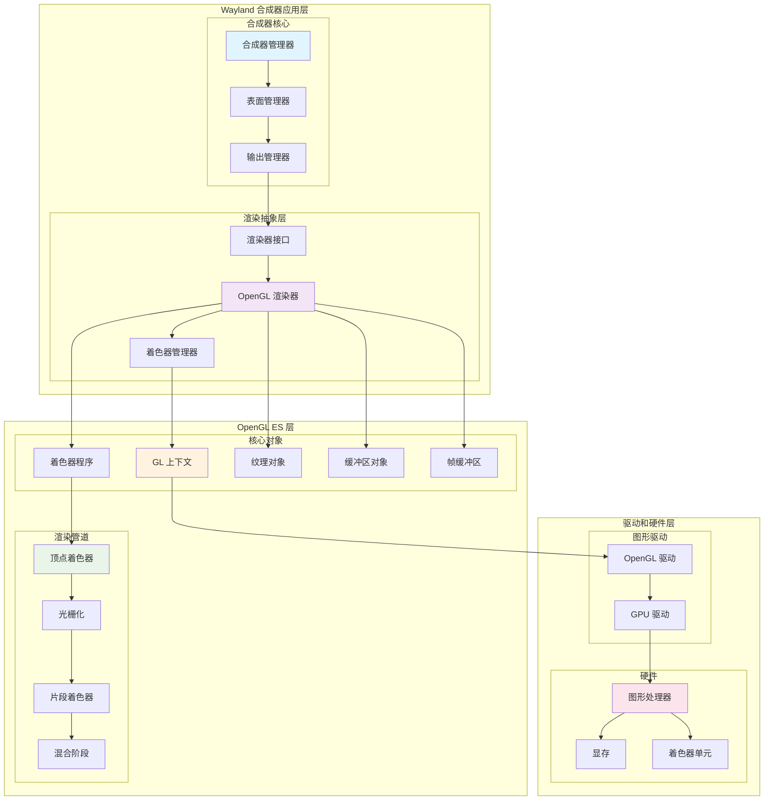
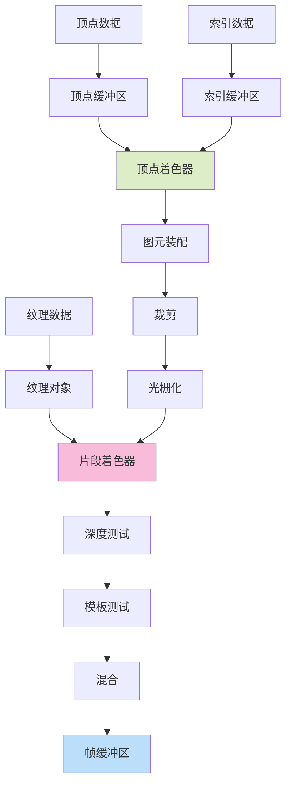
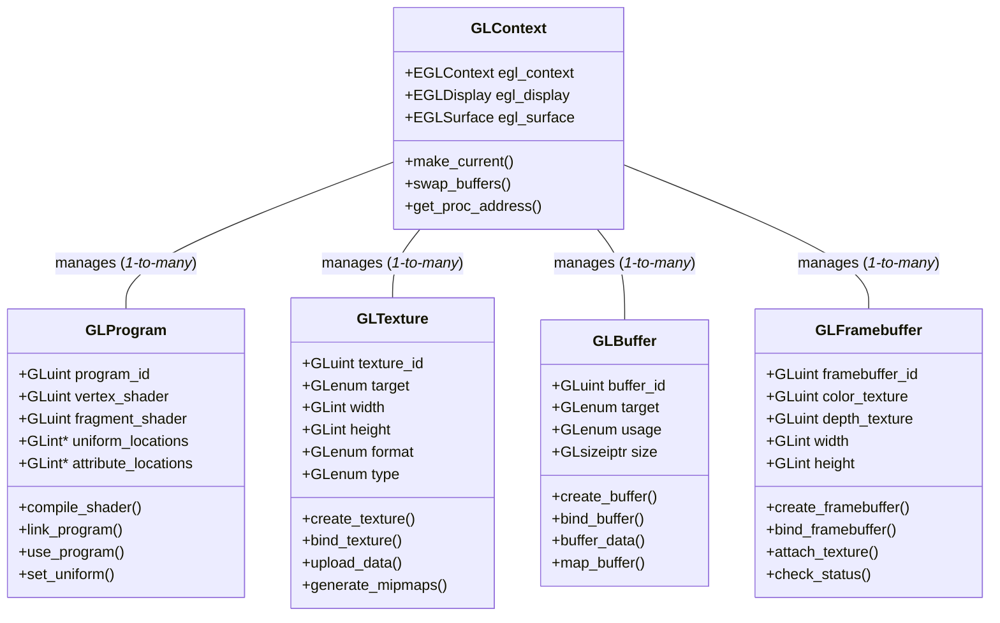
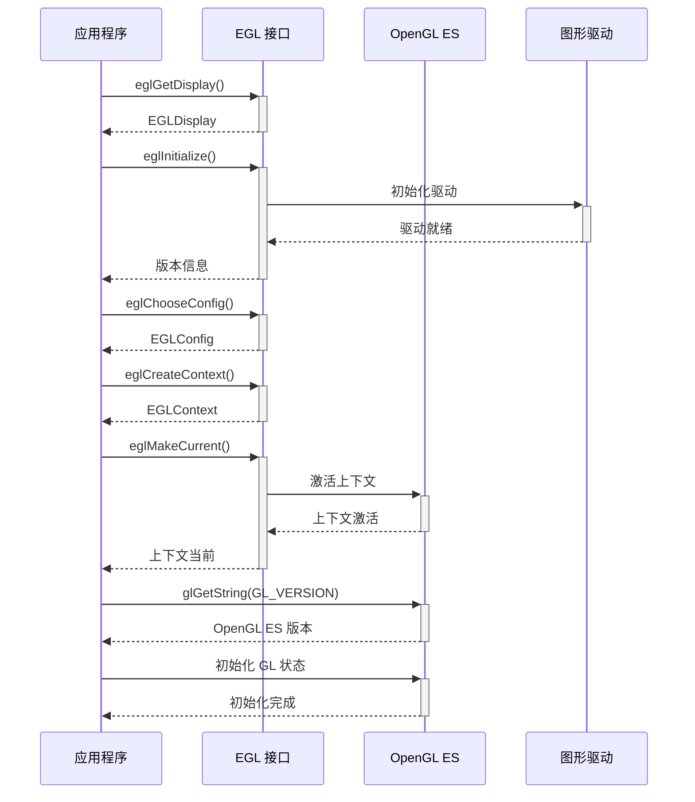
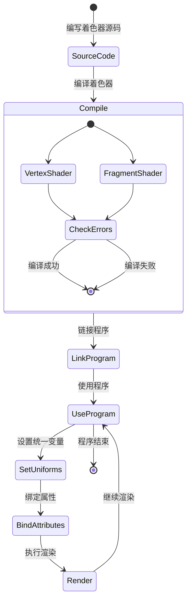
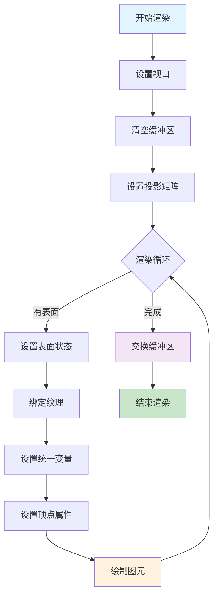
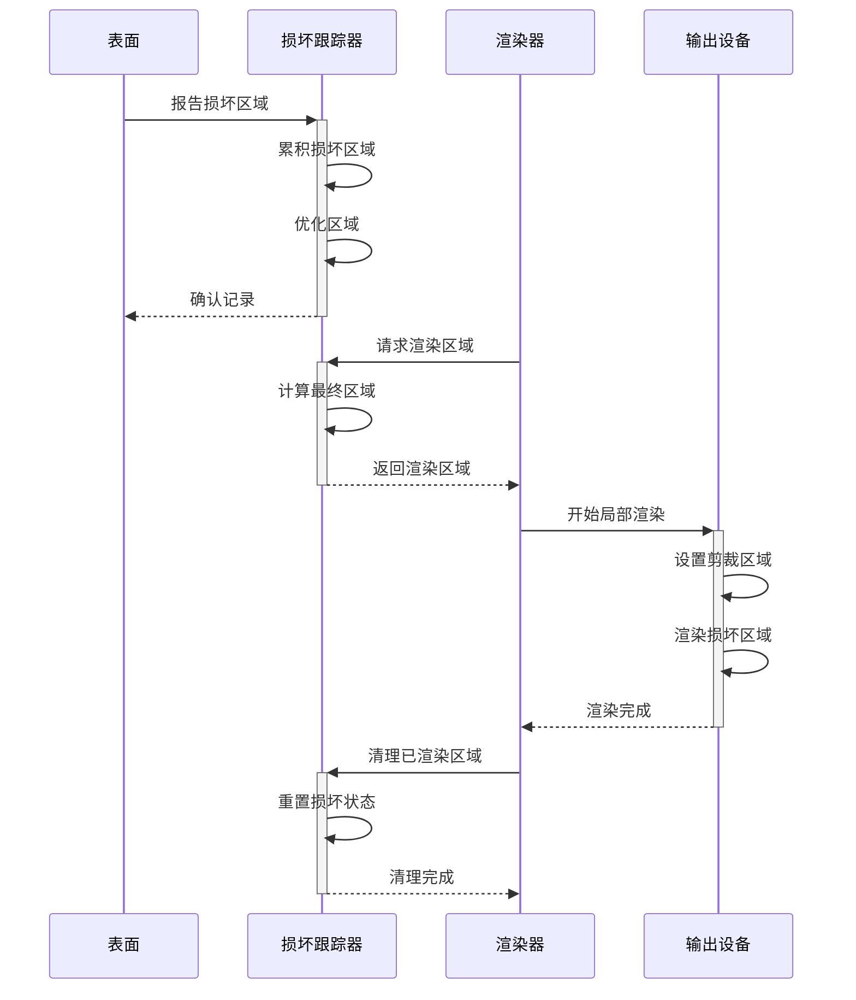

# OpenGL ES 与 Wayland 合成器开发指南

## 概述

OpenGL ES (OpenGL for Embedded Systems) 是 OpenGL 的简化版本，专为嵌入式设备和移动平台设计。在 Wayland 合成器开发中，OpenGL ES 提供了强大的硬件加速渲染能力，是实现高性能图形合成的核心技术。

OpenGL ES 的主要优势包括：硬件加速渲染、跨平台兼容性、灵活的着色器系统、高效的纹理处理和先进的混合模式。对于 Wayland 合成器开发者来说，掌握 OpenGL ES 是构建现代图形显示系统的必要技能。

## 技术架构

### 整体架构图



### OpenGL ES 渲染管道



## 核心数据结构

### OpenGL 对象管理



## OpenGL ES 初始化

### 初始化流程



### 初始化实现

```c
#include <GLES2/gl2.h>
#include <GLES2/gl2ext.h>
#include <EGL/egl.h>
#include <EGL/eglext.h>
#include <stdio.h>
#include <stdlib.h>
#include <string.h>

// OpenGL ES 渲染器结构
struct gl_renderer {
    // EGL 上下文
    EGLDisplay egl_display;
    EGLContext egl_context;
    EGLConfig egl_config;
    
    // OpenGL 信息
    const char *gl_version;
    const char *gl_vendor;
    const char *gl_renderer_string;
    const char *gl_extensions;
    
    // 功能支持
    GLboolean has_egl_image_external;
    GLboolean has_egl_buffer_age;
    GLboolean has_native_fence_sync;
    GLboolean has_dmabuf_import;
    
    // 扩展函数指针
    PFNGLEGLIMAGETARGETTEXTURE2DOESPROC glEGLImageTargetTexture2DOES;
    PFNEGLCREATEIMAGEKHRPROC eglCreateImageKHR;
    PFNEGLDESTROYIMAGEKHRPROC eglDestroyImageKHR;
    PFNEGLCREATESYNCKHRPROC eglCreateSyncKHR;
    PFNEGLDESTROYSYNCKHRPROC eglDestroySyncKHR;
    PFNEGLCLIENTWAITSYNCKHRPROC eglClientWaitSyncKHR;
    
    // 默认着色器程序
    struct gl_shader_program *default_program;
    struct gl_shader_program *texture_program;
    struct gl_shader_program *solid_program;
    
    // 顶点缓冲区
    GLuint quad_vbo;
    GLuint quad_ebo;
    
    // 统一变量缓存
    struct {
        GLint projection_matrix;
        GLint model_view_matrix;
        GLint texture_sampler;
        GLint alpha;
        GLint color;
    } uniforms;
};

// 初始化 OpenGL ES 渲染器
struct gl_renderer *gl_renderer_create(EGLDisplay display, EGLContext context) {
    struct gl_renderer *renderer;
    
    renderer = calloc(1, sizeof(*renderer));
    if (!renderer)
        return NULL;
    
    renderer->egl_display = display;
    renderer->egl_context = context;
    
    // 获取 OpenGL 信息
    renderer->gl_version = (const char*)glGetString(GL_VERSION);
    renderer->gl_vendor = (const char*)glGetString(GL_VENDOR);
    renderer->gl_renderer_string = (const char*)glGetString(GL_RENDERER);
    renderer->gl_extensions = (const char*)glGetString(GL_EXTENSIONS);
    
    printf("OpenGL ES Version: %s\n", renderer->gl_version);
    printf("OpenGL ES Vendor: %s\n", renderer->gl_vendor);
    printf("OpenGL ES Renderer: %s\n", renderer->gl_renderer_string);
    
    // 检查扩展支持
    gl_renderer_check_extensions(renderer);
    
    // 获取扩展函数指针
    gl_renderer_get_extension_functions(renderer);
    
    // 设置默认 OpenGL 状态
    gl_renderer_setup_default_state(renderer);
    
    // 创建默认资源
    if (!gl_renderer_create_default_resources(renderer)) {
        printf("Failed to create default OpenGL resources\n");
        gl_renderer_destroy(renderer);
        return NULL;
    }
    
    return renderer;
}

// 检查扩展支持
void gl_renderer_check_extensions(struct gl_renderer *renderer) {
    const char *egl_extensions = eglQueryString(renderer->egl_display, EGL_EXTENSIONS);
    
    // 检查 EGL 扩展
    renderer->has_egl_image_external = 
        strstr(egl_extensions, "EGL_KHR_image_base") &&
        strstr(renderer->gl_extensions, "GL_OES_EGL_image_external");
    
    renderer->has_egl_buffer_age = 
        strstr(egl_extensions, "EGL_EXT_buffer_age");
    
    renderer->has_native_fence_sync = 
        strstr(egl_extensions, "EGL_ANDROID_native_fence_sync");
    
    renderer->has_dmabuf_import = 
        strstr(egl_extensions, "EGL_EXT_image_dma_buf_import");
    
    printf("EGL Extensions support:\n");
    printf("  EGL_image_external: %s\n", renderer->has_egl_image_external ? "yes" : "no");
    printf("  EGL_buffer_age: %s\n", renderer->has_egl_buffer_age ? "yes" : "no");
    printf("  EGL_native_fence_sync: %s\n", renderer->has_native_fence_sync ? "yes" : "no");
    printf("  EGL_dmabuf_import: %s\n", renderer->has_dmabuf_import ? "yes" : "no");
}

// 获取扩展函数指针
void gl_renderer_get_extension_functions(struct gl_renderer *renderer) {
    // OpenGL ES 扩展函数
    renderer->glEGLImageTargetTexture2DOES = 
        (PFNGLEGLIMAGETARGETTEXTURE2DOESPROC)eglGetProcAddress("glEGLImageTargetTexture2DOES");
    
    // EGL 扩展函数
    renderer->eglCreateImageKHR = 
        (PFNEGLCREATEIMAGEKHRPROC)eglGetProcAddress("eglCreateImageKHR");
    renderer->eglDestroyImageKHR = 
        (PFNEGLDESTROYIMAGEKHRPROC)eglGetProcAddress("eglDestroyImageKHR");
    
    renderer->eglCreateSyncKHR = 
        (PFNEGLCREATESYNCKHRPROC)eglGetProcAddress("eglCreateSyncKHR");
    renderer->eglDestroySyncKHR = 
        (PFNEGLDESTROYSYNCKHRPROC)eglGetProcAddress("eglDestroySyncKHR");
    renderer->eglClientWaitSyncKHR = 
        (PFNEGLCLIENTWAITSYNCKHRPROC)eglGetProcAddress("eglClientWaitSyncKHR");
}

// 设置默认 OpenGL 状态
void gl_renderer_setup_default_state(struct gl_renderer *renderer) {
    // 启用混合
    glEnable(GL_BLEND);
    glBlendFunc(GL_SRC_ALPHA, GL_ONE_MINUS_SRC_ALPHA);
    
    // 禁用深度测试（2D 合成通常不需要）
    glDisable(GL_DEPTH_TEST);
    
    // 禁用面剔除
    glDisable(GL_CULL_FACE);
    
    // 设置清空颜色
    glClearColor(0.0f, 0.0f, 0.0f, 1.0f);
    
    // 检查 OpenGL 错误
    GLenum error = glGetError();
    if (error != GL_NO_ERROR) {
        printf("OpenGL error during initialization: 0x%x\n", error);
    }
}

// 创建默认资源
GLboolean gl_renderer_create_default_resources(struct gl_renderer *renderer) {
    // 创建四边形顶点缓冲区
    if (!gl_renderer_create_quad_buffers(renderer)) {
        return GL_FALSE;
    }
    
    // 创建默认着色器程序
    if (!gl_renderer_create_default_shaders(renderer)) {
        return GL_FALSE;
    }
    
    return GL_TRUE;
}

// 创建四边形缓冲区
GLboolean gl_renderer_create_quad_buffers(struct gl_renderer *renderer) {
    // 四边形顶点数据 (位置 + 纹理坐标)
    float quad_vertices[] = {
        // 位置      // 纹理坐标
        -1.0f,  1.0f, 0.0f, 1.0f, // 左上
         1.0f,  1.0f, 1.0f, 1.0f, // 右上
         1.0f, -1.0f, 1.0f, 0.0f, // 右下
        -1.0f, -1.0f, 0.0f, 0.0f  // 左下
    };
    
    unsigned int quad_indices[] = {
        0, 1, 2,  // 第一个三角形
        2, 3, 0   // 第二个三角形
    };
    
    // 创建顶点缓冲区
    glGenBuffers(1, &renderer->quad_vbo);
    glBindBuffer(GL_ARRAY_BUFFER, renderer->quad_vbo);
    glBufferData(GL_ARRAY_BUFFER, sizeof(quad_vertices), quad_vertices, GL_STATIC_DRAW);
    
    // 创建索引缓冲区
    glGenBuffers(1, &renderer->quad_ebo);
    glBindBuffer(GL_ELEMENT_ARRAY_BUFFER, renderer->quad_ebo);
    glBufferData(GL_ELEMENT_ARRAY_BUFFER, sizeof(quad_indices), quad_indices, GL_STATIC_DRAW);
    
    // 重置绑定
    glBindBuffer(GL_ARRAY_BUFFER, 0);
    glBindBuffer(GL_ELEMENT_ARRAY_BUFFER, 0);
    
    return GL_TRUE;
}
```

## 着色器系统

### 着色器程序结构



### 着色器管理实现

```c
// 着色器程序结构
struct gl_shader_program {
    GLuint program;
    GLuint vertex_shader;
    GLuint fragment_shader;
    
    // 统一变量位置
    struct {
        GLint projection_matrix;
        GLint model_view_matrix;
        GLint texture_sampler;
        GLint alpha;
        GLint color;
    } uniforms;
    
    // 属性位置
    struct {
        GLint position;
        GLint texcoord;
        GLint color;
    } attributes;
};

// 编译着色器
GLuint gl_compile_shader(GLenum type, const char *source) {
    GLuint shader;
    GLint compiled;
    GLint info_len = 0;
    
    shader = glCreateShader(type);
    if (shader == 0) {
        printf("Failed to create shader\n");
        return 0;
    }
    
    glShaderSource(shader, 1, &source, NULL);
    glCompileShader(shader);
    
    // 检查编译状态
    glGetShaderiv(shader, GL_COMPILE_STATUS, &compiled);
    if (!compiled) {
        glGetShaderiv(shader, GL_INFO_LOG_LENGTH, &info_len);
        if (info_len > 1) {
            char *info_log = malloc(info_len);
            glGetShaderInfoLog(shader, info_len, NULL, info_log);
            printf("Shader compilation error:\n%s\n", info_log);
            free(info_log);
        }
        glDeleteShader(shader);
        return 0;
    }
    
    return shader;
}

// 链接着色器程序
GLuint gl_link_program(GLuint vertex_shader, GLuint fragment_shader) {
    GLuint program;
    GLint linked;
    GLint info_len = 0;
    
    program = glCreateProgram();
    if (program == 0) {
        printf("Failed to create program\n");
        return 0;
    }
    
    glAttachShader(program, vertex_shader);
    glAttachShader(program, fragment_shader);
    
    // 绑定属性位置
    glBindAttribLocation(program, 0, "position");
    glBindAttribLocation(program, 1, "texcoord");
    glBindAttribLocation(program, 2, "color");
    
    glLinkProgram(program);
    
    // 检查链接状态
    glGetProgramiv(program, GL_LINK_STATUS, &linked);
    if (!linked) {
        glGetProgramiv(program, GL_INFO_LOG_LENGTH, &info_len);
        if (info_len > 1) {
            char *info_log = malloc(info_len);
            glGetProgramInfoLog(program, info_len, NULL, info_log);
            printf("Program linking error:\n%s\n", info_log);
            free(info_log);
        }
        glDeleteProgram(program);
        return 0;
    }
    
    return program;
}

// 创建着色器程序
struct gl_shader_program *gl_shader_program_create(const char *vertex_source,
                                                   const char *fragment_source) {
    struct gl_shader_program *program;
    
    program = calloc(1, sizeof(*program));
    if (!program)
        return NULL;
    
    // 编译顶点着色器
    program->vertex_shader = gl_compile_shader(GL_VERTEX_SHADER, vertex_source);
    if (!program->vertex_shader) {
        free(program);
        return NULL;
    }
    
    // 编译片段着色器
    program->fragment_shader = gl_compile_shader(GL_FRAGMENT_SHADER, fragment_source);
    if (!program->fragment_shader) {
        glDeleteShader(program->vertex_shader);
        free(program);
        return NULL;
    }
    
    // 链接程序
    program->program = gl_link_program(program->vertex_shader, program->fragment_shader);
    if (!program->program) {
        glDeleteShader(program->vertex_shader);
        glDeleteShader(program->fragment_shader);
        free(program);
        return NULL;
    }
    
    // 获取统一变量位置
    glUseProgram(program->program);
    
    program->uniforms.projection_matrix = glGetUniformLocation(program->program, "u_projection");
    program->uniforms.model_view_matrix = glGetUniformLocation(program->program, "u_modelview");
    program->uniforms.texture_sampler = glGetUniformLocation(program->program, "u_texture");
    program->uniforms.alpha = glGetUniformLocation(program->program, "u_alpha");
    program->uniforms.color = glGetUniformLocation(program->program, "u_color");
    
    // 获取属性位置
    program->attributes.position = glGetAttribLocation(program->program, "a_position");
    program->attributes.texcoord = glGetAttribLocation(program->program, "a_texcoord");
    program->attributes.color = glGetAttribLocation(program->program, "a_color");
    
    glUseProgram(0);
    
    return program;
}

// 默认纹理着色器
const char *default_vertex_shader_source = 
    "#version 100\n"
    "attribute vec2 a_position;\n"
    "attribute vec2 a_texcoord;\n"
    "uniform mat4 u_projection;\n"
    "uniform mat4 u_modelview;\n"
    "varying vec2 v_texcoord;\n"
    "void main() {\n"
    "    gl_Position = u_projection * u_modelview * vec4(a_position, 0.0, 1.0);\n"
    "    v_texcoord = a_texcoord;\n"
    "}\n";

const char *texture_fragment_shader_source = 
    "#version 100\n"
    "precision mediump float;\n"
    "varying vec2 v_texcoord;\n"
    "uniform sampler2D u_texture;\n"
    "uniform float u_alpha;\n"
    "void main() {\n"
    "    vec4 color = texture2D(u_texture, v_texcoord);\n"
    "    gl_FragColor = vec4(color.rgb, color.a * u_alpha);\n"
    "}\n";

// 纯色着色器
const char *solid_fragment_shader_source = 
    "#version 100\n"
    "precision mediump float;\n"
    "uniform vec4 u_color;\n"
    "uniform float u_alpha;\n"
    "void main() {\n"
    "    gl_FragColor = vec4(u_color.rgb, u_color.a * u_alpha);\n"
    "}\n";

// YUV 纹理着色器
const char *yuv_fragment_shader_source = 
    "#version 100\n"
    "#extension GL_OES_EGL_image_external : require\n"
    "precision mediump float;\n"
    "varying vec2 v_texcoord;\n"
    "uniform samplerExternalOES u_texture;\n"
    "uniform float u_alpha;\n"
    "void main() {\n"
    "    vec4 color = texture2D(u_texture, v_texcoord);\n"
    "    gl_FragColor = vec4(color.rgb, color.a * u_alpha);\n"
    "}\n";

// 创建默认着色器程序
GLboolean gl_renderer_create_default_shaders(struct gl_renderer *renderer) {
    // 纹理着色器程序
    renderer->texture_program = gl_shader_program_create(default_vertex_shader_source,
                                                        texture_fragment_shader_source);
    if (!renderer->texture_program) {
        printf("Failed to create texture shader program\n");
        return GL_FALSE;
    }
    
    // 纯色着色器程序
    renderer->solid_program = gl_shader_program_create(default_vertex_shader_source,
                                                      solid_fragment_shader_source);
    if (!renderer->solid_program) {
        printf("Failed to create solid shader program\n");
        return GL_FALSE;
    }
    
    // 设置默认程序
    renderer->default_program = renderer->texture_program;
    
    return GL_TRUE;
}
```

## 渲染系统

### 渲染流程



### 渲染实现

```c
// 表面渲染状态
struct gl_surface_state {
    GLuint texture;
    GLenum texture_target;
    GLfloat alpha;
    GLboolean y_inverted;
    
    // 变换矩阵
    float transform[16];
    
    // 纹理坐标
    float texcoord[8];
    
    // 混合模式
    GLenum blend_src;
    GLenum blend_dst;
    
    // 着色器程序
    struct gl_shader_program *shader_program;
};

// 渲染输出
struct gl_output {
    struct gl_renderer *renderer;
    
    // 帧缓冲区
    GLuint framebuffer;
    GLuint color_texture;
    GLuint depth_texture;
    
    // 尺寸
    int width, height;
    
    // 投影矩阵
    float projection_matrix[16];
    
    // 损坏区域
    pixman_region_t damage;
};

// 开始渲染帧
void gl_renderer_begin_frame(struct gl_renderer *renderer, struct gl_output *output) {
    // 绑定帧缓冲区
    glBindFramebuffer(GL_FRAMEBUFFER, output->framebuffer);
    
    // 设置视口
    glViewport(0, 0, output->width, output->height);
    
    // 设置投影矩阵
    glUseProgram(renderer->default_program->program);
    glUniformMatrix4fv(renderer->default_program->uniforms.projection_matrix,
                      1, GL_FALSE, output->projection_matrix);
    
    // 清空缓冲区
    glClear(GL_COLOR_BUFFER_BIT);
    
    // 启用混合
    glEnable(GL_BLEND);
}

// 渲染表面
void gl_renderer_render_surface(struct gl_renderer *renderer,
                               struct gl_surface_state *surface,
                               pixman_region_t *damage) {
    struct gl_shader_program *program;
    
    // 选择合适的着色器程序
    program = surface->shader_program ? surface->shader_program : renderer->default_program;
    
    // 使用着色器程序
    glUseProgram(program->program);
    
    // 设置混合模式
    glBlendFunc(surface->blend_src, surface->blend_dst);
    
    // 绑定纹理
    glActiveTexture(GL_TEXTURE0);
    glBindTexture(surface->texture_target, surface->texture);
    glUniform1i(program->uniforms.texture_sampler, 0);
    
    // 设置变换矩阵
    glUniformMatrix4fv(program->uniforms.model_view_matrix,
                      1, GL_FALSE, surface->transform);
    
    // 设置透明度
    glUniform1f(program->uniforms.alpha, surface->alpha);
    
    // 设置顶点属性
    gl_renderer_setup_vertex_attributes(renderer, surface);
    
    // 如果有损坏区域，使用剪裁
    if (damage && !pixman_region_not_empty(damage)) {
        return; // 没有需要渲染的区域
    }
    
    if (damage) {
        gl_renderer_setup_clipping(renderer, damage);
    }
    
    // 绘制四边形
    glDrawElements(GL_TRIANGLES, 6, GL_UNSIGNED_INT, 0);
    
    // 清理状态
    if (damage) {
        glDisable(GL_SCISSOR_TEST);
    }
}

// 设置顶点属性
void gl_renderer_setup_vertex_attributes(struct gl_renderer *renderer,
                                        struct gl_surface_state *surface) {
    // 绑定顶点缓冲区
    glBindBuffer(GL_ARRAY_BUFFER, renderer->quad_vbo);
    glBindBuffer(GL_ELEMENT_ARRAY_BUFFER, renderer->quad_ebo);
    
    // 位置属性
    glEnableVertexAttribArray(0);
    glVertexAttribPointer(0, 2, GL_FLOAT, GL_FALSE, 4 * sizeof(float), (void*)0);
    
    // 纹理坐标属性
    if (surface->y_inverted) {
        // Y 坐标翻转的纹理坐标
        float inverted_texcoord[] = {
            surface->texcoord[0], 1.0f - surface->texcoord[1],
            surface->texcoord[2], 1.0f - surface->texcoord[3],
            surface->texcoord[4], 1.0f - surface->texcoord[5],
            surface->texcoord[6], 1.0f - surface->texcoord[7]
        };
        
        // 使用临时缓冲区
        GLuint temp_vbo;
        glGenBuffers(1, &temp_vbo);
        glBindBuffer(GL_ARRAY_BUFFER, temp_vbo);
        glBufferData(GL_ARRAY_BUFFER, sizeof(inverted_texcoord), 
                    inverted_texcoord, GL_DYNAMIC_DRAW);
        
        glEnableVertexAttribArray(1);
        glVertexAttribPointer(1, 2, GL_FLOAT, GL_FALSE, 2 * sizeof(float), (void*)0);
        
        glDeleteBuffers(1, &temp_vbo);
    } else {
        glEnableVertexAttribArray(1);
        glVertexAttribPointer(1, 2, GL_FLOAT, GL_FALSE, 4 * sizeof(float), 
                             (void*)(2 * sizeof(float)));
    }
}

// 设置剪裁区域
void gl_renderer_setup_clipping(struct gl_renderer *renderer, pixman_region_t *damage) {
    pixman_box_t *rects;
    int n_rects;
    
    if (!damage || !pixman_region_not_empty(damage)) {
        return;
    }
    
    // 获取损坏矩形
    rects = pixman_region_rectangles(damage, &n_rects);
    
    if (n_rects == 1) {
        // 单个矩形，使用剪裁测试
        glEnable(GL_SCISSOR_TEST);
        glScissor(rects[0].x1, rects[0].y1,
                 rects[0].x2 - rects[0].x1,
                 rects[0].y2 - rects[0].y1);
    } else {
        // 多个矩形，需要多次渲染或使用模板缓冲区
        // 简化实现：使用边界矩形
        pixman_box_t *extents = pixman_region_extents(damage);
        glEnable(GL_SCISSOR_TEST);
        glScissor(extents->x1, extents->y1,
                 extents->x2 - extents->x1,
                 extents->y2 - extents->y1);
    }
}

// 结束渲染帧
void gl_renderer_end_frame(struct gl_renderer *renderer, struct gl_output *output) {
    // 检查 OpenGL 错误
    GLenum error = glGetError();
    if (error != GL_NO_ERROR) {
        printf("OpenGL error during rendering: 0x%x\n", error);
    }
    
    // 重置状态
    glUseProgram(0);
    glBindTexture(GL_TEXTURE_2D, 0);
    glBindBuffer(GL_ARRAY_BUFFER, 0);
    glBindBuffer(GL_ELEMENT_ARRAY_BUFFER, 0);
    glBindFramebuffer(GL_FRAMEBUFFER, 0);
    
    // 禁用顶点属性数组
    glDisableVertexAttribArray(0);
    glDisableVertexAttribArray(1);
}

// 创建纹理从像素数据
GLuint gl_renderer_create_texture_from_pixels(struct gl_renderer *renderer,
                                             int width, int height,
                                             GLenum format, GLenum type,
                                             const void *pixels) {
    GLuint texture;
    
    glGenTextures(1, &texture);
    glBindTexture(GL_TEXTURE_2D, texture);
    
    // 设置纹理参数
    glTexParameteri(GL_TEXTURE_2D, GL_TEXTURE_MIN_FILTER, GL_LINEAR);
    glTexParameteri(GL_TEXTURE_2D, GL_TEXTURE_MAG_FILTER, GL_LINEAR);
    glTexParameteri(GL_TEXTURE_2D, GL_TEXTURE_WRAP_S, GL_CLAMP_TO_EDGE);
    glTexParameteri(GL_TEXTURE_2D, GL_TEXTURE_WRAP_T, GL_CLAMP_TO_EDGE);
    
    // 上传纹理数据
    glTexImage2D(GL_TEXTURE_2D, 0, format, width, height, 0, format, type, pixels);
    
    glBindTexture(GL_TEXTURE_2D, 0);
    
    return texture;
}

// 从 EGL Image 创建纹理
GLuint gl_renderer_create_texture_from_egl_image(struct gl_renderer *renderer,
                                                EGLImageKHR egl_image) {
    GLuint texture;
    
    if (!renderer->has_egl_image_external || !renderer->glEGLImageTargetTexture2DOES) {
        printf("EGL image external not supported\n");
        return 0;
    }
    
    glGenTextures(1, &texture);
    glBindTexture(GL_TEXTURE_EXTERNAL_OES, texture);
    
    // 绑定 EGL Image 到纹理
    renderer->glEGLImageTargetTexture2DOES(GL_TEXTURE_EXTERNAL_OES, egl_image);
    
    // 设置纹理参数
    glTexParameteri(GL_TEXTURE_EXTERNAL_OES, GL_TEXTURE_MIN_FILTER, GL_LINEAR);
    glTexParameteri(GL_TEXTURE_EXTERNAL_OES, GL_TEXTURE_MAG_FILTER, GL_LINEAR);
    glTexParameteri(GL_TEXTURE_EXTERNAL_OES, GL_TEXTURE_WRAP_S, GL_CLAMP_TO_EDGE);
    glTexParameteri(GL_TEXTURE_EXTERNAL_OES, GL_TEXTURE_WRAP_T, GL_CLAMP_TO_EDGE);
    
    glBindTexture(GL_TEXTURE_EXTERNAL_OES, 0);
    
    return texture;
}
```

## 局部刷新系统

### 损坏跟踪流程



### 局部刷新实现

```c
// 损坏跟踪结构
struct gl_damage_tracker {
    // 当前帧的损坏区域
    pixman_region_t current_damage;
    
    // 前一帧的损坏区域
    pixman_region_t previous_damage;
    
    // 累积的损坏区域
    pixman_region_t accumulated_damage;
    
    // 缓冲区年龄支持
    GLboolean has_buffer_age;
    EGLint buffer_age;
    
    // 损坏历史（用于缓冲区年龄）
    pixman_region_t damage_history[4];
    int history_index;
};

// 创建损坏跟踪器
struct gl_damage_tracker *gl_damage_tracker_create() {
    struct gl_damage_tracker *tracker;
    
    tracker = calloc(1, sizeof(*tracker));
    if (!tracker)
        return NULL;
    
    pixman_region_init(&tracker->current_damage);
    pixman_region_init(&tracker->previous_damage);
    pixman_region_init(&tracker->accumulated_damage);
    
    for (int i = 0; i < 4; i++) {
        pixman_region_init(&tracker->damage_history[i]);
    }
    
    tracker->history_index = 0;
    
    return tracker;
}

// 添加损坏区域
void gl_damage_tracker_add_damage(struct gl_damage_tracker *tracker,
                                 pixman_region_t *damage) {
    if (!damage || !pixman_region_not_empty(damage)) {
        return;
    }
    
    // 添加到当前损坏区域
    pixman_region_union(&tracker->current_damage, &tracker->current_damage, damage);
    
    // 添加到累积损坏区域
    pixman_region_union(&tracker->accumulated_damage, &tracker->accumulated_damage, damage);
    
    // 记录到历史
    pixman_region_union(&tracker->damage_history[tracker->history_index],
                       &tracker->damage_history[tracker->history_index], damage);
}

// 计算渲染区域（考虑缓冲区年龄）
void gl_damage_tracker_get_render_damage(struct gl_damage_tracker *tracker,
                                        EGLSurface surface,
                                        pixman_region_t *render_damage) {
    EGLint buffer_age = 0;
    
    pixman_region_init(render_damage);
    
    // 查询缓冲区年龄
    if (tracker->has_buffer_age) {
        if (eglQuerySurface(eglGetCurrentDisplay(), surface, 
                           EGL_BUFFER_AGE_EXT, &buffer_age)) {
            tracker->buffer_age = buffer_age;
        }
    }
    
    if (buffer_age == 0 || buffer_age > 4) {
        // 缓冲区内容未知，需要重绘整个表面
        pixman_region_copy(render_damage, &tracker->accumulated_damage);
    } else {
        // 根据缓冲区年龄计算需要重绘的区域
        pixman_region_copy(render_damage, &tracker->current_damage);
        
        for (int i = 1; i < buffer_age && i < 4; i++) {
            int history_idx = (tracker->history_index - i + 4) % 4;
            pixman_region_union(render_damage, render_damage,
                               &tracker->damage_history[history_idx]);
        }
    }
    
    // 优化渲染区域
    gl_damage_tracker_optimize_damage(tracker, render_damage);
}

// 优化损坏区域
void gl_damage_tracker_optimize_damage(struct gl_damage_tracker *tracker,
                                      pixman_region_t *damage) {
    int n_rects;
    pixman_box_t *rects;
    
    rects = pixman_region_rectangles(damage, &n_rects);
    
    // 如果矩形数量太多，合并为边界矩形
    if (n_rects > MAX_DAMAGE_RECTANGLES) {
        pixman_box_t *extents = pixman_region_extents(damage);
        pixman_region_init_rect(damage, extents->x1, extents->y1,
                               extents->x2 - extents->x1,
                               extents->y2 - extents->y1);
    }
    
    // 移除过小的矩形
    pixman_region_t optimized;
    pixman_region_init(&optimized);
    
    for (int i = 0; i < n_rects; i++) {
        int width = rects[i].x2 - rects[i].x1;
        int height = rects[i].y2 - rects[i].y1;
        
        if (width >= MIN_DAMAGE_SIZE && height >= MIN_DAMAGE_SIZE) {
            pixman_region_t rect;
            pixman_region_init_rect(&rect, rects[i].x1, rects[i].y1, width, height);
            pixman_region_union(&optimized, &optimized, &rect);
            pixman_region_fini(&rect);
        }
    }
    
    pixman_region_copy(damage, &optimized);
    pixman_region_fini(&optimized);
}

// 完成渲染帧
void gl_damage_tracker_frame_complete(struct gl_damage_tracker *tracker) {
    // 保存当前损坏区域到历史
    pixman_region_copy(&tracker->damage_history[tracker->history_index],
                      &tracker->current_damage);
    
    // 移动到下一个历史索引
    tracker->history_index = (tracker->history_index + 1) % 4;
    
    // 清空下一个历史条目
    pixman_region_clear(&tracker->damage_history[tracker->history_index]);
    
    // 将当前损坏区域移动到前一帧
    pixman_region_copy(&tracker->previous_damage, &tracker->current_damage);
    pixman_region_clear(&tracker->current_damage);
}

// 局部渲染实现
void gl_renderer_partial_render(struct gl_renderer *renderer,
                               struct gl_output *output,
                               struct gl_damage_tracker *damage_tracker) {
    pixman_region_t render_damage;
    pixman_box_t *rects;
    int n_rects;
    
    // 获取需要渲染的区域
    gl_damage_tracker_get_render_damage(damage_tracker, output->egl_surface, &render_damage);
    
    if (!pixman_region_not_empty(&render_damage)) {
        // 没有需要渲染的区域
        pixman_region_fini(&render_damage);
        return;
    }
    
    // 开始渲染
    gl_renderer_begin_frame(renderer, output);
    
    // 获取损坏矩形
    rects = pixman_region_rectangles(&render_damage, &n_rects);
    
    for (int i = 0; i < n_rects; i++) {
        pixman_region_t rect_region;
        
        // 创建单个矩形区域
        pixman_region_init_rect(&rect_region, rects[i].x1, rects[i].y1,
                               rects[i].x2 - rects[i].x1,
                               rects[i].y2 - rects[i].y1);
        
        // 设置剪裁区域
        gl_renderer_setup_clipping(renderer, &rect_region);
        
        // 清空该区域
        glClear(GL_COLOR_BUFFER_BIT);
        
        // 渲染该区域内的所有表面
        gl_renderer_render_region(renderer, output, &rect_region);
        
        pixman_region_fini(&rect_region);
    }
    
    // 结束渲染
    gl_renderer_end_frame(renderer, output);
    
    // 标记渲染完成
    gl_damage_tracker_frame_complete(damage_tracker);
    
    pixman_region_fini(&render_damage);
}

// 渲染指定区域
void gl_renderer_render_region(struct gl_renderer *renderer,
                              struct gl_output *output,
                              pixman_region_t *region) {
    struct surface *surface;
    
    // 遍历所有表面
    wl_list_for_each_reverse(surface, &renderer->compositor->surface_list, link) {
        pixman_region_t surface_damage;
        
        // 计算表面与区域的交集
        pixman_region_init(&surface_damage);
        
        if (surface_intersects_region(surface, region, &surface_damage)) {
            // 渲染表面的这部分
            gl_renderer_render_surface(renderer, surface->gl_state, &surface_damage);
        }
        
        pixman_region_fini(&surface_damage);
    }
}

// 检查表面是否与区域相交
GLboolean surface_intersects_region(struct surface *surface,
                                   pixman_region_t *region,
                                   pixman_region_t *intersection) {
    pixman_region_t surface_region;
    GLboolean intersects;
    
    // 创建表面区域
    pixman_region_init_rect(&surface_region, 
                           surface->geometry.x, surface->geometry.y,
                           surface->geometry.width, surface->geometry.height);
    
    // 计算交集
    pixman_region_intersect(intersection, &surface_region, region);
    intersects = pixman_region_not_empty(intersection);
    
    pixman_region_fini(&surface_region);
    
    return intersects;
}
```

## 性能优化和最佳实践

### 1. 纹理管理优化
- 使用纹理图集减少纹理切换
- 合理选择纹理格式和大小
- 实现纹理缓存和池化

### 2. 着色器优化
- 最小化着色器变体数量
- 使用统一缓冲区对象 (UBO)
- 避免动态分支

### 3. 渲染优化
- 批量渲染相似的表面
- 使用实例化渲染
- 减少状态切换

### 4. 调试工具

```c
// 性能监控
struct gl_performance_monitor {
    // 渲染统计
    uint64_t frame_count;
    uint64_t draw_calls;
    uint64_t triangles_rendered;
    
    // 时间统计
    double total_render_time;
    double average_frame_time;
    
    // GPU 查询
    GLuint time_query;
    GLboolean gpu_timing_available;
};

// OpenGL 错误检查
void gl_check_error(const char *operation) {
    GLenum error = glGetError();
    if (error != GL_NO_ERROR) {
        printf("OpenGL error in %s: 0x%x\n", operation, error);
    }
}

// 调试环境变量
void gl_setup_debug_environment() {
    // 启用 OpenGL 调试输出
    if (getenv("GL_DEBUG")) {
        glEnable(GL_DEBUG_OUTPUT);
        glEnable(GL_DEBUG_OUTPUT_SYNCHRONOUS);
        // 设置调试回调函数
    }
    
    // 着色器调试
    if (getenv("GL_SHADER_DEBUG")) {
        // 保存着色器源码到文件
    }
}
```

## 总结

OpenGL ES 作为现代图形渲染的核心技术，为 Wayland 合成器提供了强大的硬件加速能力。通过深入理解其初始化流程、着色器系统、渲染管道和局部刷新机制，开发者可以构建高效的图形合成系统。

关键要点：
1. **正确的初始化**: 合理配置 OpenGL ES 上下文和状态
2. **高效的着色器**: 设计灵活且性能优化的着色器系统
3. **智能渲染**: 实现基于损坏跟踪的局部刷新
4. **性能优化**: 减少状态切换和 GPU-CPU 同步

通过遵循最佳实践和合理的架构设计，Wayland 合成器开发者可以充分发挥 OpenGL ES 的性能优势，创建流畅、高效的图形用户界面。