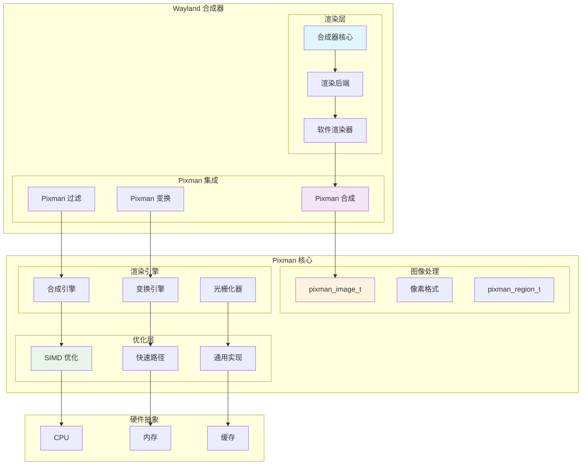
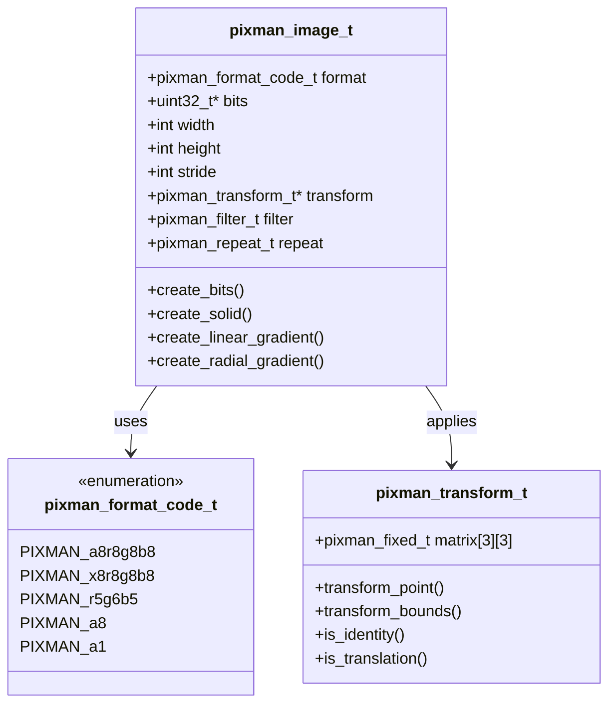
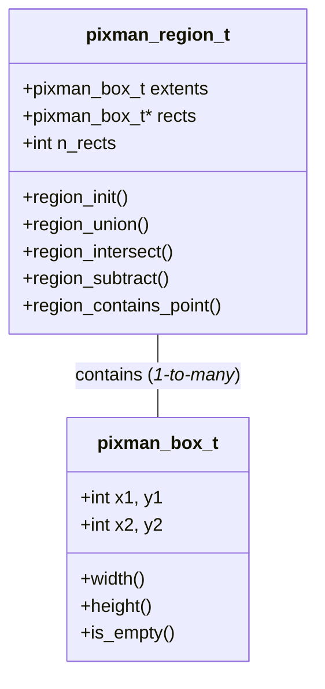
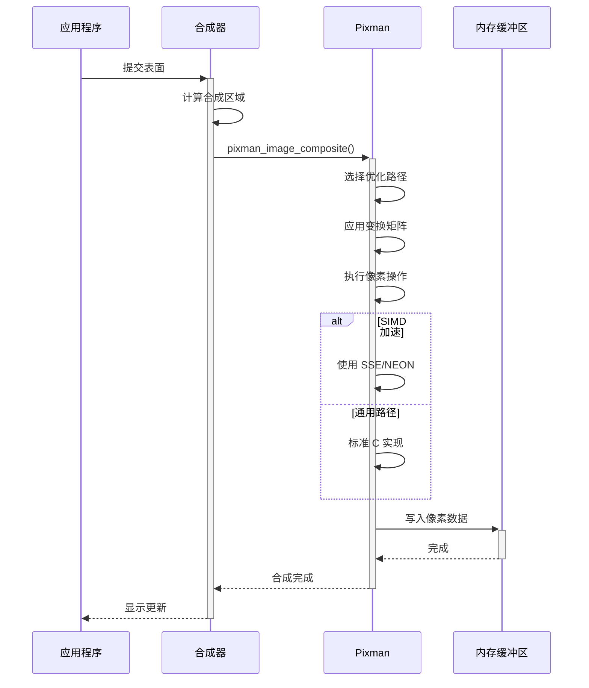
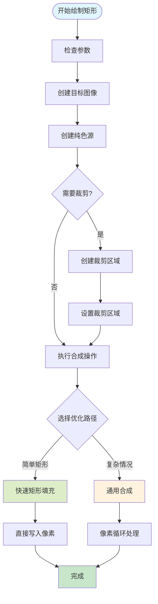
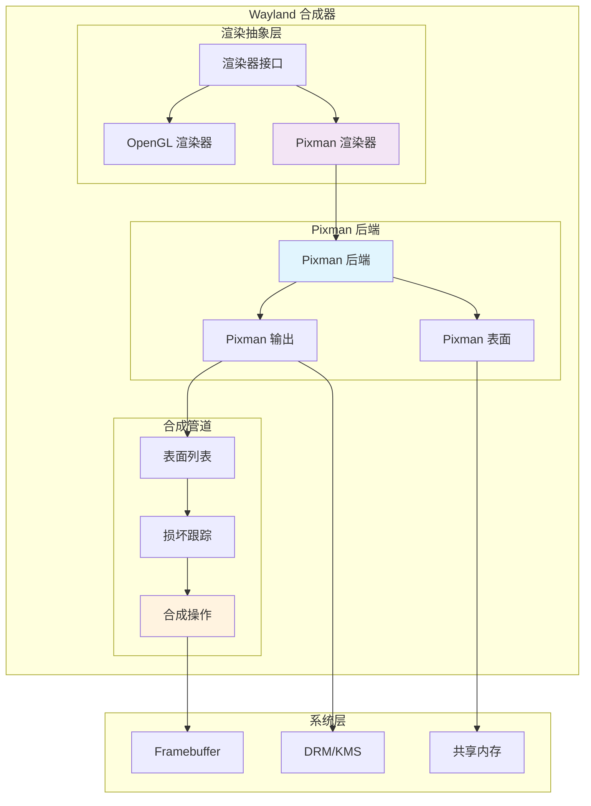
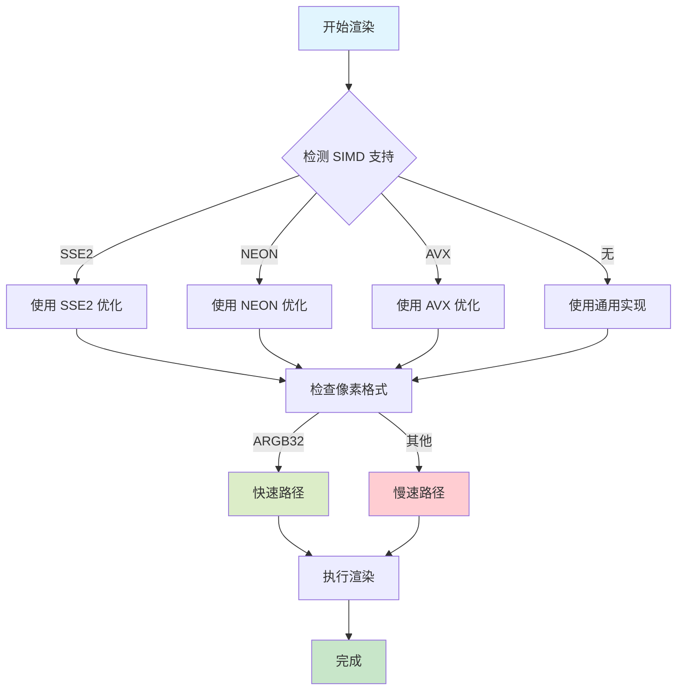

# Pixman 图形库与 Wayland 合成器开发指南

## 概述

Pixman 是一个低级像素操作库，专门用于高性能的 2D 图形渲染。它是许多现代图形系统的核心组件，包括 X.Org、Cairo 和 Wayland 合成器。Pixman 提供了像素级的图像合成、变换、过滤等功能，是构建高效图形渲染管道的基础。

对于 Wayland 合成器开发者来说，Pixman 是实现软件渲染后端的重要工具，特别适合处理 2D 合成、图像缩放、颜色转换等任务。

## 技术架构

### 整体架构图



### 核心组件

1. **pixman_image_t**: 图像对象，支持多种像素格式
2. **pixman_region_t**: 区域管理，用于裁剪和损坏跟踪
3. **pixman_transform_t**: 变换矩阵，支持旋转、缩放、平移
4. **合成引擎**: Porter-Duff 合成操作
5. **光栅化器**: 矢量图形到像素的转换
6. **SIMD 优化**: 多平台向量化加速

## 核心数据结构

### pixman_image_t 图像对象



### pixman_region_t 区域管理



## 图形绘制流程

### 图像合成流程



### 矩形绘制流程



## 基础绘制功能实现

### 图像创建与基础操作

```c
#include <pixman.h>
#include <stdlib.h>
#include <stdint.h>

// 创建位图图像
pixman_image_t *create_bitmap_image(int width, int height, 
                                   pixman_format_code_t format) {
    pixman_image_t *image;
    uint32_t *pixels;
    int stride;
    
    // 计算步长（字节对齐）
    stride = ((width * PIXMAN_FORMAT_BPP(format) + 31) / 32) * 4;
    
    // 分配像素缓冲区
    pixels = malloc(height * stride);
    if (!pixels)
        return NULL;
    
    // 创建图像对象
    image = pixman_image_create_bits(format, width, height, pixels, stride);
    if (!image) {
        free(pixels);
        return NULL;
    }
    
    return image;
}

// 创建纯色图像
pixman_image_t *create_solid_image(uint32_t color) {
    return pixman_image_create_solid_fill(&(pixman_color_t){
        .red = ((color >> 16) & 0xff) * 257,
        .green = ((color >> 8) & 0xff) * 257,
        .blue = (color & 0xff) * 257,
        .alpha = ((color >> 24) & 0xff) * 257
    });
}

// 创建线性渐变
pixman_image_t *create_linear_gradient(pixman_point_fixed_t *p1,
                                      pixman_point_fixed_t *p2,
                                      pixman_gradient_stop_t *stops,
                                      int n_stops) {
    return pixman_image_create_linear_gradient(p1, p2, stops, n_stops);
}

// 图像合成基础函数
void composite_images(pixman_image_t *dest, pixman_image_t *src,
                     pixman_image_t *mask, pixman_op_t op,
                     int src_x, int src_y, int mask_x, int mask_y,
                     int dest_x, int dest_y, int width, int height) {
    pixman_image_composite(op, src, mask, dest,
                          src_x, src_y, mask_x, mask_y,
                          dest_x, dest_y, width, height);
}
```

### 矩形绘制实现

```c
// 填充矩形
void draw_filled_rectangle(pixman_image_t *image, int x, int y, 
                          int width, int height, uint32_t color) {
    pixman_image_t *solid;
    pixman_color_t pixman_color;
    
    // 转换颜色格式
    pixman_color.red = ((color >> 16) & 0xff) * 257;
    pixman_color.green = ((color >> 8) & 0xff) * 257;
    pixman_color.blue = (color & 0xff) * 257;
    pixman_color.alpha = ((color >> 24) & 0xff) * 257;
    
    // 创建纯色源
    solid = pixman_image_create_solid_fill(&pixman_color);
    
    // 执行合成
    pixman_image_composite(PIXMAN_OP_OVER, solid, NULL, image,
                          0, 0, 0, 0, x, y, width, height);
    
    pixman_image_unref(solid);
}

// 绘制矩形边框
void draw_rectangle_outline(pixman_image_t *image, int x, int y,
                           int width, int height, int border_width,
                           uint32_t color) {
    // 上边框
    draw_filled_rectangle(image, x, y, width, border_width, color);
    
    // 下边框
    draw_filled_rectangle(image, x, y + height - border_width, 
                         width, border_width, color);
    
    // 左边框
    draw_filled_rectangle(image, x, y + border_width, border_width,
                         height - 2 * border_width, color);
    
    // 右边框
    draw_filled_rectangle(image, x + width - border_width, y + border_width,
                         border_width, height - 2 * border_width, color);
}

// 圆角矩形
void draw_rounded_rectangle(pixman_image_t *image, int x, int y,
                           int width, int height, int radius,
                           uint32_t color) {
    pixman_image_t *mask, *solid;
    
    // 创建遮罩图像
    mask = create_rounded_rectangle_mask(width, height, radius);
    
    // 创建颜色源
    solid = create_solid_image(color);
    
    // 使用遮罩合成
    pixman_image_composite(PIXMAN_OP_OVER, solid, mask, image,
                          0, 0, 0, 0, x, y, width, height);
    
    pixman_image_unref(mask);
    pixman_image_unref(solid);
}

// 创建圆角矩形遮罩
pixman_image_t *create_rounded_rectangle_mask(int width, int height, int radius) {
    pixman_image_t *mask;
    uint8_t *pixels;
    int stride = (width + 3) & ~3;  // 4字节对齐
    
    pixels = calloc(height, stride);
    mask = pixman_image_create_bits(PIXMAN_a8, width, height, 
                                   (uint32_t*)pixels, stride);
    
    // 绘制圆角遮罩
    for (int y = 0; y < height; y++) {
        for (int x = 0; x < width; x++) {
            uint8_t alpha = calculate_rounded_rect_alpha(x, y, width, height, radius);
            pixels[y * stride + x] = alpha;
        }
    }
    
    return mask;
}

// 计算圆角矩形的 alpha 值
uint8_t calculate_rounded_rect_alpha(int x, int y, int width, int height, int radius) {
    // 判断是否在圆角区域
    bool in_corner = false;
    int cx, cy; // 圆心坐标
    
    if (x < radius && y < radius) {
        // 左上角
        cx = radius; cy = radius;
        in_corner = true;
    } else if (x >= width - radius && y < radius) {
        // 右上角
        cx = width - radius - 1; cy = radius;
        in_corner = true;
    } else if (x < radius && y >= height - radius) {
        // 左下角
        cx = radius; cy = height - radius - 1;
        in_corner = true;
    } else if (x >= width - radius && y >= height - radius) {
        // 右下角
        cx = width - radius - 1; cy = height - radius - 1;
        in_corner = true;
    }
    
    if (in_corner) {
        float dx = x - cx;
        float dy = y - cy;
        float distance = sqrt(dx * dx + dy * dy);
        
        if (distance <= radius) {
            return 255;  // 完全不透明
        } else if (distance <= radius + 1) {
            // 抗锯齿边缘
            return (uint8_t)((radius + 1 - distance) * 255);
        } else {
            return 0;    // 完全透明
        }
    }
    
    return 255;  // 矩形主体区域
}
```

### 线段绘制实现

```c
// 绘制线段（Bresenham 算法）
void draw_line(pixman_image_t *image, int x0, int y0, int x1, int y1,
               int thickness, uint32_t color) {
    if (thickness == 1) {
        draw_thin_line(image, x0, y0, x1, y1, color);
    } else {
        draw_thick_line(image, x0, y0, x1, y1, thickness, color);
    }
}

// 绘制细线
void draw_thin_line(pixman_image_t *image, int x0, int y0, int x1, int y1,
                   uint32_t color) {
    int dx = abs(x1 - x0);
    int dy = abs(y1 - y0);
    int sx = x0 < x1 ? 1 : -1;
    int sy = y0 < y1 ? 1 : -1;
    int err = dx - dy;
    int x = x0, y = y0;
    
    // 创建单像素画笔
    pixman_image_t *solid = create_solid_image(color);
    
    while (true) {
        // 绘制像素
        pixman_image_composite(PIXMAN_OP_OVER, solid, NULL, image,
                              0, 0, 0, 0, x, y, 1, 1);
        
        if (x == x1 && y == y1) break;
        
        int e2 = 2 * err;
        if (e2 > -dy) {
            err -= dy;
            x += sx;
        }
        if (e2 < dx) {
            err += dx;
            y += sy;
        }
    }
    
    pixman_image_unref(solid);
}

// 绘制粗线
void draw_thick_line(pixman_image_t *image, int x0, int y0, int x1, int y1,
                    int thickness, uint32_t color) {
    // 计算线段的法向量
    float dx = x1 - x0;
    float dy = y1 - y0;
    float length = sqrt(dx * dx + dy * dy);
    
    if (length == 0) return;
    
    // 单位法向量
    float nx = -dy / length;
    float ny = dx / length;
    
    // 计算线段的四个角点
    float half_thickness = thickness / 2.0f;
    
    pixman_point_fixed_t quad[4] = {
        { pixman_double_to_fixed(x0 + nx * half_thickness),
          pixman_double_to_fixed(y0 + ny * half_thickness) },
        { pixman_double_to_fixed(x1 + nx * half_thickness),
          pixman_double_to_fixed(y1 + ny * half_thickness) },
        { pixman_double_to_fixed(x1 - nx * half_thickness),
          pixman_double_to_fixed(y1 - ny * half_thickness) },
        { pixman_double_to_fixed(x0 - nx * half_thickness),
          pixman_double_to_fixed(y0 - ny * half_thickness) }
    };
    
    // 填充四边形
    fill_polygon(image, quad, 4, color);
}

// 绘制抗锯齿线段
void draw_antialiased_line(pixman_image_t *image, float x0, float y0,
                          float x1, float y1, float thickness, uint32_t color) {
    // 创建临时图像用于抗锯齿渲染
    int min_x = (int)floor(fmin(x0, x1) - thickness);
    int min_y = (int)floor(fmin(y0, y1) - thickness);
    int max_x = (int)ceil(fmax(x0, x1) + thickness);
    int max_y = (int)ceil(fmax(y0, y1) + thickness);
    
    int width = max_x - min_x + 1;
    int height = max_y - min_y + 1;
    
    pixman_image_t *temp = create_bitmap_image(width, height, PIXMAN_a8);
    
    // 渲染抗锯齿线段到临时图像
    render_antialiased_line_to_alpha(temp, x0 - min_x, y0 - min_y,
                                    x1 - min_x, y1 - min_y, thickness);
    
    // 使用临时图像作为遮罩合成到目标图像
    pixman_image_t *solid = create_solid_image(color);
    pixman_image_composite(PIXMAN_OP_OVER, solid, temp, image,
                          0, 0, 0, 0, min_x, min_y, width, height);
    
    pixman_image_unref(temp);
    pixman_image_unref(solid);
}
```

### 圆形绘制实现

```c
// 绘制填充圆形
void draw_filled_circle(pixman_image_t *image, int cx, int cy, int radius,
                       uint32_t color) {
    pixman_image_t *mask, *solid;
    int diameter = radius * 2 + 1;
    
    // 创建圆形遮罩
    mask = create_circle_mask(diameter, diameter, radius);
    
    // 创建颜色源
    solid = create_solid_image(color);
    
    // 合成
    pixman_image_composite(PIXMAN_OP_OVER, solid, mask, image,
                          0, 0, 0, 0, cx - radius, cy - radius,
                          diameter, diameter);
    
    pixman_image_unref(mask);
    pixman_image_unref(solid);
}

// 创建圆形遮罩
pixman_image_t *create_circle_mask(int width, int height, int radius) {
    pixman_image_t *mask;
    uint8_t *pixels;
    int stride = (width + 3) & ~3;
    
    pixels = calloc(height, stride);
    mask = pixman_image_create_bits(PIXMAN_a8, width, height,
                                   (uint32_t*)pixels, stride);
    
    int cx = width / 2;
    int cy = height / 2;
    
    for (int y = 0; y < height; y++) {
        for (int x = 0; x < width; x++) {
            float dx = x - cx;
            float dy = y - cy;
            float distance = sqrt(dx * dx + dy * dy);
            
            uint8_t alpha;
            if (distance <= radius) {
                alpha = 255;
            } else if (distance <= radius + 1) {
                // 抗锯齿边缘
                alpha = (uint8_t)((radius + 1 - distance) * 255);
            } else {
                alpha = 0;
            }
            
            pixels[y * stride + x] = alpha;
        }
    }
    
    return mask;
}

// 绘制圆形边框
void draw_circle_outline(pixman_image_t *image, int cx, int cy,
                        int radius, int border_width, uint32_t color) {
    pixman_image_t *outer_mask, *inner_mask, *border_mask, *solid;
    int diameter = (radius + border_width) * 2 + 1;
    
    // 创建外圆和内圆遮罩
    outer_mask = create_circle_mask(diameter, diameter, radius + border_width);
    inner_mask = create_circle_mask(diameter, diameter, radius);
    
    // 创建边框遮罩（外圆减去内圆）
    border_mask = create_bitmap_image(diameter, diameter, PIXMAN_a8);
    
    // 先绘制外圆
    pixman_image_composite(PIXMAN_OP_SRC, outer_mask, NULL, border_mask,
                          0, 0, 0, 0, 0, 0, diameter, diameter);
    
    // 减去内圆
    pixman_image_composite(PIXMAN_OP_OUT, inner_mask, NULL, border_mask,
                          0, 0, 0, 0, 0, 0, diameter, diameter);
    
    // 创建颜色源并合成
    solid = create_solid_image(color);
    pixman_image_composite(PIXMAN_OP_OVER, solid, border_mask, image,
                          0, 0, 0, 0, cx - radius - border_width,
                          cy - radius - border_width, diameter, diameter);
    
    pixman_image_unref(outer_mask);
    pixman_image_unref(inner_mask);
    pixman_image_unref(border_mask);
    pixman_image_unref(solid);
}
```

### 自由曲线绘制实现

```c
// 贝塞尔曲线控制点结构
typedef struct {
    float x, y;
} point_t;

// 绘制二次贝塞尔曲线
void draw_quadratic_bezier(pixman_image_t *image, point_t p0, point_t p1, point_t p2,
                          float thickness, uint32_t color) {
    // 计算曲线长度的近似值
    float chord_length = sqrt((p2.x - p0.x) * (p2.x - p0.x) + 
                             (p2.y - p0.y) * (p2.y - p0.y));
    int steps = (int)(chord_length / 2) + 10;  // 采样点数
    
    point_t *points = malloc(steps * sizeof(point_t));
    
    // 采样贝塞尔曲线
    for (int i = 0; i < steps; i++) {
        float t = (float)i / (steps - 1);
        float t2 = t * t;
        float mt = 1 - t;
        float mt2 = mt * mt;
        
        points[i].x = mt2 * p0.x + 2 * mt * t * p1.x + t2 * p2.x;
        points[i].y = mt2 * p0.y + 2 * mt * t * p1.y + t2 * p2.y;
    }
    
    // 连接采样点
    for (int i = 0; i < steps - 1; i++) {
        draw_antialiased_line(image, points[i].x, points[i].y,
                             points[i + 1].x, points[i + 1].y,
                             thickness, color);
    }
    
    free(points);
}

// 绘制三次贝塞尔曲线
void draw_cubic_bezier(pixman_image_t *image, point_t p0, point_t p1,
                      point_t p2, point_t p3, float thickness, uint32_t color) {
    float chord_length = sqrt((p3.x - p0.x) * (p3.x - p0.x) + 
                             (p3.y - p0.y) * (p3.y - p0.y));
    int steps = (int)(chord_length / 2) + 15;
    
    point_t *points = malloc(steps * sizeof(point_t));
    
    for (int i = 0; i < steps; i++) {
        float t = (float)i / (steps - 1);
        float t2 = t * t;
        float t3 = t2 * t;
        float mt = 1 - t;
        float mt2 = mt * mt;
        float mt3 = mt2 * mt;
        
        points[i].x = mt3 * p0.x + 3 * mt2 * t * p1.x + 
                     3 * mt * t2 * p2.x + t3 * p3.x;
        points[i].y = mt3 * p0.y + 3 * mt2 * t * p1.y + 
                     3 * mt * t2 * p2.y + t3 * p3.y;
    }
    
    for (int i = 0; i < steps - 1; i++) {
        draw_antialiased_line(image, points[i].x, points[i].y,
                             points[i + 1].x, points[i + 1].y,
                             thickness, color);
    }
    
    free(points);
}

// 自由曲线路径
typedef struct {
    point_t *points;
    int count;
    int capacity;
} path_t;

// 创建路径
path_t *path_create() {
    path_t *path = malloc(sizeof(path_t));
    path->capacity = 100;
    path->points = malloc(path->capacity * sizeof(point_t));
    path->count = 0;
    return path;
}

// 添加点到路径
void path_add_point(path_t *path, float x, float y) {
    if (path->count >= path->capacity) {
        path->capacity *= 2;
        path->points = realloc(path->points, path->capacity * sizeof(point_t));
    }
    
    path->points[path->count].x = x;
    path->points[path->count].y = y;
    path->count++;
}

// 绘制平滑曲线路径
void draw_smooth_path(pixman_image_t *image, path_t *path, float thickness,
                     uint32_t color) {
    if (path->count < 2) return;
    
    // 使用 Catmull-Rom 样条进行平滑
    for (int i = 0; i < path->count - 1; i++) {
        point_t p0 = (i == 0) ? path->points[0] : path->points[i - 1];
        point_t p1 = path->points[i];
        point_t p2 = path->points[i + 1];
        point_t p3 = (i == path->count - 2) ? path->points[i + 1] : path->points[i + 2];
        
        draw_catmull_rom_segment(image, p0, p1, p2, p3, thickness, color);
    }
}

// 绘制 Catmull-Rom 样条段
void draw_catmull_rom_segment(pixman_image_t *image, point_t p0, point_t p1,
                             point_t p2, point_t p3, float thickness, uint32_t color) {
    int steps = 20;
    
    for (int i = 0; i < steps; i++) {
        float t = (float)i / steps;
        float t2 = t * t;
        float t3 = t2 * t;
        
        // Catmull-Rom 插值公式
        point_t current = {
            0.5f * ((2 * p1.x) + (-p0.x + p2.x) * t + 
                   (2 * p0.x - 5 * p1.x + 4 * p2.x - p3.x) * t2 + 
                   (-p0.x + 3 * p1.x - 3 * p2.x + p3.x) * t3),
            0.5f * ((2 * p1.y) + (-p0.y + p2.y) * t + 
                   (2 * p0.y - 5 * p1.y + 4 * p2.y - p3.y) * t2 + 
                   (-p0.y + 3 * p1.y - 3 * p2.y + p3.y) * t3)
        };
        
        point_t next = {
            0.5f * ((2 * p1.x) + (-p0.x + p2.x) * (t + 1.0f/steps) + 
                   (2 * p0.x - 5 * p1.x + 4 * p2.x - p3.x) * (t + 1.0f/steps) * (t + 1.0f/steps) + 
                   (-p0.x + 3 * p1.x - 3 * p2.x + p3.x) * (t + 1.0f/steps) * (t + 1.0f/steps) * (t + 1.0f/steps)),
            0.5f * ((2 * p1.y) + (-p0.y + p2.y) * (t + 1.0f/steps) + 
                   (2 * p0.y - 5 * p1.y + 4 * p2.y - p3.y) * (t + 1.0f/steps) * (t + 1.0f/steps) + 
                   (-p0.y + 3 * p1.y - 3 * p2.y + p3.y) * (t + 1.0f/steps) * (t + 1.0f/steps) * (t + 1.0f/steps))
        };
        
        draw_antialiased_line(image, current.x, current.y, next.x, next.y,
                             thickness, color);
    }
}

// 销毁路径
void path_destroy(path_t *path) {
    free(path->points);
    free(path);
}
```

## Wayland 合成器集成

### Pixman 后端实现



### 合成器 Pixman 集成代码

```c
// Pixman 渲染器结构
struct pixman_renderer {
    struct wl_list link;
    struct compositor *compositor;
    struct pixman_output_state *output_state;
    
    pixman_image_t *shadow_image;
    uint32_t *shadow_buffer;
};

// Pixman 输出状态
struct pixman_output_state {
    struct pixman_renderer *renderer;
    struct output *output;
    
    pixman_image_t *hw_buffer;
    pixman_image_t *shadow_image;
    
    pixman_region_t damage;
    
    struct wl_listener mode_change_listener;
    struct wl_listener transform_listener;
    struct wl_listener frame_listener;
};

// Pixman 表面状态
struct pixman_surface_state {
    struct surface *surface;
    struct pixman_renderer *renderer;
    
    pixman_image_t *image;
    struct wl_listener surface_destroy_listener;
    struct wl_listener buffer_destroy_listener;
};

// 创建 Pixman 渲染器
struct pixman_renderer *pixman_renderer_create(struct compositor *comp) {
    struct pixman_renderer *renderer;
    
    renderer = calloc(1, sizeof(*renderer));
    if (!renderer)
        return NULL;
    
    renderer->compositor = comp;
    wl_list_init(&renderer->link);
    
    // 注册表面创建监听器
    renderer->surface_create_listener.notify = pixman_surface_create;
    wl_signal_add(&comp->surface_create_signal, &renderer->surface_create_listener);
    
    return renderer;
}

// 创建 Pixman 输出
int pixman_output_create(struct output *output) {
    struct pixman_output_state *po;
    struct pixman_renderer *renderer = output->compositor->renderer;
    
    po = calloc(1, sizeof(*po));
    if (!po)
        return -1;
    
    po->output = output;
    po->renderer = renderer;
    
    pixman_region_init(&po->damage);
    
    // 创建硬件缓冲区
    po->hw_buffer = create_output_image(output);
    if (!po->hw_buffer) {
        free(po);
        return -1;
    }
    
    output->renderer_state = po;
    
    return 0;
}

// 表面合成
void pixman_surface_composite(struct surface *surface, struct output *output,
                             pixman_region_t *damage) {
    struct pixman_surface_state *ps = surface->renderer_state;
    struct pixman_output_state *po = output->renderer_state;
    pixman_region_t surface_damage;
    
    if (!ps || !ps->image)
        return;
    
    // 计算表面在输出上的损坏区域
    pixman_region_init(&surface_damage);
    pixman_region_copy(&surface_damage, damage);
    pixman_region_translate(&surface_damage, -surface->geometry.x, -surface->geometry.y);
    
    // 设置变换
    if (surface->transform) {
        pixman_image_set_transform(ps->image, surface->transform);
    }
    
    // 设置过滤器
    pixman_image_set_filter(ps->image, PIXMAN_FILTER_BILINEAR, NULL, 0);
    
    // 执行合成
    pixman_image_set_clip_region(po->hw_buffer, &surface_damage);
    pixman_image_composite(PIXMAN_OP_OVER, ps->image, NULL, po->hw_buffer,
                          0, 0, 0, 0,
                          surface->geometry.x, surface->geometry.y,
                          surface->geometry.width, surface->geometry.height);
    
    pixman_region_fini(&surface_damage);
}

// 输出渲染
void pixman_output_render(struct output *output, pixman_region_t *damage) {
    struct pixman_output_state *po = output->renderer_state;
    struct surface *surface;
    
    // 清空损坏区域
    clear_damage_region(po->hw_buffer, damage);
    
    // 遍历表面列表进行合成
    wl_list_for_each_reverse(surface, &output->compositor->surface_list, link) {
        if (surface_is_visible(surface, output)) {
            pixman_surface_composite(surface, output, damage);
        }
    }
    
    // 将结果提交到硬件
    pixman_output_present(output, damage);
}

// 优化的快速路径检测
bool can_use_fast_path(struct surface *surface, struct output *output) {
    struct pixman_surface_state *ps = surface->renderer_state;
    
    // 检查是否可以使用快速合成路径
    if (!ps->image)
        return false;
    
    // 检查格式兼容性
    pixman_format_code_t surface_format = pixman_image_get_format(ps->image);
    pixman_format_code_t output_format = get_output_format(output);
    
    if (!formats_compatible(surface_format, output_format))
        return false;
    
    // 检查变换
    if (surface->transform && !pixman_transform_is_identity(surface->transform))
        return false;
    
    // 检查缩放
    if (surface->scale != 1.0f)
        return false;
    
    return true;
}

// 高性能合成优化
void pixman_fast_composite(struct surface *surface, struct output *output,
                          pixman_region_t *damage) {
    struct pixman_surface_state *ps = surface->renderer_state;
    struct pixman_output_state *po = output->renderer_state;
    
    // 使用最优化的合成操作
    pixman_image_composite32(PIXMAN_OP_OVER,
                            ps->image, NULL, po->hw_buffer,
                            0, 0, 0, 0,
                            surface->geometry.x, surface->geometry.y,
                            surface->geometry.width, surface->geometry.height);
}
```

## 性能优化策略

### SIMD 优化检测



### 内存优化和缓存策略

```c
// 内存池管理
struct pixman_memory_pool {
    uint8_t *memory;
    size_t size;
    size_t used;
    struct wl_list free_blocks;
};

// 图像缓存
struct pixman_image_cache {
    struct wl_list images;
    int max_size;
    int current_size;
};

// 优化的图像创建
pixman_image_t *cached_image_create(struct pixman_image_cache *cache,
                                   int width, int height,
                                   pixman_format_code_t format) {
    struct cached_image *cached;
    
    // 尝试从缓存中获取
    wl_list_for_each(cached, &cache->images, link) {
        if (cached->width == width && cached->height == height &&
            cached->format == format && !cached->in_use) {
            cached->in_use = true;
            return cached->image;
        }
    }
    
    // 缓存中没有，创建新的
    if (cache->current_size >= cache->max_size) {
        evict_oldest_image(cache);
    }
    
    cached = malloc(sizeof(*cached));
    cached->image = create_bitmap_image(width, height, format);
    cached->width = width;
    cached->height = height;
    cached->format = format;
    cached->in_use = true;
    
    wl_list_insert(&cache->images, &cached->link);
    cache->current_size++;
    
    return cached->image;
}

// 损坏区域优化
void optimize_damage_regions(pixman_region_t *damage) {
    pixman_region_t simplified;
    
    pixman_region_init(&simplified);
    
    // 合并相邻的损坏矩形
    pixman_region_copy(&simplified, damage);
    
    // 如果损坏区域太复杂，简化为边界矩形
    if (pixman_region_n_rects(damage) > MAX_DAMAGE_RECTS) {
        pixman_box_t *extents = pixman_region_extents(damage);
        pixman_region_init_rect(&simplified, extents->x1, extents->y1,
                               extents->x2 - extents->x1,
                               extents->y2 - extents->y1);
    }
    
    pixman_region_copy(damage, &simplified);
    pixman_region_fini(&simplified);
}
```

## 调试和性能分析

### 调试工具

```c
// Pixman 调试信息
void pixman_debug_dump_image(pixman_image_t *image, const char *filename) {
    int width = pixman_image_get_width(image);
    int height = pixman_image_get_height(image);
    int stride = pixman_image_get_stride(image);
    uint32_t *data = (uint32_t*)pixman_image_get_data(image);
    
    FILE *f = fopen(filename, "wb");
    if (!f) return;
    
    // 写入简单的 PPM 格式
    fprintf(f, "P6\n%d %d\n255\n", width, height);
    
    for (int y = 0; y < height; y++) {
        for (int x = 0; x < width; x++) {
            uint32_t pixel = data[y * stride / 4 + x];
            uint8_t rgb[3] = {
                (pixel >> 16) & 0xff,
                (pixel >> 8) & 0xff,
                pixel & 0xff
            };
            fwrite(rgb, 3, 1, f);
        }
    }
    
    fclose(f);
}

// 性能计时
struct pixman_timer {
    struct timespec start;
    struct timespec end;
    double total_time;
    int call_count;
};

void timer_start(struct pixman_timer *timer) {
    clock_gettime(CLOCK_MONOTONIC, &timer->start);
}

void timer_end(struct pixman_timer *timer) {
    clock_gettime(CLOCK_MONOTONIC, &timer->end);
    
    double elapsed = (timer->end.tv_sec - timer->start.tv_sec) +
                    (timer->end.tv_nsec - timer->start.tv_nsec) / 1e9;
    
    timer->total_time += elapsed;
    timer->call_count++;
}

double timer_average(struct pixman_timer *timer) {
    return timer->call_count > 0 ? timer->total_time / timer->call_count : 0.0;
}
```

## 最佳实践

### 1. 内存管理
- 使用对象池减少内存分配开销
- 及时释放不再使用的图像对象
- 监控内存使用情况避免泄漏

### 2. 性能优化
- 利用 Pixman 的 SIMD 优化
- 选择合适的像素格式
- 优化损坏区域计算

### 3. 质量控制
- 使用抗锯齿提升渲染质量
- 选择合适的过滤器
- 处理颜色空间转换

## 总结

Pixman 是一个强大而高效的 2D 图形渲染库，为 Wayland 合成器提供了完整的软件渲染解决方案。通过深入理解其架构和 API，开发者可以实现高质量的图形渲染功能。

关键要点：
1. **模块化设计**: 清晰的图像、区域、变换抽象
2. **性能优化**: 多平台 SIMD 加速和快速路径
3. **灵活的合成**: 支持复杂的 Porter-Duff 操作
4. **内存效率**: 优化的内存使用和缓存策略
5. **质量控制**: 抗锯齿和高质量过滤器

通过合理使用 Pixman 的各种功能，Wayland 合成器开发者可以构建出既高效又美观的图形界面系统。