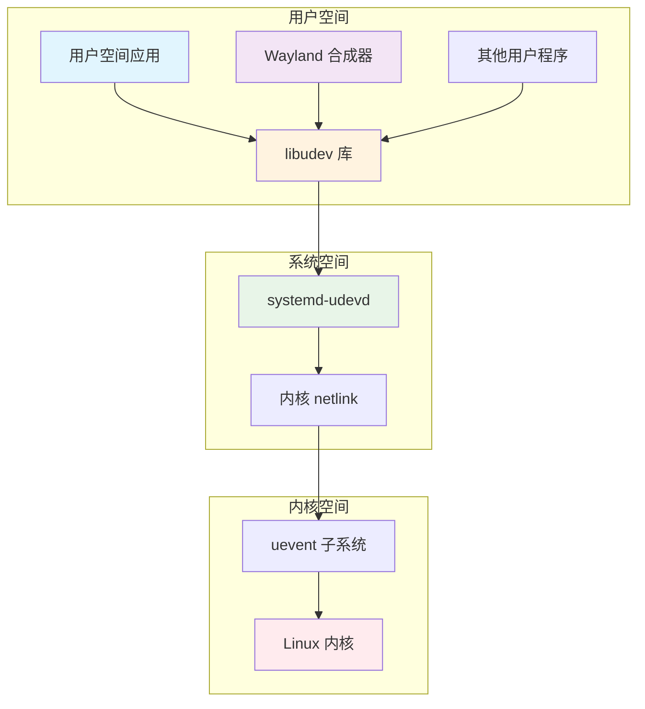
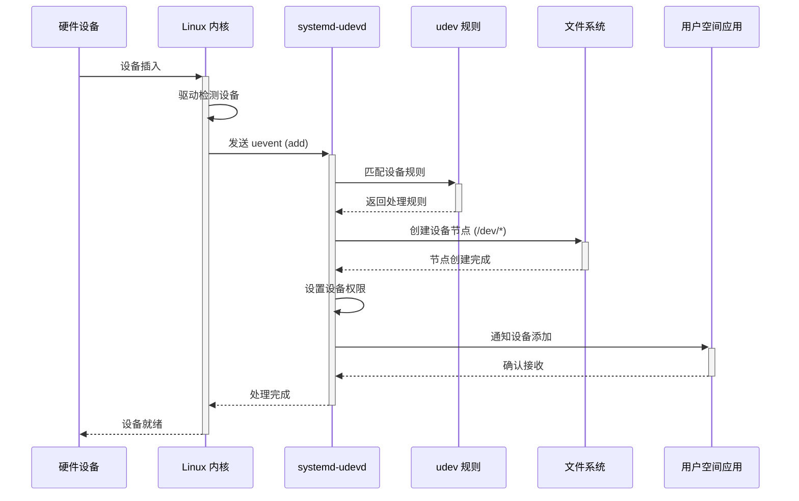
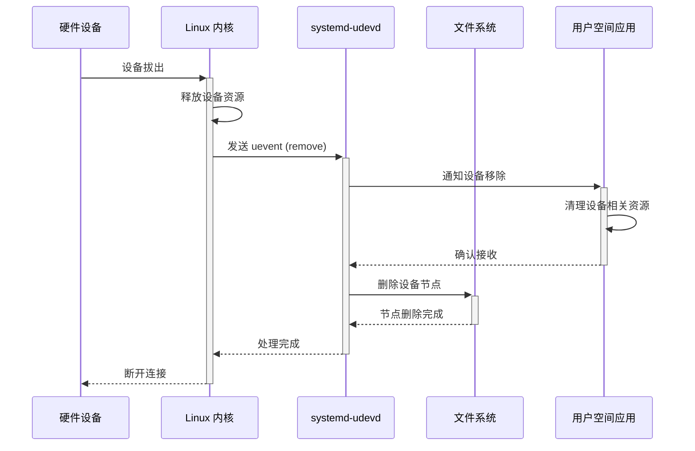
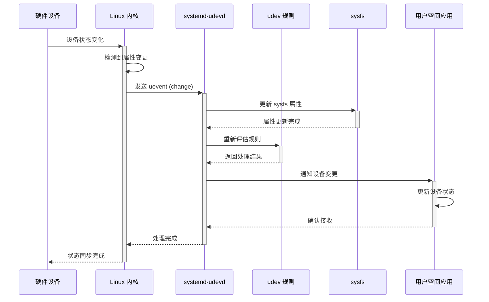
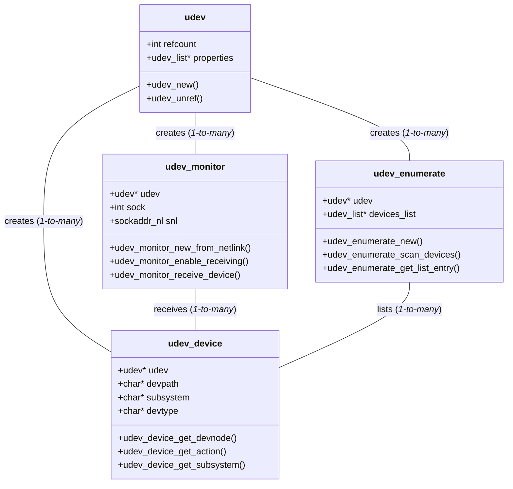
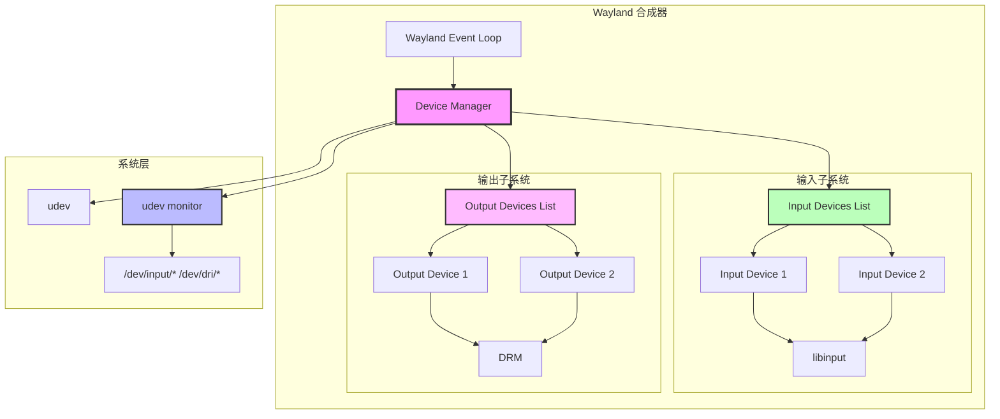
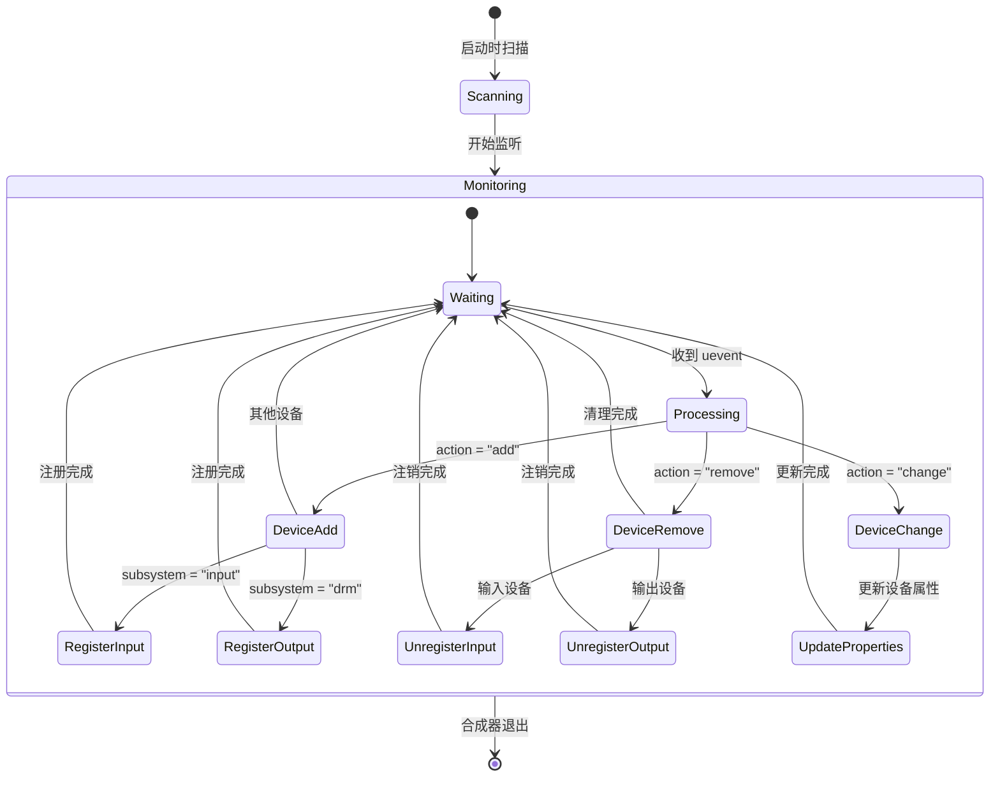
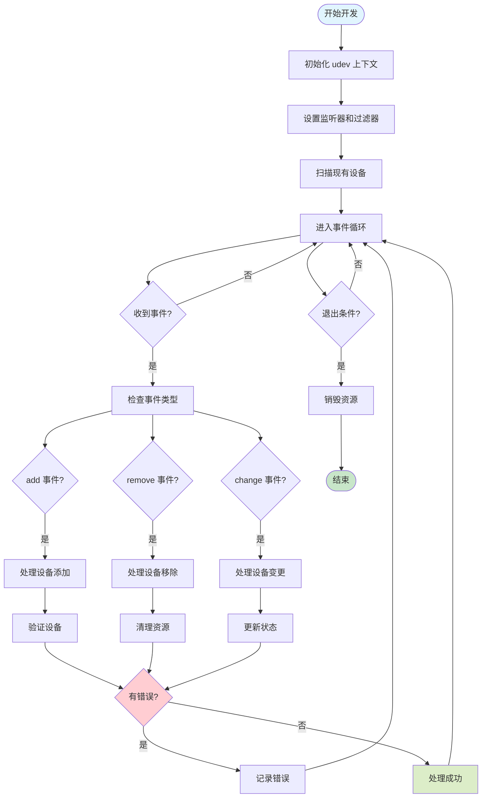

# Linux udev 系统与 libudev 开发指南

## 概述

udev（userspace device management）是 Linux 系统中用于动态管理设备节点的系统。它负责处理设备的热插拔事件，维护 `/dev` 目录下的设备文件，并为用户空间程序提供设备管理接口。对于 Wayland 合成器开发者来说，udev 是管理输入设备、显示设备和其他硬件资源的核心组件。

## 技术架构

### 整体架构



### 核心组件

1. **内核 uevent 子系统**: 负责生成设备事件
2. **systemd-udevd**: udev 守护进程，处理设备事件
3. **libudev**: 用户空间库，提供设备管理 API
4. **udev 规则**: 定义设备处理逻辑的配置文件

## 设备事件流程

### 设备添加 (Add) 流程



```
设备插入 → 内核检测 → 生成 uevent → systemd-udevd 处理 → 执行规则 → 创建设备节点 → 通知用户空间
```

详细步骤：

1. **内核检测**: 硬件设备插入，内核驱动检测到新设备
2. **uevent 生成**: 内核通过 netlink socket 发送 "add" 事件
3. **udevd 接收**: systemd-udevd 监听 netlink 消息
4. **规则匹配**: 根据设备属性匹配 udev 规则
5. **设备节点创建**: 在 `/dev` 下创建相应的设备文件
6. **权限设置**: 根据规则设置设备文件权限
7. **用户通知**: 通过 libudev 通知监听的用户空间程序

### 设备移除 (Remove) 流程



```
设备拔出 → 内核检测 → 生成 uevent → systemd-udevd 处理 → 删除设备节点 → 通知用户空间
```

详细步骤：

1. **设备断开**: 硬件设备被移除
2. **内核清理**: 内核释放设备相关资源
3. **uevent 生成**: 发送 "remove" 事件
4. **udevd 处理**: 执行移除规则
5. **节点删除**: 删除 `/dev` 下的设备文件
6. **清理通知**: 通知用户空间程序设备已移除

### 设备变更 (Change) 流程



```
设备状态变化 → 内核检测 → 生成 uevent → systemd-udevd 处理 → 更新设备属性 → 通知用户空间
```

详细步骤：

1. **状态变化**: 设备属性或状态发生变化
2. **事件触发**: 内核发送 "change" 事件
3. **属性更新**: udevd 更新设备的 sysfs 属性
4. **规则重新评估**: 重新执行相关 udev 规则
5. **变更通知**: 通知用户空间程序设备状态变化

## libudev 核心结构

### 主要数据结构关系图



### 主要数据结构

#### struct udev
```c
struct udev {
    int refcount;
    struct udev_list *properties;
    // ... 其他字段
};
```
- udev 上下文对象，所有操作的基础

#### struct udev_device
```c
struct udev_device {
    struct udev *udev;
    char *devpath;
    char *subsystem;
    char *devtype;
    // ... 设备属性
};
```
- 表示单个设备的对象

#### struct udev_monitor
```c
struct udev_monitor {
    struct udev *udev;
    int sock;
    struct sockaddr_nl snl;
    // ... 监听器配置
};
```
- 用于监听设备事件的对象

#### struct udev_enumerate
```c
struct udev_enumerate {
    struct udev *udev;
    struct udev_list *devices_list;
    // ... 枚举配置
};
```
- 用于枚举现有设备的对象

## libudev API 使用指南

### 基础初始化

```c
#include <libudev.h>

// 创建 udev 上下文
struct udev *udev = udev_new();
if (!udev) {
    fprintf(stderr, "无法创建 udev 上下文\n");
    return -1;
}

// 使用完毕后释放
udev_unref(udev);
```

### 设备枚举

```c
// 枚举所有输入设备
struct udev_enumerate *enumerate = udev_enumerate_new(udev);
udev_enumerate_add_match_subsystem(enumerate, "input");
udev_enumerate_scan_devices(enumerate);

struct udev_list_entry *devices = udev_enumerate_get_list_entry(enumerate);
struct udev_list_entry *entry;

udev_list_entry_foreach(entry, devices) {
    const char *path = udev_list_entry_get_name(entry);
    struct udev_device *device = udev_device_new_from_syspath(udev, path);
    
    // 获取设备信息
    const char *devnode = udev_device_get_devnode(device);
    const char *subsystem = udev_device_get_subsystem(device);
    
    printf("设备: %s, 子系统: %s\n", devnode, subsystem);
    
    udev_device_unref(device);
}

udev_enumerate_unref(enumerate);
```

### 设备监听

```c
// 创建监听器
struct udev_monitor *monitor = udev_monitor_new_from_netlink(udev, "udev");
if (!monitor) {
    fprintf(stderr, "无法创建监听器\n");
    return -1;
}

// 过滤特定子系统
udev_monitor_filter_add_match_subsystem_devtype(monitor, "input", NULL);
udev_monitor_filter_add_match_subsystem_devtype(monitor, "drm", NULL);

// 启用监听
udev_monitor_enable_receiving(monitor);

// 获取文件描述符用于 poll/select
int fd = udev_monitor_get_fd(monitor);

// 事件循环
while (1) {
    fd_set fds;
    FD_ZERO(&fds);
    FD_SET(fd, &fds);
    
    int ret = select(fd + 1, &fds, NULL, NULL, NULL);
    if (ret > 0 && FD_ISSET(fd, &fds)) {
        struct udev_device *device = udev_monitor_receive_device(monitor);
        if (device) {
            handle_device_event(device);
            udev_device_unref(device);
        }
    }
}

udev_monitor_unref(monitor);
```

### 设备事件处理

```c
void handle_device_event(struct udev_device *device) {
    const char *action = udev_device_get_action(device);
    const char *devnode = udev_device_get_devnode(device);
    const char *subsystem = udev_device_get_subsystem(device);
    
    printf("事件: %s, 设备: %s, 子系统: %s\n", 
           action, devnode ? devnode : "N/A", subsystem);
    
    if (strcmp(action, "add") == 0) {
        handle_device_add(device);
    } else if (strcmp(action, "remove") == 0) {
        handle_device_remove(device);
    } else if (strcmp(action, "change") == 0) {
        handle_device_change(device);
    }
}

void handle_device_add(struct udev_device *device) {
    const char *subsystem = udev_device_get_subsystem(device);
    
    if (strcmp(subsystem, "input") == 0) {
        // 处理输入设备添加
        const char *devnode = udev_device_get_devnode(device);
        if (devnode) {
            printf("新增输入设备: %s\n", devnode);
            // 在 Wayland 合成器中注册新的输入设备
        }
    } else if (strcmp(subsystem, "drm") == 0) {
        // 处理显示设备添加
        const char *devnode = udev_device_get_devnode(device);
        if (devnode && strstr(devnode, "card")) {
            printf("新增显示设备: %s\n", devnode);
            // 在合成器中添加新的输出设备
        }
    }
}

void handle_device_remove(struct udev_device *device) {
    // 清理相关资源
    const char *devnode = udev_device_get_devnode(device);
    printf("设备移除: %s\n", devnode ? devnode : "未知");
    
    // 在合成器中移除对应的设备
}

void handle_device_change(struct udev_device *device) {
    // 处理设备状态变化
    const char *devnode = udev_device_get_devnode(device);
    printf("设备变化: %s\n", devnode ? devnode : "未知");
    
    // 更新合成器中的设备状态
}
```

## Wayland 合成器集成示例

### 设备管理器架构图



### 设备管理器结构

```c
struct device_manager {
    struct udev *udev;
    struct udev_monitor *monitor;
    struct wl_event_source *udev_source;
    
    // 设备列表
    struct wl_list input_devices;
    struct wl_list output_devices;
};

struct input_device {
    struct wl_list link;
    char *devnode;
    int fd;
    struct libinput_device *libinput_device;
};

struct output_device {
    struct wl_list link;
    char *devnode;
    int fd;
    // DRM 相关结构
};
```

### 初始化设备管理器

```c
struct device_manager *device_manager_create(struct wl_event_loop *loop) {
    struct device_manager *dm = calloc(1, sizeof(*dm));
    
    dm->udev = udev_new();
    if (!dm->udev) {
        free(dm);
        return NULL;
    }
    
    dm->monitor = udev_monitor_new_from_netlink(dm->udev, "udev");
    udev_monitor_filter_add_match_subsystem_devtype(dm->monitor, "input", NULL);
    udev_monitor_filter_add_match_subsystem_devtype(dm->monitor, "drm", NULL);
    udev_monitor_enable_receiving(dm->monitor);
    
    // 添加到事件循环
    int fd = udev_monitor_get_fd(dm->monitor);
    dm->udev_source = wl_event_loop_add_fd(loop, fd, WL_EVENT_READABLE,
                                          handle_udev_event, dm);
    
    wl_list_init(&dm->input_devices);
    wl_list_init(&dm->output_devices);
    
    // 扫描现有设备
    scan_existing_devices(dm);
    
    return dm;
}
```

### 事件处理函数

```c
static int handle_udev_event(int fd, uint32_t mask, void *data) {
    struct device_manager *dm = data;
    struct udev_device *device;
    
    device = udev_monitor_receive_device(dm->monitor);
    if (!device)
        return 1;
    
    const char *action = udev_device_get_action(device);
    
    if (strcmp(action, "add") == 0) {
        device_added(dm, device);
    } else if (strcmp(action, "remove") == 0) {
        device_removed(dm, device);
    } else if (strcmp(action, "change") == 0) {
        device_changed(dm, device);
    }
    
    udev_device_unref(device);
    return 1;
}
```

### 设备生命周期管理流程



## 最佳实践

### udev 开发流程图



### 1. 错误处理
- 始终检查函数返回值
- 正确释放 udev 对象避免内存泄漏
- 处理设备文件权限问题

### 2. 性能优化
- 使用适当的过滤器减少不必要的事件
- 异步处理设备事件避免阻塞主线程
- 缓存设备信息减少重复查询

### 3. 安全考虑
- 验证设备路径防止路径遍历攻击
- 检查设备权限确保访问安全
- 处理恶意设备事件

### 4. 调试技巧
```bash
# 监控 udev 事件
udevadm monitor

# 查看设备信息
udevadm info --query=all --name=/dev/input/event0

# 测试规则
udevadm test /sys/class/input/event0
```

## 常见问题

### Q: 如何处理设备权限问题？
A: 通过 udev 规则设置适当的权限，或将用户添加到相应的组（如 input 组）。

### Q: 为什么某些设备事件收不到？
A: 检查监听器的过滤条件，确保订阅了正确的子系统。

### Q: 如何区分同类型的多个设备？
A: 使用设备的唯一标识符，如序列号、厂商 ID、产品 ID 等属性。

## 总结

udev 和 libudev 为 Wayland 合成器提供了强大的设备管理能力。通过理解其工作原理和正确使用 API，开发者可以构建响应式的设备管理系统，为用户提供良好的硬件支持体验。关键是要正确处理设备生命周期事件，实现高效的事件循环集成，并遵循最佳实践确保系统的稳定性和安全性。