# Wayland 协议与合成器开发指南

## 概述

Wayland 是一个现代的显示服务器协议，旨在替代传统的 X11 窗口系统。它采用客户端-服务器架构，通过简洁的协议实现应用程序与合成器（compositor）之间的通信。对于合成器开发者来说，深入理解 Wayland 的核心组件和通信机制是构建高性能显示系统的关键。

## 技术架构

### 整体架构图

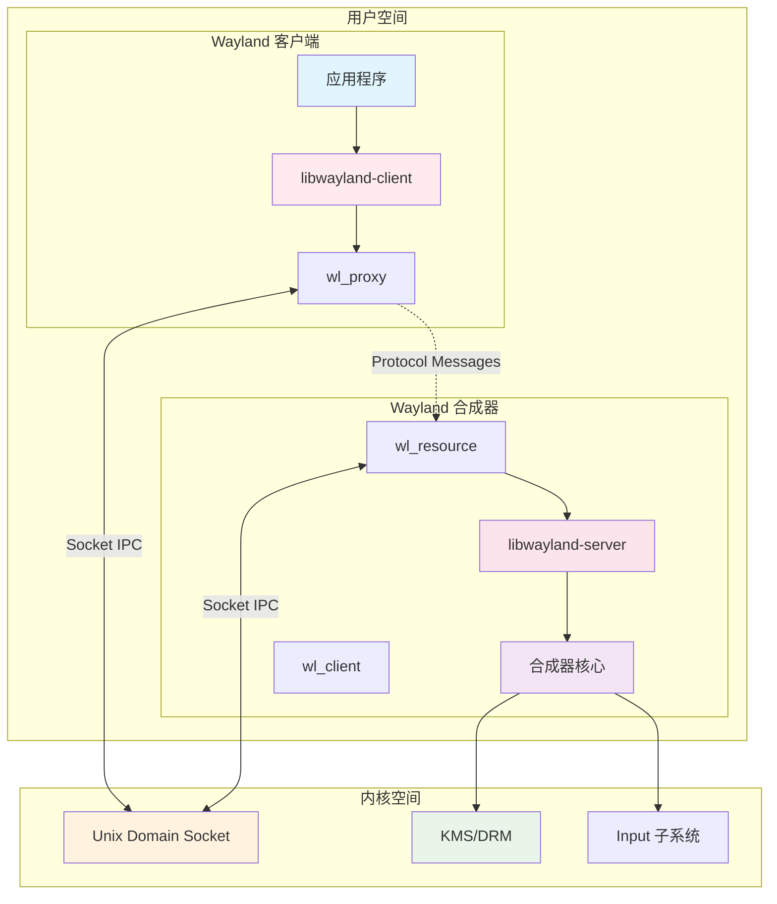
```mermaid
graph TB
    subgraph "用户空间"
        subgraph "Wayland 客户端"
            App[应用程序]
            LibWC[libwayland-client]
            WLProxy[wl_proxy]
        end
        
        subgraph "Wayland 合成器"
            Comp[合成器核心]
            LibWS[libwayland-server]
            WLResource[wl_resource]
            WLClient[wl_client]
        end
    end
    
    subgraph "内核空间"
        Unix[Unix Domain Socket]
        KMS[KMS/DRM]
        Input[Input 子系统]
    end
    
    App --> LibWC
    LibWC --> WLProxy
    WLProxy -.->|Protocol Messages| WLResource
    WLResource --> LibWS
    LibWS --> Comp
    
    WLProxy <-->|Socket IPC| Unix
    WLResource <-->|Socket IPC| Unix
    
    Comp --> KMS
    Comp --> Input
    
    style App fill:#e1f5fe
    style Comp fill:#f3e5f5
    style Unix fill:#fff3e0
    style KMS fill:#e8f5e8
    style LibWC fill:#ffebee
    style LibWS fill:#fce4ec
```

### 核心组件

1. **libwayland-client**: 客户端库，提供协议绑定
2. **libwayland-server**: 服务端库，提供合成器接口
3. **wl_proxy**: 客户端对象代理
4. **wl_resource**: 服务端资源对象
5. **wl_client**: 客户端连接管理
6. **wl_signal/wl_listener**: 事件系统
7. **wl_list**: 双向链表实现
8. **wl_event_queue**: 事件队列管理

## 客户端与服务端通信流程

### 连接建立流程

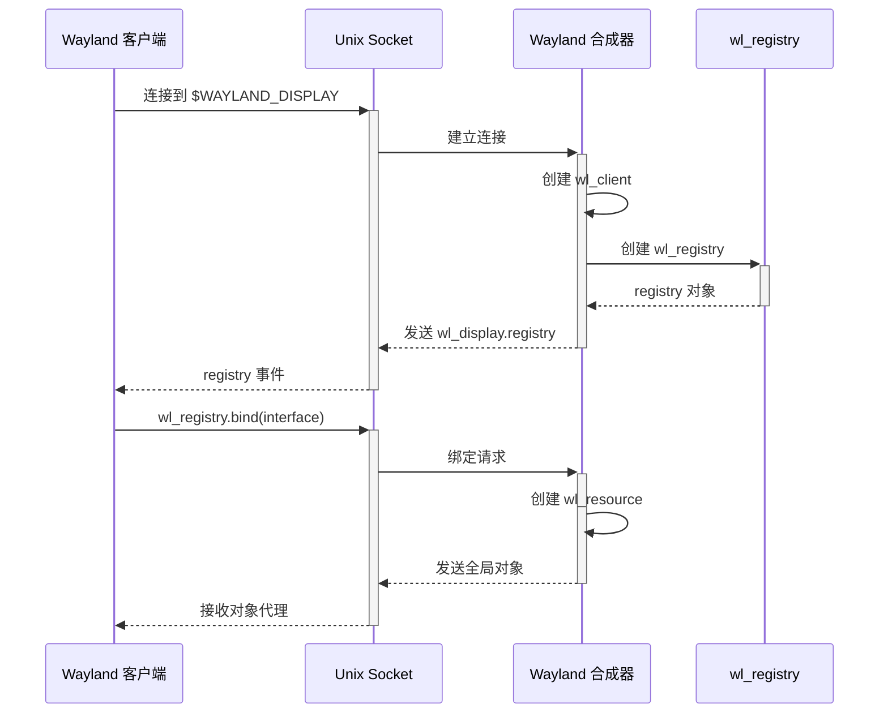
```mermaid
sequenceDiagram
    participant Client as Wayland 客户端
    participant Socket as Unix Socket
    participant Server as Wayland 合成器
    participant Registry as wl_registry
    
    Client->>+Socket: 连接到 $WAYLAND_DISPLAY
    Socket->>+Server: 建立连接
    Server->>Server: 创建 wl_client
    Server->>+Registry: 创建 wl_registry
    Registry-->>-Server: registry 对象
    Server-->>-Socket: 发送 wl_display.registry
    Socket-->>-Client: registry 事件
    
    Client->>+Socket: wl_registry.bind(interface)
    Socket->>+Server: 绑定请求
    Server->>Server: 创建 wl_resource
    Server-->>-Socket: 发送全局对象
    Socket-->>-Client: 接收对象代理
```

### 消息传递机制

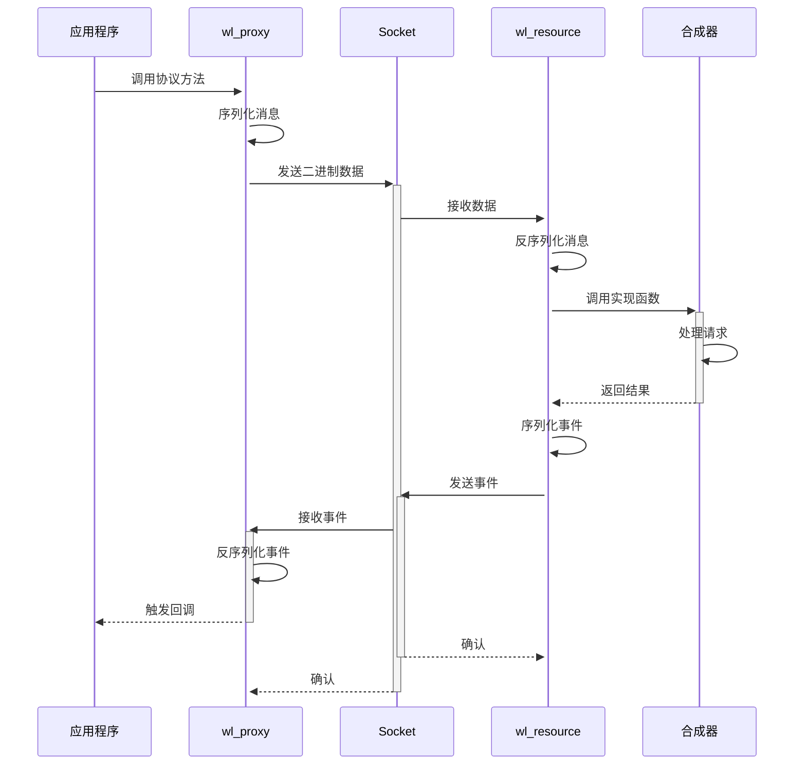
```mermaid
sequenceDiagram
    participant App as 应用程序
    participant Proxy as wl_proxy
    participant Socket as Socket
    participant Resource as wl_resource
    participant Comp as 合成器
    
    App->>+Proxy: 调用协议方法
    Proxy->>Proxy: 序列化消息
    Proxy->>+Socket: 发送二进制数据
    Socket->>+Resource: 接收数据
    Resource->>Resource: 反序列化消息
    Resource->>+Comp: 调用实现函数
    Comp->>Comp: 处理请求
    Comp-->>-Resource: 返回结果
    Resource->>Resource: 序列化事件
    Resource->>+Socket: 发送事件
    Socket->>+Proxy: 接收事件
    Proxy->>Proxy: 反序列化事件
    Proxy-->>-App: 触发回调
    Socket-->>-Resource: 确认
    Socket-->>-Proxy: 确认
```

### Wayland 消息序列化与反序列化

#### 消息序列化流程图

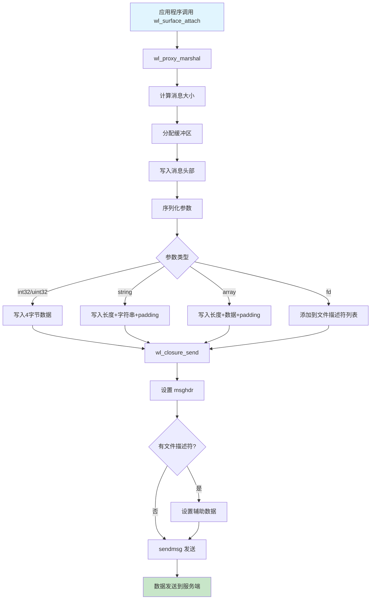
```mermaid
flowchart TD
    A[应用程序调用 wl_surface_attach] --> B[wl_proxy_marshal]
    B --> C[计算消息大小]
    C --> D[分配缓冲区]
    D --> E[写入消息头部]
    E --> F[序列化参数]
    F --> G{参数类型}
    
    G -->|int32/uint32| H[写入4字节数据]
    G -->|string| I[写入长度+字符串+padding]
    G -->|array| J[写入长度+数据+padding]
    G -->|fd| K[添加到文件描述符列表]
    
    H --> L[wl_closure_send]
    I --> L
    J --> L
    K --> L
    
    L --> M[设置 msghdr]
    M --> N{有文件描述符?}
    N -->|是| O[设置辅助数据]
    N -->|否| P[sendmsg 发送]
    O --> P
    P --> Q[数据发送到服务端]
    
    style A fill:#e1f5fe
    style Q fill:#c8e6c9
```

#### 消息反序列化流程图

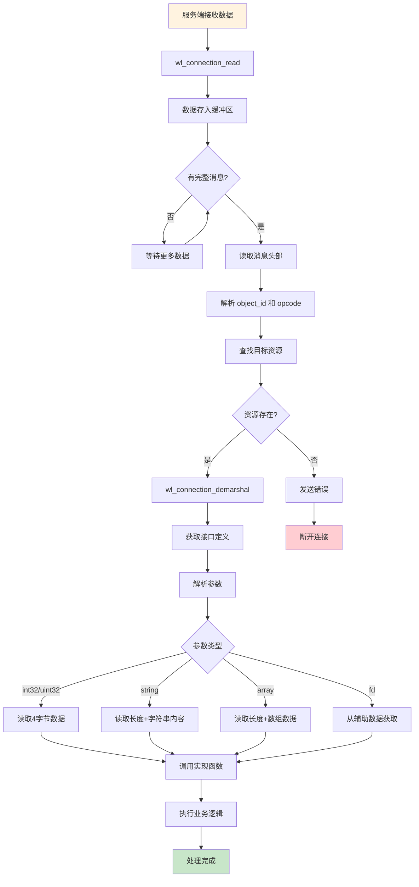
```mermaid
flowchart TD
    A[服务端接收数据] --> B[wl_connection_read]
    B --> C[数据存入缓冲区]
    C --> D{有完整消息?}
    D -->|否| E[等待更多数据]
    D -->|是| F[读取消息头部]
    
    F --> G[解析 object_id 和 opcode]
    G --> H[查找目标资源]
    H --> I{资源存在?}
    I -->|否| J[发送错误]
    I -->|是| K[wl_connection_demarshal]
    
    K --> L[获取接口定义]
    L --> M[解析参数]
    M --> N{参数类型}
    
    N -->|int32/uint32| O[读取4字节数据]
    N -->|string| P[读取长度+字符串内容]
    N -->|array| Q[读取长度+数组数据]
    N -->|fd| R[从辅助数据获取]
    
    O --> S[调用实现函数]
    P --> S
    Q --> S
    R --> S
    
    S --> T[执行业务逻辑]
    T --> U[处理完成]
    
    E --> D
    J --> V[断开连接]
    
    style A fill:#fff3e0
    style U fill:#c8e6c9
    style V fill:#ffcdd2
```

#### 消息二进制格式

Wayland 协议使用自定义的二进制格式来序列化消息。每个消息都遵循固定的结构：

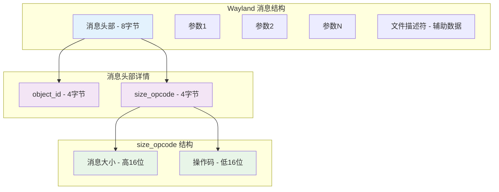
```mermaid
graph TB
    subgraph "Wayland 消息结构"
        A[消息头部 - 8字节]
        B[参数1]
        C[参数2]
        D[参数N]
        E[文件描述符 - 辅助数据]
    end
    
    subgraph "消息头部详情"
        F[object_id - 4字节]
        G[size_opcode - 4字节]
    end
    
    subgraph "size_opcode 结构"
        H[消息大小 - 高16位]
        I[操作码 - 低16位]
    end
    
    A --> F
    A --> G
    G --> H
    G --> I
    
    style A fill:#e3f2fd
    style F fill:#f3e5f5
    style G fill:#f3e5f5
    style H fill:#e8f5e8
    style I fill:#e8f5e8
```

#### 不同参数类型的编码结构

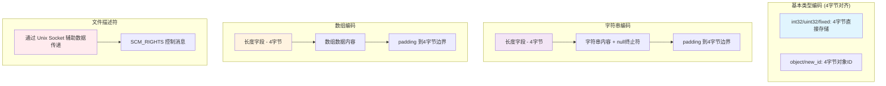
```mermaid
graph TB
    subgraph "基本类型编码 (4字节对齐)"
        A["int32/uint32/fixed: 4字节直接存储"]
        B["object/new_id: 4字节对象ID"]
    end
    
    subgraph "字符串编码"
        C[长度字段 - 4字节]
        D[字符串内容 + null终止符]
        E[padding 到4字节边界]
    end
    
    subgraph "数组编码"
        F[长度字段 - 4字节]
        G[数组数据内容]
        H[padding 到4字节边界]
    end
    
    subgraph "文件描述符"
        I[通过 Unix Socket 辅助数据传递]
        J[SCM_RIGHTS 控制消息]
    end
    
    C --> D
    D --> E
    F --> G
    G --> H
    I --> J
    
    style A fill:#e1f5fe
    style C fill:#f3e5f5
    style F fill:#fff3e0
    style I fill:#ffebee
```

```c
// Wayland 消息头部结构
struct wl_message_header {
    uint32_t object_id;    // 目标对象 ID
    uint32_t size_opcode;  // 消息大小 (高16位) + 操作码 (低16位)
};

// 消息格式: [头部] [参数1] [参数2] ... [参数N]
// - 头部：8字节固定头部
// - 参数：根据协议定义的类型进行编码
```

#### 参数类型编码规则

```c
// 基本类型编码
typedef enum {
    WL_ARG_INT,      // int32_t  - 4字节，小端序
    WL_ARG_UINT,     // uint32_t - 4字节，小端序
    WL_ARG_FIXED,    // wl_fixed_t - 4字节定点数
    WL_ARG_STRING,   // 字符串：4字节长度 + 字符串内容 + padding
    WL_ARG_OBJECT,   // 对象 ID - 4字节 uint32_t
    WL_ARG_NEW_ID,   // 新对象 ID - 4字节 uint32_t
    WL_ARG_ARRAY,    // 数组：4字节长度 + 数据内容 + padding
    WL_ARG_FD        // 文件描述符 - 通过辅助数据发送
} wl_argument_type;

// 字符串编码示例
// 字符串 "hello" 编码为：
// [0x05, 0x00, 0x00, 0x00] [h, e, l, l, o, \0, 0x00, 0x00]
//     长度字段                   字符串内容 + padding到4字节边界

// 数组编码示例
// 数组长度：4字节
// 数据内容：实际字节
// Padding：对齐到4字节边界
```

#### 消息传输时序图

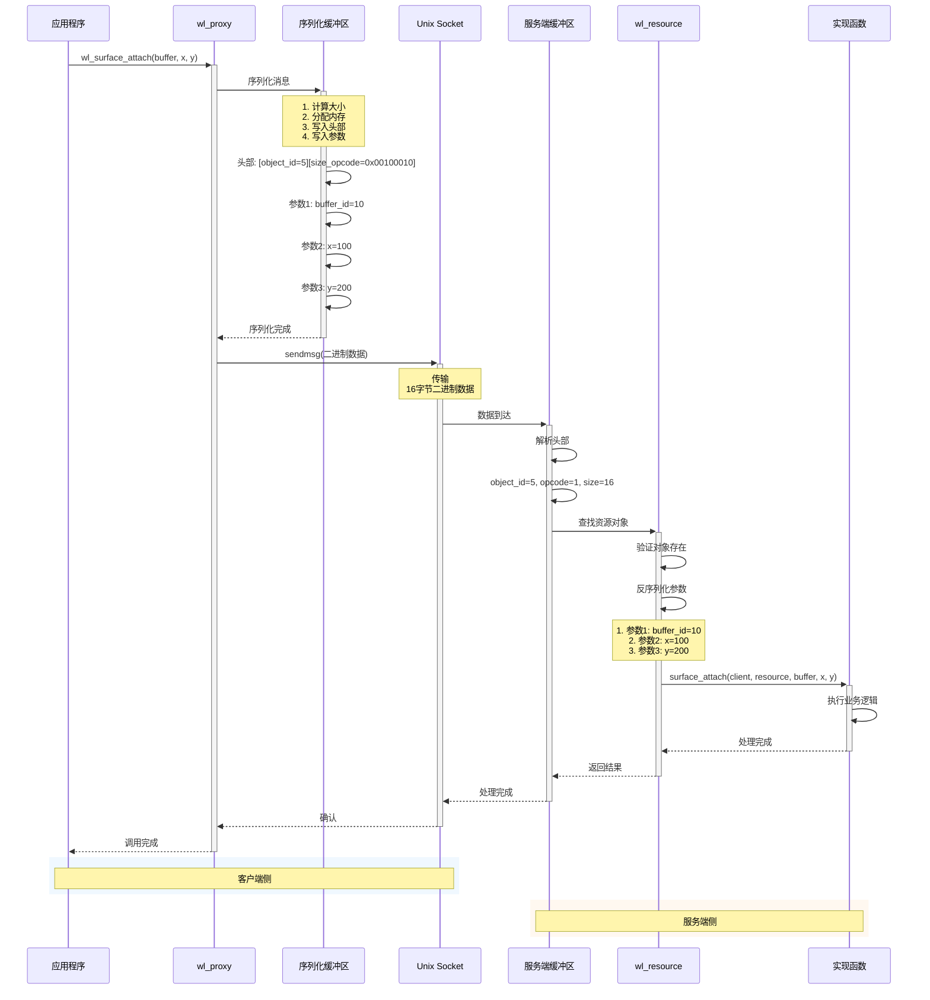
```mermaid
sequenceDiagram
    participant App as 应用程序
    participant Proxy as wl_proxy
    participant Buffer as 序列化缓冲区
    participant Socket as Unix Socket
    participant Server as 服务端缓冲区
    participant Resource as wl_resource
    participant Impl as 实现函数
    
    App->>+Proxy: wl_surface_attach(buffer, x, y)
    Proxy->>+Buffer: 序列化消息
    
    Note over Buffer: 1. 计算大小<br/>2. 分配内存<br/>3. 写入头部<br/>4. 写入参数
    
    Buffer->>Buffer: 头部: [object_id=5][size_opcode=0x00100010]
    Buffer->>Buffer: 参数1: buffer_id=10
    Buffer->>Buffer: 参数2: x=100
    Buffer->>Buffer: 参数3: y=200
    
    Buffer-->>-Proxy: 序列化完成
    Proxy->>+Socket: sendmsg(二进制数据)
    
    Note over Socket: 传输<br/>16字节二进制数据
    
    Socket->>+Server: 数据到达
    Server->>Server: 解析头部
    Server->>Server: object_id=5, opcode=1, size=16
    
    Server->>+Resource: 查找资源对象
    Resource->>Resource: 验证对象存在
    Resource->>Resource: 反序列化参数
    
    Note over Resource: 1. 参数1: buffer_id=10<br/>2. 参数2: x=100<br/>3. 参数3: y=200
    
    Resource->>+Impl: surface_attach(client, resource, buffer, x, y)
    Impl->>Impl: 执行业务逻辑
    Impl-->>-Resource: 处理完成
    Resource-->>-Server: 返回结果
    Server-->>-Socket: 处理完成
    Socket-->>-Proxy: 确认
    Proxy-->>-App: 调用完成
    
    rect rgb(240, 248, 255)
        Note over App, Socket: 客户端侧
    end
    rect rgb(255, 248, 240)
        Note over Server, Impl: 服务端侧
    end
```

#### 客户端消息序列化过程

```c
// wl_proxy.c 中的消息序列化实现
struct wl_closure *wl_closure_marshal(struct wl_proxy *sender,
                                     uint32_t opcode,
                                     const struct wl_message *message,
                                     union wl_argument *args) {
    struct wl_closure *closure;
    struct wl_message_header header;
    int size = 8; // 头部大小
    int fd_count = 0;
    char *buffer, *p;
    
    // 1. 计算消息总大小
    for (int i = 0; message->signature[i]; i++) {
        switch (message->signature[i]) {
        case 'i': // int32
        case 'u': // uint32
        case 'f': // fixed
        case 'o': // object
        case 'n': // new_id
            size += 4;
            break;
        case 's': // string
            if (args[i].s) {
                size += 4 + strlen(args[i].s) + 1;
                size = (size + 3) & ~3; // 4字节对齐
            } else {
                size += 4; // NULL字符串
            }
            break;
        case 'a': // array
            if (args[i].a) {
                size += 4 + args[i].a->size;
                size = (size + 3) & ~3; // 4字节对齐
            } else {
                size += 4; // 空数组
            }
            break;
        case 'h': // fd
            fd_count++;
            break;
        }
    }
    
    // 2. 分配缓冲区
    closure = malloc(sizeof(*closure) + size + fd_count * sizeof(int));
    closure->message = message;
    closure->sender_id = sender->object.id;
    closure->count = size / 4;
    closure->fd_count = fd_count;
    
    buffer = (char *)&closure[1];
    p = buffer;
    
    // 3. 写入消息头部
    header.object_id = sender->object.id;
    header.size_opcode = (size << 16) | (opcode & 0xffff);
    memcpy(p, &header, sizeof(header));
    p += sizeof(header);
    
    // 4. 序列化参数
    int fd_index = 0;
    for (int i = 0; message->signature[i]; i++) {
        switch (message->signature[i]) {
        case 'i': // int32
        case 'u': // uint32
        case 'f': // fixed
            *(uint32_t*)p = args[i].u;
            p += 4;
            break;
        case 'o': // object
            *(uint32_t*)p = args[i].o ? wl_proxy_get_id(args[i].o) : 0;
            p += 4;
            break;
        case 'n': // new_id
            *(uint32_t*)p = args[i].n;
            p += 4;
            break;
        case 's': // string
            if (args[i].s) {
                uint32_t len = strlen(args[i].s) + 1;
                *(uint32_t*)p = len;
                p += 4;
                memcpy(p, args[i].s, len);
                p += len;
                // padding to 4-byte boundary
                while ((p - buffer) % 4 != 0) {
                    *p++ = 0;
                }
            } else {
                *(uint32_t*)p = 0;
                p += 4;
            }
            break;
        case 'a': // array
            if (args[i].a) {
                *(uint32_t*)p = args[i].a->size;
                p += 4;
                memcpy(p, args[i].a->data, args[i].a->size);
                p += args[i].a->size;
                // padding to 4-byte boundary
                while ((p - buffer) % 4 != 0) {
                    *p++ = 0;
                }
            } else {
                *(uint32_t*)p = 0;
                p += 4;
            }
            break;
        case 'h': // fd
            closure->fds[fd_index++] = args[i].h;
            break;
        }
    }
    
    return closure;
}

// 发送序列化后的消息
int wl_closure_send(struct wl_closure *closure, struct wl_connection *connection) {
    struct msghdr msg;
    struct iovec iov;
    struct cmsghdr *cmsg;
    char cmsg_data[CMSG_SPACE(sizeof(int) * WL_CLOSURE_MAX_FDS)];
    
    // 设置消息向量
    iov.iov_base = closure->buffer;
    iov.iov_len = closure->count * 4;
    
    msg.msg_name = NULL;
    msg.msg_namelen = 0;
    msg.msg_iov = &iov;
    msg.msg_iovlen = 1;
    msg.msg_flags = 0;
    
    // 处理文件描述符
    if (closure->fd_count > 0) {
        msg.msg_control = cmsg_data;
        msg.msg_controllen = CMSG_SPACE(sizeof(int) * closure->fd_count);
        
        cmsg = CMSG_FIRSTHDR(&msg);
        cmsg->cmsg_level = SOL_SOCKET;
        cmsg->cmsg_type = SCM_RIGHTS;
        cmsg->cmsg_len = CMSG_LEN(sizeof(int) * closure->fd_count);
        memcpy(CMSG_DATA(cmsg), closure->fds, sizeof(int) * closure->fd_count);
    } else {
        msg.msg_control = NULL;
        msg.msg_controllen = 0;
    }
    
    // 使用 sendmsg 发送二进制数据
    return sendmsg(connection->fd, &msg, MSG_DONTWAIT);
}
```

#### 服务端消息反序列化过程

```c
// wl_connection.c 中的消息反序列化实现
int wl_connection_demarshal(struct wl_connection *connection,
                           struct wl_closure *closure,
                           const struct wl_interface *interface,
                           struct wl_object *target) {
    const struct wl_message *message;
    const char *signature;
    union wl_argument *args;
    int count, fd_index = 0;
    uint32_t *p, *end;
    
    if (closure->opcode >= interface->method_count) {
        return -1;
    }
    
    message = &interface->methods[closure->opcode];
    signature = message->signature;
    count = strlen(signature);
    
    if (count > WL_CLOSURE_MAX_ARGS) {
        return -1;
    }
    
    args = closure->args;
    p = closure->buffer + 2; // 跳过头部
    end = closure->buffer + closure->count;
    
    // 反序列化参数
    for (int i = 0; signature[i]; i++) {
        if (p + 1 > end) {
            return -1;
        }
        
        switch (signature[i]) {
        case 'i': // int32
            args[i].i = *p++;
            break;
        case 'u': // uint32
        case 'o': // object
        case 'n': // new_id
            args[i].u = *p++;
            break;
        case 'f': // fixed
            args[i].f = *p++;
            break;
        case 's': { // string
            uint32_t length = *p++;
            if (length == 0) {
                args[i].s = NULL;
            } else {
                if (p + DIV_ROUNDUP(length, sizeof(*p)) > end) {
                    return -1;
                }
                args[i].s = (char *)p;
                p += DIV_ROUNDUP(length, sizeof(*p));
            }
            break;
        }
        case 'a': { // array
            uint32_t length = *p++;
            if (length == 0) {
                args[i].a = NULL;
            } else {
                if (p + DIV_ROUNDUP(length, sizeof(*p)) > end) {
                    return -1;
                }
                args[i].a = wl_array_create_from_data((char *)p, length);
                p += DIV_ROUNDUP(length, sizeof(*p));
            }
            break;
        }
        case 'h': // fd
            if (fd_index >= closure->fd_count) {
                return -1;
            }
            args[i].h = closure->fds[fd_index++];
            break;
        }
    }
    
    // 调用实际的接口实现函数
    if (message->types[0] == NULL) {
        // 普通方法调用
        void (*func)(struct wl_client *, struct wl_resource *, ...);
        func = target->implementation;
        if (func) {
            // 根据参数数量调用函数
            switch (count) {
            case 0:
                func(closure->client, target);
                break;
            case 1:
                func(closure->client, target, args[0]);
                break;
            case 2:
                func(closure->client, target, args[0], args[1]);
                break;
            // ... 更多参数情况
            default:
                // 使用 ffi 或其他机制进行动态调用
                break;
            }
        }
    }
    
    return 0;
}

// 接收和处理消息的主循环
int wl_client_connection_data(int fd, uint32_t mask, void *data) {
    struct wl_client *client = data;
    struct wl_connection *connection = client->connection;
    struct wl_closure closure;
    int len, size, opcode;
    
    if (mask & WL_EVENT_READABLE) {
        // 读取数据到连接缓冲区
        len = wl_connection_read(connection);
        if (len < 0) {
            wl_client_destroy(client);
            return 1;
        }
        
        // 处理缓冲区中的所有完整消息
        while (wl_connection_pending_input(connection)) {
            // 1. 读取消息头部
            if (wl_connection_copy(connection, &closure.buffer, 8) < 8) {
                break; // 头部不完整，等待更多数据
            }
            
            uint32_t object_id = closure.buffer[0];
            uint32_t size_opcode = closure.buffer[1];
            size = size_opcode >> 16;
            opcode = size_opcode & 0xffff;
            
            // 2. 检查消息是否完整
            if (wl_connection_pending_input(connection) < size) {
                break; // 消息不完整，等待更多数据
            }
            
            // 3. 读取完整消息
            wl_connection_copy(connection, &closure.buffer, size);
            wl_connection_consume(connection, size);
            
            closure.count = size / 4;
            closure.opcode = opcode;
            closure.client = client;
            
            // 4. 查找目标对象
            struct wl_resource *resource;
            resource = wl_client_get_object(client, object_id);
            if (!resource) {
                wl_client_post_no_memory(client);
                continue;
            }
            
            // 5. 反序列化并调用实现函数
            if (wl_connection_demarshal(connection, &closure,
                                      resource->object.interface,
                                      &resource->object) < 0) {
                wl_client_post_no_memory(client);
                continue;
            }
        }
    }
    
    return 1;
}
```

#### 实际二进制数据示例

```c
// 示例：wl_surface.attach(buffer, x, y) 调用
// 假设：surface_id=5, buffer_id=10, x=100, y=200

// 序列化后的二进制数据：
uint8_t message_data[] = {
    // 消息头部 (8字节)
    0x05, 0x00, 0x00, 0x00,  // object_id = 5 (wl_surface)
    0x10, 0x00, 0x01, 0x00,  // size=16字节, opcode=1 (attach)
    
    // 参数1: buffer_id = 10 (4字节)
    0x0A, 0x00, 0x00, 0x00,  // buffer object id
    
    // 参数2: x = 100 (4字节)
    0x64, 0x00, 0x00, 0x00,  // x coordinate
    
    // 参数3: y = 200 (4字节)
    0xC8, 0x00, 0x00, 0x00   // y coordinate
};

// 发送过程：
// 1. wl_surface_attach() 被调用
// 2. 参数被序列化到上述二进制格式
// 3. 使用 sendmsg() 发送到服务端
// 4. 服务端接收并反序列化
// 5. 调用服务端的 surface_attach() 实现函数
```

#### 字符串和数组的复杂示例

```c
// wl_surface.set_title("Hello World") 的序列化
uint8_t string_message[] = {
    // 消息头部
    0x05, 0x00, 0x00, 0x00,  // object_id = 5
    0x18, 0x00, 0x02, 0x00,  // size=24字节, opcode=2
    
    // 字符串参数
    0x0C, 0x00, 0x00, 0x00,  // 字符串长度 = 12 ("Hello World\0")
    'H',  'e',  'l',  'l',   // 字符串内容
    'o',  ' ',  'W',  'o',
    'r',  'l',  'd',  '\0',
    0x00, 0x00, 0x00, 0x00   // padding 到4字节边界
};

// 数组数据示例 (假设发送 RGB 像素数据)
uint8_t array_message[] = {
    // 消息头部
    0x05, 0x00, 0x00, 0x00,  // object_id = 5
    0x18, 0x00, 0x03, 0x00,  // size=24字节, opcode=3
    
    // 数组参数
    0x09, 0x00, 0x00, 0x00,  // 数组长度 = 9字节
    0xFF, 0x00, 0x00,        // RGB: 红色像素
    0x00, 0xFF, 0x00,        // RGB: 绿色像素  
    0x00, 0x00, 0xFF,        // RGB: 蓝色像素
    0x00, 0x00, 0x00         // padding 到4字节边界
};
```

这个详细的序列化和反序列化过程展示了 Wayland 协议如何在客户端和服务端之间高效地传输结构化数据，同时保持跨平台的兼容性和性能。


### 事件循环集成

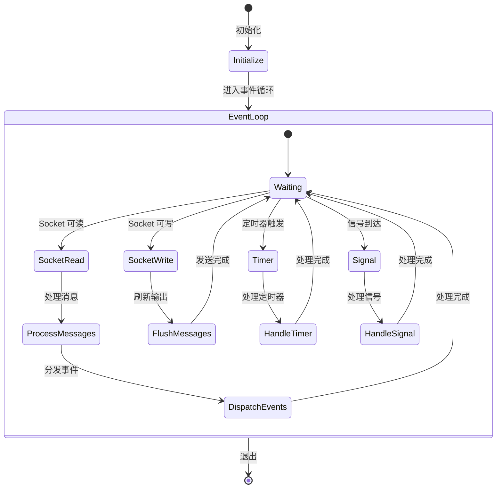
```mermaid
stateDiagram-v2
    [*] --> Initialize: 初始化
    Initialize --> EventLoop: 进入事件循环
    
    state EventLoop {
        [*] --> Waiting
        Waiting --> SocketRead: Socket 可读
        Waiting --> SocketWrite: Socket 可写
        Waiting --> Timer: 定时器触发
        Waiting --> Signal: 信号到达
        
        SocketRead --> ProcessMessages: 处理消息
        ProcessMessages --> DispatchEvents: 分发事件
        DispatchEvents --> Waiting: 处理完成
        
        SocketWrite --> FlushMessages: 刷新输出
        FlushMessages --> Waiting: 发送完成
        
        Timer --> HandleTimer: 处理定时器
        HandleTimer --> Waiting: 处理完成
        
        Signal --> HandleSignal: 处理信号
        HandleSignal --> Waiting: 处理完成
    }
    
    EventLoop --> [*]: 退出
```

## 核心数据结构详解

### wl_list 双向链表

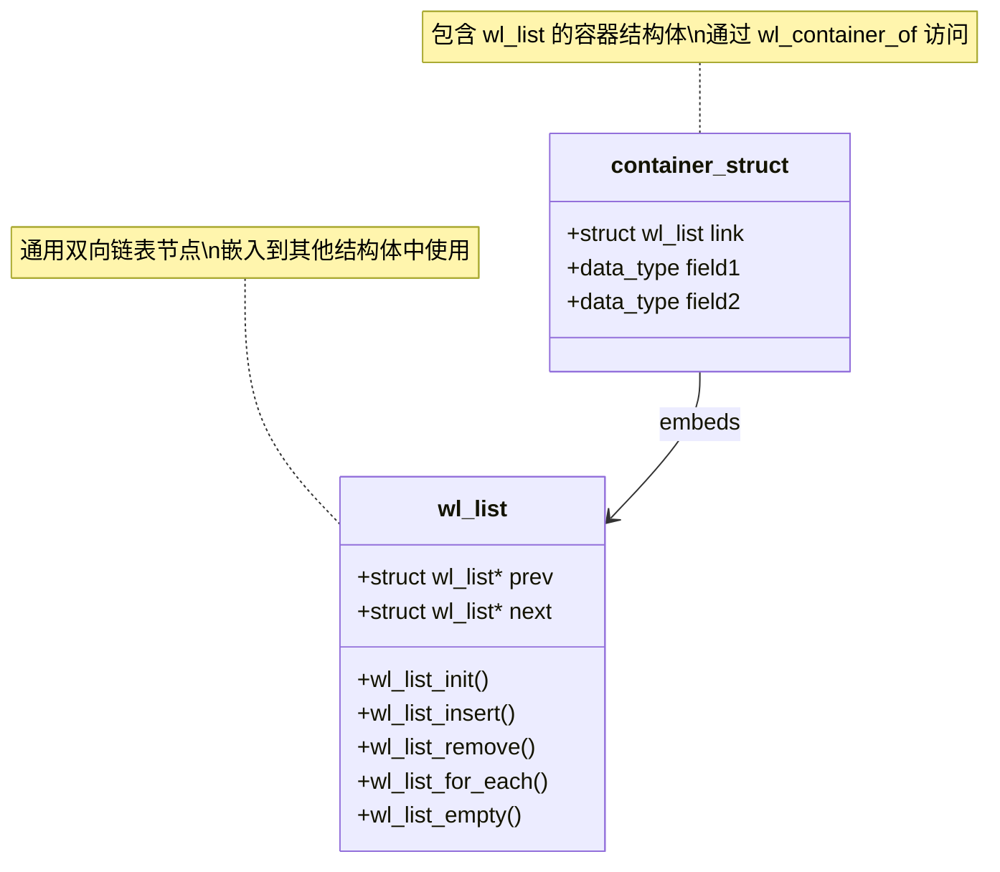
```mermaid
classDiagram
    class wl_list {
        +struct wl_list* prev
        +struct wl_list* next
        +wl_list_init()
        +wl_list_insert()
        +wl_list_remove()
        +wl_list_for_each()
        +wl_list_empty()
    }
    
    class container_struct {
        +struct wl_list link
        +data_type field1
        +data_type field2
    }
    
    note for wl_list "通用双向链表节点\n嵌入到其他结构体中使用"
    note for container_struct "包含 wl_list 的容器结构体\n通过 wl_container_of 访问"
    
    container_struct --> wl_list : embeds
```

#### 实现原理与使用

```c
struct wl_list {
    struct wl_list *prev;
    struct wl_list *next;
};

// 初始化链表
static inline void wl_list_init(struct wl_list *list) {
    list->prev = list;
    list->next = list;
}

// 插入元素
static inline void wl_list_insert(struct wl_list *list, struct wl_list *elm) {
    elm->prev = list;
    elm->next = list->next;
    list->next->prev = elm;
    list->next = elm;
}

// 使用示例
struct surface {
    struct wl_list link;
    int width, height;
    // ... 其他字段
};

struct compositor {
    struct wl_list surfaces;  // 表面列表
};

// 初始化
wl_list_init(&comp->surfaces);

// 添加表面
struct surface *surf = malloc(sizeof(*surf));
wl_list_insert(&comp->surfaces, &surf->link);

// 遍历表面
struct surface *surf;
wl_list_for_each(surf, &comp->surfaces, link) {
    // 处理每个表面
    printf("Surface: %dx%d\n", surf->width, surf->height);
}
```

### wl_signal 和 wl_listener 事件系统

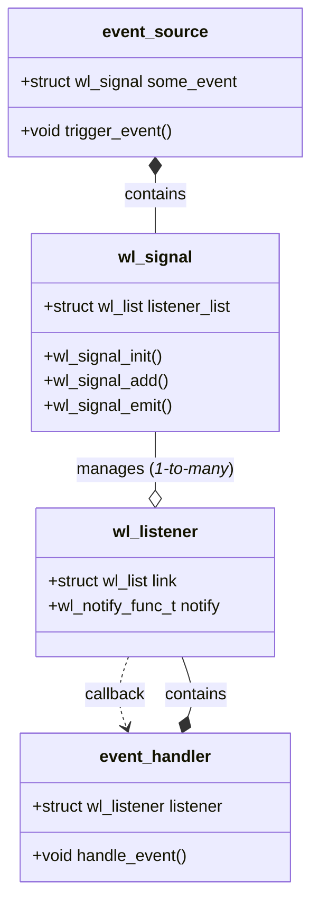
```mermaid
classDiagram
    class wl_signal {
        +struct wl_list listener_list
        +wl_signal_init()
        +wl_signal_add()
        +wl_signal_emit()
    }
    
    class wl_listener {
        +struct wl_list link
        +wl_notify_func_t notify
    }
    
    class event_source {
        +struct wl_signal some_event
        +void trigger_event()
    }
    
    class event_handler {
        +struct wl_listener listener
        +void handle_event()
    }

    %% wl_signal manages many wl_listener (1-to-many)
    wl_signal --o wl_listener : manages (*1-to-many*)
    event_source *-- wl_signal : contains
    event_handler *-- wl_listener : contains
    wl_listener ..> event_handler : callback
```

#### 事件系统工作流程

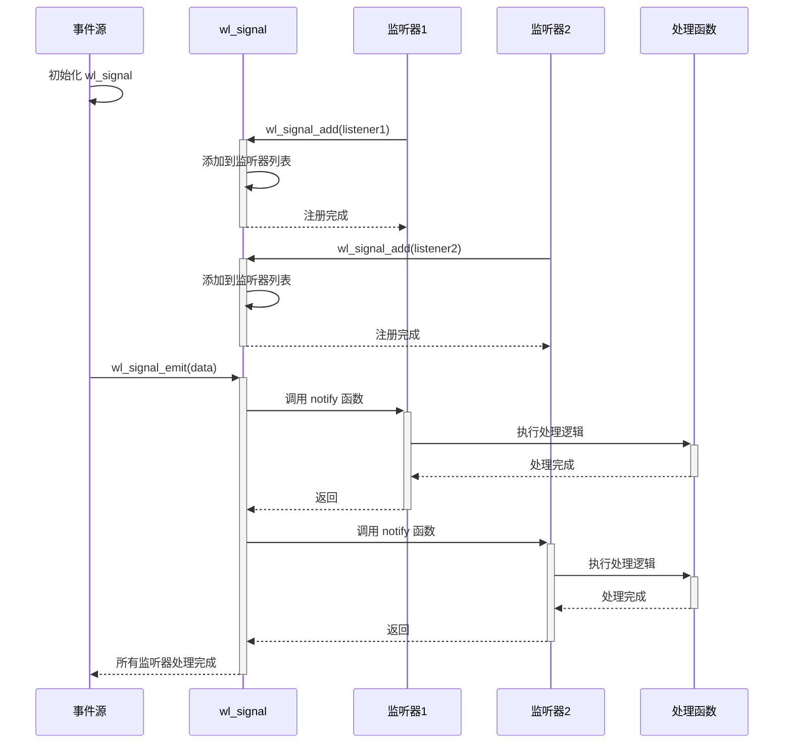
```mermaid
sequenceDiagram
    participant Source as 事件源
    participant Signal as wl_signal
    participant Listener1 as 监听器1
    participant Listener2 as 监听器2
    participant Handler as 处理函数
    
    Source->>Source: 初始化 wl_signal
    Listener1->>+Signal: wl_signal_add(listener1)
    Signal->>Signal: 添加到监听器列表
    Signal-->>-Listener1: 注册完成
    
    Listener2->>+Signal: wl_signal_add(listener2)
    Signal->>Signal: 添加到监听器列表
    Signal-->>-Listener2: 注册完成
    
    Source->>+Signal: wl_signal_emit(data)
    Signal->>+Listener1: 调用 notify 函数
    Listener1->>+Handler: 执行处理逻辑
    Handler-->>-Listener1: 处理完成
    Listener1-->>-Signal: 返回
    
    Signal->>+Listener2: 调用 notify 函数
    Listener2->>+Handler: 执行处理逻辑
    Handler-->>-Listener2: 处理完成
    Listener2-->>-Signal: 返回
    Signal-->>-Source: 所有监听器处理完成
```

#### 实现与使用示例

```c
// 信号定义
struct wl_signal {
    struct wl_list listener_list;
};

// 监听器定义
struct wl_listener {
    struct wl_list link;
    wl_notify_func_t notify;
};

// 通知函数类型
typedef void (*wl_notify_func_t)(struct wl_listener *listener, void *data);

// 初始化信号
void wl_signal_init(struct wl_signal *signal) {
    wl_list_init(&signal->listener_list);
}

// 添加监听器
void wl_signal_add(struct wl_signal *signal, struct wl_listener *listener) {
    wl_list_insert(signal->listener_list.prev, &listener->link);
}

// 触发信号
void wl_signal_emit(struct wl_signal *signal, void *data) {
    struct wl_listener *l, *next;
    wl_list_for_each_safe(l, next, &signal->listener_list, link) {
        l->notify(l, data);
    }
}

// 使用示例
struct surface_events {
    struct wl_signal destroy;
    struct wl_signal commit;
    struct wl_signal damage;
};

struct surface {
    struct surface_events events;
    // ... 其他字段
};

// 监听器实现
void surface_destroy_handler(struct wl_listener *listener, void *data) {
    struct surface *surface = data;
    printf("Surface destroyed: %p\n", surface);
    // 清理相关资源
}

// 注册监听器
struct wl_listener destroy_listener = {
    .notify = surface_destroy_handler
};

wl_signal_add(&surface->events.destroy, &destroy_listener);

// 触发事件
wl_signal_emit(&surface->events.destroy, surface);
```

### wl_client 客户端管理

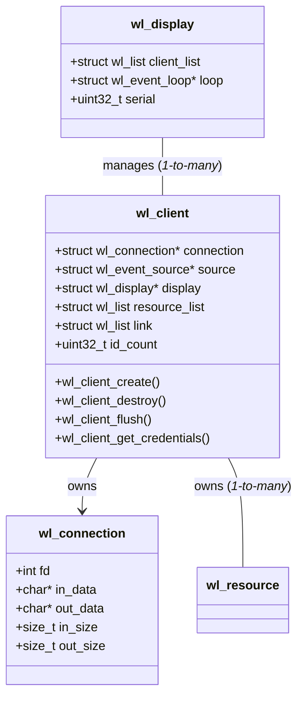
```mermaid
classDiagram
    class wl_client {
        +struct wl_connection* connection
        +struct wl_event_source* source
        +struct wl_display* display
        +struct wl_list resource_list
        +struct wl_list link
        +uint32_t id_count
        +wl_client_create()
        +wl_client_destroy()
        +wl_client_flush()
        +wl_client_get_credentials()
    }
    
    class wl_connection {
        +int fd
        +char* in_data
        +char* out_data
        +size_t in_size
        +size_t out_size
    }
    
    class wl_display {
        +struct wl_list client_list
        +struct wl_event_loop* loop
        +uint32_t serial
    }
    
    class wl_resource

    %% wl_display manages many wl_client (1-to-many)
    wl_display -- wl_client : manages (*1-to-many*)
    wl_client --> wl_connection : owns
    %% wl_client owns many wl_resource (1-to-many)
    wl_client -- wl_resource : owns (*1-to-many*)
```

#### 客户端生命周期管理

```c
struct wl_client {
    struct wl_connection *connection;
    struct wl_event_source *source;
    struct wl_display *display;
    struct wl_list resource_list;
    struct wl_list link;
    struct wl_map objects;
    uint32_t id_count;
    pid_t pid;
    uid_t uid;
    gid_t gid;
};

// 创建客户端
struct wl_client *wl_client_create(struct wl_display *display, int fd) {
    struct wl_client *client;
    struct ucred ucred;
    socklen_t len;
    
    client = malloc(sizeof *client);
    if (!client)
        return NULL;
    
    client->display = display;
    client->connection = wl_connection_create(fd);
    client->source = wl_event_loop_add_fd(display->loop, fd,
                                         WL_EVENT_READABLE,
                                         wl_client_connection_data, client);
    
    wl_list_init(&client->resource_list);
    wl_list_insert(display->client_list.prev, &client->link);
    
    // 获取客户端凭据
    len = sizeof ucred;
    if (getsockopt(fd, SOL_SOCKET, SO_PEERCRED, &ucred, &len) < 0) {
        // 错误处理
    } else {
        client->pid = ucred.pid;
        client->uid = ucred.uid;
        client->gid = ucred.gid;
    }
    
    return client;
}

// 客户端事件处理
static int wl_client_connection_data(int fd, uint32_t mask, void *data) {
    struct wl_client *client = data;
    struct wl_connection *connection = client->connection;
    
    if (mask & WL_EVENT_READABLE) {
        if (wl_connection_read(connection) < 0) {
            wl_client_destroy(client);
            return 1;
        }
        
        while (wl_connection_pending_input(connection)) {
            if (wl_client_connection_flush_data(client) < 0) {
                wl_client_destroy(client);
                return 1;
            }
        }
    }
    
    if (mask & WL_EVENT_WRITABLE) {
        if (wl_connection_flush(connection) < 0) {
            wl_client_destroy(client);
            return 1;
        }
    }
    
    return 1;
}
```

### wl_resource 服务端资源

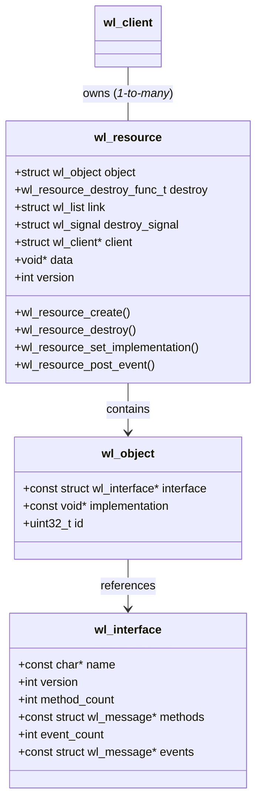
```mermaid
classDiagram
    class wl_resource {
        +struct wl_object object
        +wl_resource_destroy_func_t destroy
        +struct wl_list link
        +struct wl_signal destroy_signal
        +struct wl_client* client
        +void* data
        +int version
        +wl_resource_create()
        +wl_resource_destroy()
        +wl_resource_set_implementation()
        +wl_resource_post_event()
    }
    
    class wl_object {
        +const struct wl_interface* interface
        +const void* implementation
        +uint32_t id
    }
    
    class wl_interface {
        +const char* name
        +int version
        +int method_count
        +const struct wl_message* methods
        +int event_count
        +const struct wl_message* events
    }

    class wl_client

    wl_resource --> wl_object : contains
    wl_object --> wl_interface : references
    %% wl_client owns many wl_resource (1-to-many)
    wl_client -- wl_resource : owns (*1-to-many*)
```

#### 资源管理实现

```c
struct wl_resource {
    struct wl_object object;
    wl_resource_destroy_func_t destroy;
    struct wl_list link;
    struct wl_signal destroy_signal;
    struct wl_client *client;
    void *data;
    int version;
};

// 创建资源
struct wl_resource *wl_resource_create(struct wl_client *client,
                                      const struct wl_interface *interface,
                                      int version, uint32_t id) {
    struct wl_resource *resource;
    
    resource = malloc(sizeof *resource);
    if (!resource)
        return NULL;
    
    resource->object.interface = interface;
    resource->object.id = id;
    resource->client = client;
    resource->version = version;
    resource->data = NULL;
    resource->destroy = NULL;
    
    wl_signal_init(&resource->destroy_signal);
    wl_list_init(&resource->link);
    wl_list_insert(&client->resource_list, &resource->link);
    
    return resource;
}

// 设置实现
void wl_resource_set_implementation(struct wl_resource *resource,
                                   const void *implementation,
                                   void *data,
                                   wl_resource_destroy_func_t destroy) {
    resource->object.implementation = implementation;
    resource->data = data;
    resource->destroy = destroy;
}

// 发送事件
void wl_resource_post_event(struct wl_resource *resource, uint32_t opcode, ...) {
    struct wl_closure *closure;
    va_list ap;
    
    va_start(ap, opcode);
    closure = wl_closure_vmarshal(resource, opcode, ap,
                                 &resource->object.interface->events[opcode]);
    va_end(ap);
    
    if (!closure)
        return;
    
    wl_closure_send(closure, resource->client->connection);
    wl_closure_destroy(closure);
}
```

### wl_proxy 客户端代理

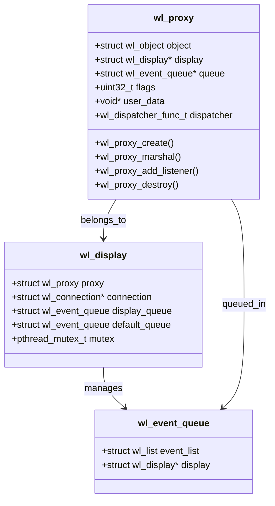
```mermaid
classDiagram
    class wl_proxy {
        +struct wl_object object
        +struct wl_display* display
        +struct wl_event_queue* queue
        +uint32_t flags
        +void* user_data
        +wl_dispatcher_func_t dispatcher
        +wl_proxy_create()
        +wl_proxy_marshal()
        +wl_proxy_add_listener()
        +wl_proxy_destroy()
    }
    
    class wl_display {
        +struct wl_proxy proxy
        +struct wl_connection* connection
        +struct wl_event_queue display_queue
        +struct wl_event_queue default_queue
        +pthread_mutex_t mutex
    }
    
    class wl_event_queue {
        +struct wl_list event_list
        +struct wl_display* display
    }
    
    wl_proxy --> wl_display : belongs_to
    wl_display --> wl_event_queue : manages
    wl_proxy --> wl_event_queue : queued_in
```

#### 代理对象实现

```c
struct wl_proxy {
    struct wl_object object;
    struct wl_display *display;
    struct wl_event_queue *queue;
    uint32_t flags;
    void *user_data;
    wl_dispatcher_func_t dispatcher;
};

// 创建代理
struct wl_proxy *wl_proxy_create(struct wl_proxy *factory,
                                const struct wl_interface *interface) {
    struct wl_proxy *proxy;
    uint32_t id;
    
    proxy = malloc(sizeof *proxy);
    if (!proxy)
        return NULL;
    
    proxy->object.interface = interface;
    proxy->display = factory->display;
    proxy->queue = factory->queue;
    proxy->flags = 0;
    proxy->user_data = NULL;
    proxy->dispatcher = NULL;
    
    // 分配对象 ID
    id = wl_map_insert_new(&proxy->display->objects, WL_MAP_CLIENT_SIDE, proxy);
    proxy->object.id = id;
    
    return proxy;
}

// 序列化并发送消息
struct wl_proxy *wl_proxy_marshal_constructor(struct wl_proxy *proxy,
                                             uint32_t opcode,
                                             const struct wl_interface *interface,
                                             ...) {
    struct wl_closure *closure;
    struct wl_proxy *new_proxy;
    va_list ap;
    
    new_proxy = wl_proxy_create(proxy, interface);
    if (!new_proxy)
        return NULL;
    
    va_start(ap, interface);
    closure = wl_closure_vmarshal(proxy, opcode, ap,
                                 &proxy->object.interface->methods[opcode]);
    va_end(ap);
    
    if (!closure) {
        wl_proxy_destroy(new_proxy);
        return NULL;
    }
    
    wl_closure_send(closure, proxy->display->connection);
    wl_closure_destroy(closure);
    
    return new_proxy;
}

// 添加事件监听器
int wl_proxy_add_listener(struct wl_proxy *proxy,
                         void (**implementation)(void), void *data) {
    if (proxy->object.implementation || proxy->dispatcher) {
        return -1;  // 已经设置了监听器
    }
    
    proxy->object.implementation = implementation;
    proxy->user_data = data;
    
    return 0;
}
```

### wl_event_queue 事件队列

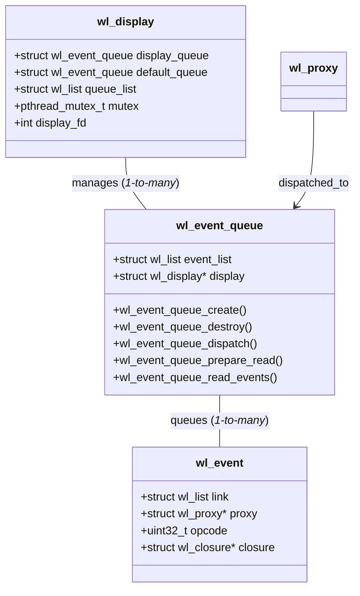
```mermaid
classDiagram
    class wl_event_queue {
        +struct wl_list event_list
        +struct wl_display* display
        +wl_event_queue_create()
        +wl_event_queue_destroy()
        +wl_event_queue_dispatch()
        +wl_event_queue_prepare_read()
        +wl_event_queue_read_events()
    }
    
    class wl_event {
        +struct wl_list link
        +struct wl_proxy* proxy
        +uint32_t opcode
        +struct wl_closure* closure
    }
    
    class wl_display {
        +struct wl_event_queue display_queue
        +struct wl_event_queue default_queue
        +struct wl_list queue_list
        +pthread_mutex_t mutex
        +int display_fd
    }
    
    %% wl_event_queue queues many wl_event (1-to-many)
    wl_event_queue -- wl_event : queues (*1-to-many*)
    %% wl_display manages many wl_event_queue (1-to-many)
    wl_display -- wl_event_queue : manages (*1-to-many*)
    wl_proxy --> wl_event_queue : dispatched_to
```

#### 事件队列架构

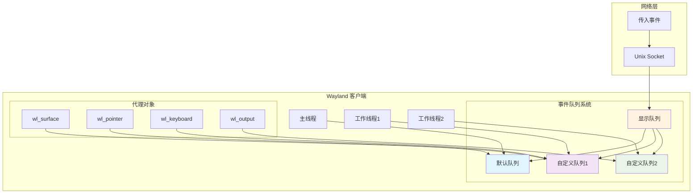
```mermaid
graph TB
    subgraph "Wayland 客户端"
        subgraph "事件队列系统"
            DefaultQ[默认队列]
            DisplayQ[显示队列]
            CustomQ1[自定义队列1]
            CustomQ2[自定义队列2]
        end
        
        subgraph "代理对象"
            Proxy1[wl_surface]
            Proxy2[wl_pointer]
            Proxy3[wl_keyboard]
            Proxy4[wl_output]
        end
        
        MainThread[主线程]
        WorkerThread1[工作线程1]
        WorkerThread2[工作线程2]
    end
    
    subgraph "网络层"
        Socket[Unix Socket]
        Events[传入事件]
    end
    
    Events --> Socket
    Socket --> DisplayQ
    
    DisplayQ --> DefaultQ
    DisplayQ --> CustomQ1
    DisplayQ --> CustomQ2
    
    Proxy1 --> DefaultQ
    Proxy2 --> CustomQ1
    Proxy3 --> CustomQ1
    Proxy4 --> CustomQ2
    
    MainThread --> DefaultQ
    WorkerThread1 --> CustomQ1
    WorkerThread2 --> CustomQ2
    
    style DefaultQ fill:#e1f5fe
    style DisplayQ fill:#fff3e0
    style CustomQ1 fill:#f3e5f5
    style CustomQ2 fill:#e8f5e8
```

#### 事件队列工作流程

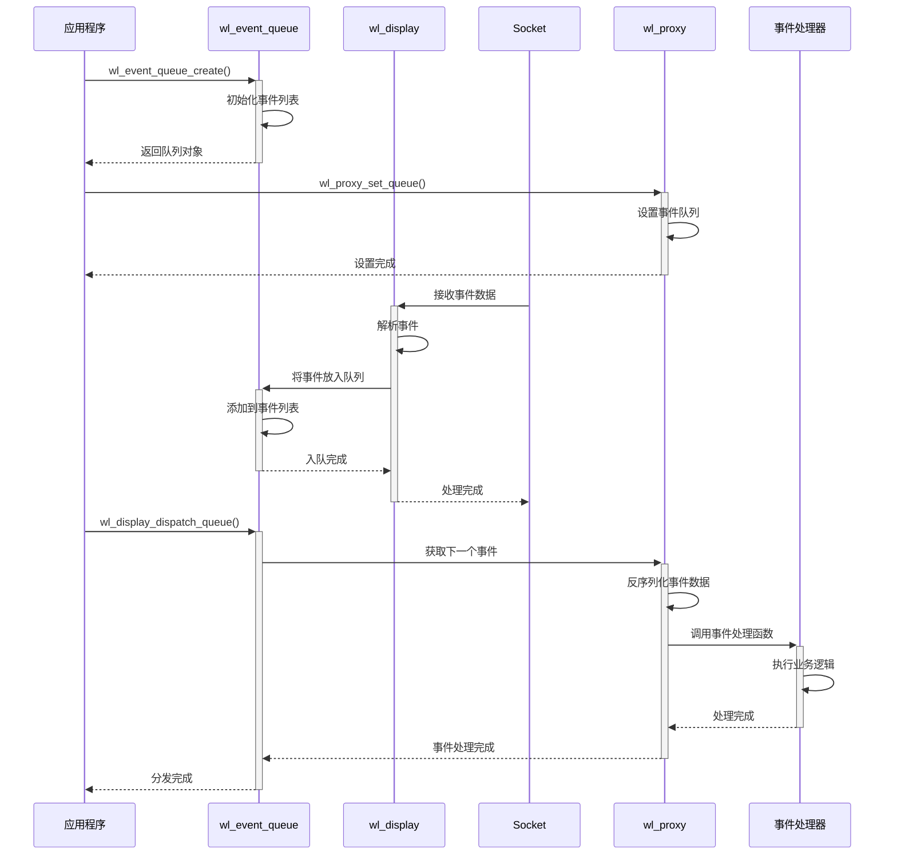
```mermaid
sequenceDiagram
    participant App as 应用程序
    participant Queue as wl_event_queue
    participant Display as wl_display
    participant Socket as Socket
    participant Proxy as wl_proxy
    participant Handler as 事件处理器
    
    App->>+Queue: wl_event_queue_create()
    Queue->>Queue: 初始化事件列表
    Queue-->>-App: 返回队列对象
    
    App->>+Proxy: wl_proxy_set_queue()
    Proxy->>Proxy: 设置事件队列
    Proxy-->>-App: 设置完成
    
    Socket->>+Display: 接收事件数据
    Display->>Display: 解析事件
    Display->>+Queue: 将事件放入队列
    Queue->>Queue: 添加到事件列表
    Queue-->>-Display: 入队完成
    Display-->>-Socket: 处理完成
    
    App->>+Queue: wl_display_dispatch_queue()
    Queue->>+Proxy: 获取下一个事件
    Proxy->>Proxy: 反序列化事件数据
    Proxy->>+Handler: 调用事件处理函数
    Handler->>Handler: 执行业务逻辑
    Handler-->>-Proxy: 处理完成
    Proxy-->>-Queue: 事件处理完成
    Queue-->>-App: 分发完成
```

#### 实现与使用示例

```c
struct wl_event_queue {
    struct wl_list event_list;
    struct wl_display *display;
};

struct wl_event {
    struct wl_list link;
    struct wl_proxy *proxy;
    uint32_t opcode;
    struct wl_closure *closure;
};

// 创建事件队列
struct wl_event_queue *wl_display_create_queue(struct wl_display *display) {
    struct wl_event_queue *queue;
    
    queue = malloc(sizeof *queue);
    if (!queue)
        return NULL;
    
    wl_list_init(&queue->event_list);
    queue->display = display;
    
    pthread_mutex_lock(&display->mutex);
    wl_list_insert(&display->queue_list, &queue->link);
    pthread_mutex_unlock(&display->mutex);
    
    return queue;
}

// 销毁事件队列
void wl_event_queue_destroy(struct wl_event_queue *queue) {
    struct wl_event *event, *next;
    
    // 清理待处理的事件
    wl_list_for_each_safe(event, next, &queue->event_list, link) {
        wl_list_remove(&event->link);
        wl_closure_destroy(event->closure);
        free(event);
    }
    
    pthread_mutex_lock(&queue->display->mutex);
    wl_list_remove(&queue->link);
    pthread_mutex_unlock(&queue->display->mutex);
    
    free(queue);
}

// 分发队列中的事件
int wl_display_dispatch_queue(struct wl_display *display,
                             struct wl_event_queue *queue) {
    struct wl_event *event, *next;
    int count = 0;
    
    wl_list_for_each_safe(event, next, &queue->event_list, link) {
        wl_list_remove(&event->link);
        
        // 分发事件到代理对象
        if (event->proxy) {
            wl_closure_invoke(event->closure, WL_CLOSURE_INVOKE_CLIENT,
                             &event->proxy->object, event->opcode,
                             event->proxy->user_data);
            count++;
        }
        
        wl_closure_destroy(event->closure);
        free(event);
    }
    
    return count;
}

// 将代理对象绑定到特定队列
void wl_proxy_set_queue(struct wl_proxy *proxy, struct wl_event_queue *queue) {
    if (queue)
        proxy->queue = queue;
    else
        proxy->queue = &proxy->display->default_queue;
}

// 准备读取事件
int wl_display_prepare_read_queue(struct wl_display *display,
                                 struct wl_event_queue *queue) {
    pthread_mutex_lock(&display->mutex);
    
    // 检查队列是否有待处理的事件
    if (!wl_list_empty(&queue->event_list)) {
        pthread_mutex_unlock(&display->mutex);
        return -1;  // 需要先处理现有事件
    }
    
    // 标记为正在读取状态
    display->reader_count++;
    pthread_mutex_unlock(&display->mutex);
    
    return 0;
}

// 读取事件到队列
int wl_display_read_events(struct wl_display *display) {
    struct wl_connection *connection = display->connection;
    int ret;
    
    pthread_mutex_lock(&display->mutex);
    
    if (display->reader_count == 0) {
        pthread_mutex_unlock(&display->mutex);
        return -1;
    }
    
    pthread_mutex_unlock(&display->mutex);
    
    // 从套接字读取数据
    ret = wl_connection_read(connection);
    if (ret < 0)
        return ret;
    
    // 处理读取的数据
    return dispatch_queue_events(display);
}

// 多线程事件处理示例
struct thread_data {
    struct wl_display *display;
    struct wl_event_queue *queue;
    struct wl_seat *seat;
    struct wl_pointer *pointer;
    struct wl_keyboard *keyboard;
    bool running;
};

// 输入处理线程
void *input_thread_func(void *arg) {
    struct thread_data *data = arg;
    
    // 创建专用的输入事件队列
    data->queue = wl_display_create_queue(data->display);
    
    // 将输入相关的代理对象绑定到此队列
    wl_proxy_set_queue((struct wl_proxy *)data->pointer, data->queue);
    wl_proxy_set_queue((struct wl_proxy *)data->keyboard, data->queue);
    
    // 设置输入事件监听器
    static const struct wl_pointer_listener pointer_listener = {
        .enter = pointer_enter,
        .leave = pointer_leave,
        .motion = pointer_motion,
        .button = pointer_button,
        .axis = pointer_axis,
    };
    
    static const struct wl_keyboard_listener keyboard_listener = {
        .keymap = keyboard_keymap,
        .enter = keyboard_enter,
        .leave = keyboard_leave,
        .key = keyboard_key,
        .modifiers = keyboard_modifiers,
    };
    
    wl_pointer_add_listener(data->pointer, &pointer_listener, data);
    wl_keyboard_add_listener(data->keyboard, &keyboard_listener, data);
    
    // 事件循环
    while (data->running) {
        // 准备读取
        if (wl_display_prepare_read_queue(data->display, data->queue) == 0) {
            // 等待事件
            if (poll_for_events(wl_display_get_fd(data->display)) > 0) {
                wl_display_read_events(data->display);
            } else {
                wl_display_cancel_read(data->display);
            }
        }
        
        // 分发队列中的事件
        wl_display_dispatch_queue_pending(data->display, data->queue);
    }
    
    // 清理
    wl_event_queue_destroy(data->queue);
    return NULL;
}

// 主程序中的使用示例
int main() {
    struct wl_display *display;
    struct wl_registry *registry;
    struct thread_data input_data;
    pthread_t input_thread;
    
    // 连接到显示服务器
    display = wl_display_connect(NULL);
    if (!display) {
        return -1;
    }
    
    // 获取全局对象
    registry = wl_display_get_registry(display);
    wl_registry_add_listener(registry, &registry_listener, &input_data);
    wl_display_roundtrip(display);
    
    // 启动输入处理线程
    input_data.display = display;
    input_data.running = true;
    pthread_create(&input_thread, NULL, input_thread_func, &input_data);
    
    // 主线程处理其他事件
    while (true) {
        if (wl_display_dispatch(display) == -1) {
            break;
        }
    }
    
    // 清理
    input_data.running = false;
    pthread_join(input_thread, NULL);
    wl_display_disconnect(display);
    
    return 0;
}

// 事件队列优先级处理
struct priority_queue_manager {
    struct wl_event_queue *high_priority;    // 高优先级（输入事件）
    struct wl_event_queue *normal_priority;  // 普通优先级（渲染事件）
    struct wl_event_queue *low_priority;     // 低优先级（配置事件）
    struct wl_display *display;
};

void process_events_by_priority(struct priority_queue_manager *mgr) {
    // 优先处理高优先级事件
    while (wl_display_dispatch_queue_pending(mgr->display, mgr->high_priority) > 0) {
        // 继续处理直到队列为空
    }
    
    // 处理普通优先级事件（限制数量避免饥饿）
    int normal_count = 0;
    while (normal_count < 10 && 
           wl_display_dispatch_queue_pending(mgr->display, mgr->normal_priority) > 0) {
        normal_count++;
    }
    
    // 处理低优先级事件（更严格的限制）
    int low_count = 0;
    while (low_count < 5 && 
           wl_display_dispatch_queue_pending(mgr->display, mgr->low_priority) > 0) {
        low_count++;
    }
}
```

## 协议工作流程

### 表面创建与显示流程

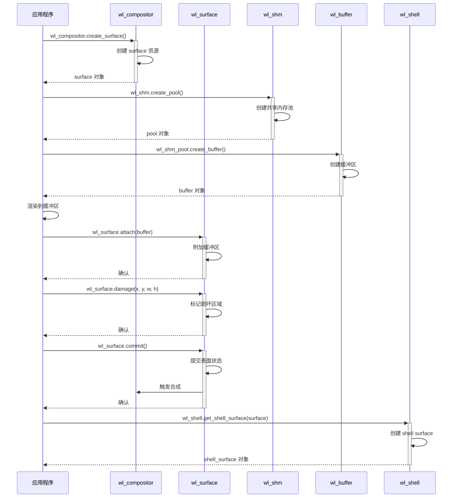
```mermaid
sequenceDiagram
    participant App as 应用程序
    participant Comp as wl_compositor
    participant Surf as wl_surface
    participant SHM as wl_shm
    participant Buffer as wl_buffer
    participant Shell as wl_shell
    
    App->>+Comp: wl_compositor.create_surface()
    Comp->>Comp: 创建 surface 资源
    Comp-->>-App: surface 对象
    
    App->>+SHM: wl_shm.create_pool()
    SHM->>SHM: 创建共享内存池
    SHM-->>-App: pool 对象
    
    App->>+Buffer: wl_shm_pool.create_buffer()
    Buffer->>Buffer: 创建缓冲区
    Buffer-->>-App: buffer 对象
    
    App->>App: 渲染到缓冲区
    
    App->>+Surf: wl_surface.attach(buffer)
    Surf->>Surf: 附加缓冲区
    Surf-->>-App: 确认
    
    App->>+Surf: wl_surface.damage(x, y, w, h)
    Surf->>Surf: 标记损坏区域
    Surf-->>-App: 确认
    
    App->>+Surf: wl_surface.commit()
    Surf->>Surf: 提交表面状态
    Surf->>Comp: 触发合成
    Surf-->>-App: 确认
    
    App->>+Shell: wl_shell.get_shell_surface(surface)
    Shell->>Shell: 创建 shell surface
    Shell-->>-App: shell_surface 对象
```

### 输入事件处理流程

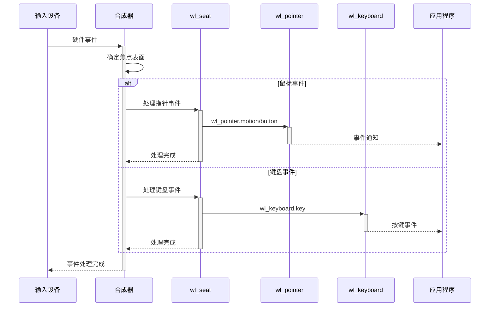
```mermaid
sequenceDiagram
    participant Input as 输入设备
    participant Comp as 合成器
    participant Seat as wl_seat
    participant Pointer as wl_pointer
    participant Keyboard as wl_keyboard
    participant App as 应用程序
    
    Input->>+Comp: 硬件事件
    Comp->>Comp: 确定焦点表面
    
    alt 鼠标事件
        Comp->>+Seat: 处理指针事件
        Seat->>+Pointer: wl_pointer.motion/button
        Pointer-->>-App: 事件通知
        Seat-->>-Comp: 处理完成
    else 键盘事件
        Comp->>+Seat: 处理键盘事件
        Seat->>+Keyboard: wl_keyboard.key
        Keyboard-->>-App: 按键事件
        Seat-->>-Comp: 处理完成
    end
    
    Comp-->>-Input: 事件处理完成
```

## 合成器开发实践

### 基础合成器结构

```c
struct my_compositor {
    struct wl_display *display;
    struct wl_event_loop *loop;
    struct wl_compositor *compositor;
    struct wl_shell *shell;
    struct wl_seat *seat;
    
    // 表面管理
    struct wl_list surface_list;
    
    // 输出管理
    struct wl_list output_list;
    
    // 信号
    struct {
        struct wl_signal surface_create;
        struct wl_signal surface_destroy;
        struct wl_signal output_create;
        struct wl_signal output_destroy;
    } signals;
    
    // 后端
    struct backend *backend;
};

// 表面结构
struct my_surface {
    struct wl_resource *resource;
    struct wl_list link;
    
    // 几何信息
    int32_t x, y;
    int32_t width, height;
    
    // 缓冲区
    struct wl_resource *buffer_resource;
    
    // 状态
    bool mapped;
    bool damaged;
    
    // 事件
    struct {
        struct wl_signal destroy;
        struct wl_signal commit;
        struct wl_signal map;
        struct wl_signal unmap;
    } events;
    
    // 监听器
    struct wl_listener buffer_destroy_listener;
};
```

### 实现 compositor 接口

```c
// compositor 接口实现
static void compositor_create_surface(struct wl_client *client,
                                     struct wl_resource *resource,
                                     uint32_t id) {
    struct my_compositor *comp = wl_resource_get_user_data(resource);
    struct my_surface *surface;
    
    surface = calloc(1, sizeof(*surface));
    if (!surface) {
        wl_client_post_no_memory(client);
        return;
    }
    
    surface->resource = wl_resource_create(client, &wl_surface_interface,
                                          wl_resource_get_version(resource), id);
    if (!surface->resource) {
        free(surface);
        wl_client_post_no_memory(client);
        return;
    }
    
    wl_resource_set_implementation(surface->resource, &surface_implementation,
                                  surface, surface_resource_destroy);
    
    // 初始化表面
    wl_list_init(&surface->link);
    wl_signal_init(&surface->events.destroy);
    wl_signal_init(&surface->events.commit);
    wl_signal_init(&surface->events.map);
    wl_signal_init(&surface->events.unmap);
    
    // 添加到表面列表
    wl_list_insert(&comp->surface_list, &surface->link);
    
    // 触发创建信号
    wl_signal_emit(&comp->signals.surface_create, surface);
}

static void compositor_create_region(struct wl_client *client,
                                    struct wl_resource *resource,
                                    uint32_t id) {
    // 实现区域创建
}

static const struct wl_compositor_interface compositor_implementation = {
    .create_surface = compositor_create_surface,
    .create_region = compositor_create_region,
};
```

### 实现 surface 接口

```c
static void surface_attach(struct wl_client *client,
                          struct wl_resource *resource,
                          struct wl_resource *buffer_resource,
                          int32_t sx, int32_t sy) {
    struct my_surface *surface = wl_resource_get_user_data(resource);
    
    // 移除旧的缓冲区监听器
    if (surface->buffer_resource) {
        wl_list_remove(&surface->buffer_destroy_listener.link);
    }
    
    surface->buffer_resource = buffer_resource;
    
    if (buffer_resource) {
        // 添加缓冲区销毁监听器
        surface->buffer_destroy_listener.notify = surface_buffer_destroy;
        wl_resource_add_destroy_listener(buffer_resource,
                                       &surface->buffer_destroy_listener);
    }
}

static void surface_damage(struct wl_client *client,
                          struct wl_resource *resource,
                          int32_t x, int32_t y,
                          int32_t width, int32_t height) {
    struct my_surface *surface = wl_resource_get_user_data(resource);
    
    // 标记损坏区域
    surface->damaged = true;
    // 可以实现更复杂的损坏区域跟踪
}

static void surface_commit(struct wl_client *client,
                          struct wl_resource *resource) {
    struct my_surface *surface = wl_resource_get_user_data(resource);
    
    // 应用待处理状态
    if (surface->buffer_resource && !surface->mapped) {
        surface->mapped = true;
        wl_signal_emit(&surface->events.map, surface);
    }
    
    // 触发提交事件
    wl_signal_emit(&surface->events.commit, surface);
    
    // 请求重绘
    schedule_repaint(surface->compositor);
}

static const struct wl_surface_interface surface_implementation = {
    .attach = surface_attach,
    .damage = surface_damage,
    .commit = surface_commit,
    // ... 其他方法
};
```

### 事件循环集成

```c
int main(int argc, char *argv[]) {
    struct my_compositor compositor = {0};
    
    // 创建显示服务器
    compositor.display = wl_display_create();
    if (!compositor.display) {
        return -1;
    }
    
    compositor.loop = wl_display_get_event_loop(compositor.display);
    
    // 初始化列表
    wl_list_init(&compositor.surface_list);
    wl_list_init(&compositor.output_list);
    
    // 初始化信号
    wl_signal_init(&compositor.signals.surface_create);
    wl_signal_init(&compositor.signals.surface_destroy);
    
    // 注册全局对象
    if (!wl_global_create(compositor.display, &wl_compositor_interface, 4,
                         &compositor, compositor_bind)) {
        goto error;
    }
    
    // 创建监听套接字
    const char *socket = wl_display_add_socket_auto(compositor.display);
    if (!socket) {
        goto error;
    }
    
    setenv("WAYLAND_DISPLAY", socket, 1);
    
    // 初始化后端 (KMS, X11, etc.)
    compositor.backend = backend_create(&compositor);
    if (!compositor.backend) {
        goto error;
    }
    
    printf("Wayland compositor started on %s\n", socket);
    
    // 运行事件循环
    wl_display_run(compositor.display);
    
    // 清理
    backend_destroy(compositor.backend);
    wl_display_destroy(compositor.display);
    
    return 0;

error:
    wl_display_destroy(compositor.display);
    return -1;
}
```

## 最佳实践

### 1. 错误处理
- 始终检查内存分配失败
- 正确处理客户端断开连接
- 实现优雅的资源清理

### 2. 性能优化
- 使用高效的损坏跟踪
- 实现智能的重绘调度
- 优化事件分发路径

### 3. 内存管理
- 正确使用引用计数
- 避免循环引用
- 及时清理资源

### 4. 调试技巧

```bash
# 设置调试环境变量
export WAYLAND_DEBUG=1

# 使用 wayland-scanner 生成协议代码
wayland-scanner server-header < protocol.xml > protocol-server.h
wayland-scanner private-code < protocol.xml > protocol.c

# 使用 weston-debug 调试
export WESTON_DEBUG=compositor,input,shell
```

## 扩展协议开发

### 自定义协议示例

```xml
<?xml version="1.0" encoding="UTF-8"?>
<protocol name="my_extension">
  <interface name="my_extension" version="1">
    <description summary="custom extension">
      This is a custom extension for demonstration.
    </description>
    
    <request name="get_object">
      <description summary="get a custom object">
        Create a new custom object.
      </description>
      <arg name="id" type="new_id" interface="my_object"/>
    </request>
  </interface>
  
  <interface name="my_object" version="1">
    <description summary="custom object">
      A custom object with specific functionality.
    </description>
    
    <request name="set_property">
      <arg name="value" type="int"/>
    </request>
    
    <event name="property_changed">
      <arg name="value" type="int"/>
    </event>
  </interface>
</protocol>
```

## 总结

Wayland 协议通过其清晰的架构和强大的核心组件，为现代显示系统提供了坚实的基础。深入理解 wl_signal、wl_listener、wl_list、wl_client、wl_resource 和 wl_proxy 等核心组件的工作原理，是开发高质量 Wayland 合成器的关键。

关键要点：
1. **事件驱动架构**: 基于信号-监听器模式的松耦合设计
2. **资源管理**: 严格的对象生命周期管理和引用计数
3. **协议扩展性**: 支持自定义协议扩展
4. **性能优化**: 高效的事件分发和渲染管道

通过遵循最佳实践和深入理解核心机制，开发者可以构建出稳定、高性能的 Wayland 合成器。